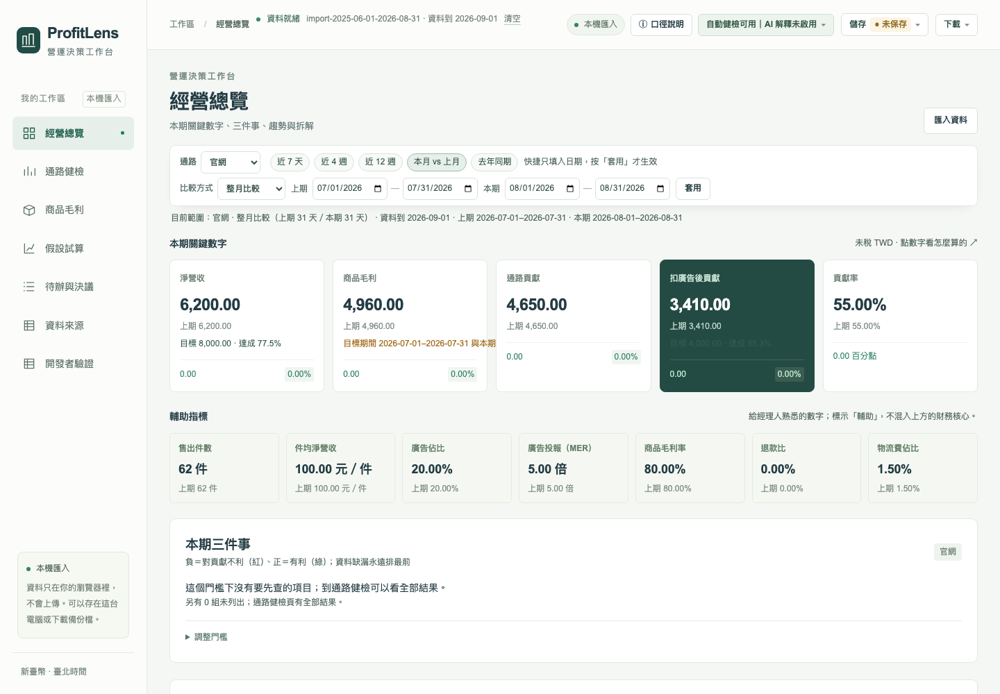

# ProfitLens｜電商獲利診斷與決策工作台

從銷售、通路費用與廣告資料，看清扣廣告後貢獻的變化，每個數字都能追到來源。

**正式站：[profitlens-tau.vercel.app](https://profitlens-tau.vercel.app)**



## 它回答三個問題（給營運／行銷主管）

1. 營收漲了，扣完平台抽成、物流、廣告之後，到底多賺還是少賺？
2. 問題在哪個通路、哪一項費用？金額多少？
3. 如果調廣告、調折扣、取消免運，貢獻會變多少？

→ 每個數字都能點開看公式與來源（CSV 檔名與行號）。

## 30 秒試用

開正式站 → 按「試試示範資料」→ 看「本期三件事」→ 點任一數字看「怎麼算的」。（示範資料為合成資料，不代表任何真實商家。）

## 用自己的資料

- 需要三份**日粒度** CSV：商品銷售（`sales_daily.csv`）、通路費用（`channel_costs_daily.csv`）、廣告投放（`ad_spend_daily.csv`）。空白範本在 [templates/](templates/)，含三列示範的範例檔在 [templates/examples/](templates/examples/)；匯入精靈第 1 步也能下載。
- 含稅報表可以在匯入時換算成未稅（選「含稅」，預設營業稅 5%）；原值與換算值都看得到。
- 資料只在你的瀏覽器裡，不會上傳；要不要存在這台電腦，由你決定。
- 平台匯出的是訂單明細？先用 [scripts/aggregate_orders.py](scripts/aggregate_orders.py) 整理成日粒度（見 [docs/ORDER_AGGREGATION.md](docs/ORDER_AGGREGATION.md)）。

## 口徑一頁說明

1. 金額都是未稅、依結帳（入帳）日計算。
2. 四層數字：淨營收 → 商品毛利 → 通路貢獻 → 扣廣告後貢獻。
3. 不包含：固定費（房租、人事）、所得稅、消費者付的運費收入、平台補貼。所以扣廣告後貢獻不是公司淨利。
4. 兩期的差額是「發生了什麼」，不是「為什麼」；也不是可以省下的錢。
5. 合計已包含各通路，各通路的差額不能再加總。
6. 退款比是金額比，不是件數退貨率，也不是同批訂單最終退貨率。
7. 假設試算是「如果這樣做會變多少」，不是預測；三個方案不能相加。
8. MER（淨營收 ÷ 廣告費）常被稱為 ROAS，但沒有媒體歸因；廣告費為 0 時不顯示。
9. 商品頁只看商品毛利；廣告與平台費不分到單一商品。

完整公式見 [docs/METRICS.md](docs/METRICS.md)。

## 功能一覽

| 頁面 | 做什麼 |
|---|---|
| 經營總覽 | 本期關鍵數字、三件事、趨勢與拆解 |
| 通路健檢 | 自動健檢：哪個通路、哪項費用出了問題 |
| 商品毛利 | 商品賣得好不好、賺不賺 |
| 假設試算 | 如果調廣告、調折扣，貢獻會變多少 |
| 待辦與決議 | 要做什麼、誰負責、何時檢查 |
| 會議紀錄 | 議程、決議、與上次會議比較、匯出 |
| 資料來源 | 匯入資料、確認口徑與完整性 |

頂欄「下載 ▾」可匯出 PDF、Excel、PowerPoint、Markdown 與 CSV；「儲存 ▾」可下載備份檔或存在這台電腦。

## 示範資料

示範資料是合成的 12 週、2 個通路、20 個商品，不代表任何真實商家。畫面只換顯示名稱：通路顯示「官網 · DTC」「平台 · MARKETPLACE」，品類顯示「居家／保養／配件／3C」；CSV 裡的原始代碼不變。頁面與匯出都標示「合成資料」。台灣化的新示範資料（官網／蝦皮／momo、商品名稱、檔期）列為上線後待辦。

## 限制與不做的事

- 單一公司、新臺幣（TWD）、未稅金額（含稅報表在匯入時換算成未稅）。
- 沒有登入、沒有雲端：資料不跨裝置同步，也不能多人共用。
- 不做 SKU 層級的廣告歸因；廣告與平台費不分到單一商品。
- 扣廣告後貢獻不是淨利（不含固定費與所得稅）。
- AI 解釋在公開版未啟用；所有計算與健檢都不需要 AI。
- 平台訂單明細需先整理成日粒度（`scripts/aggregate_orders.py`），畫面內不彙總。
- 九個來源預設中，只有 `shopee_orders`（蝦皮訂單匯出）以真實匯出檔驗證，其餘待驗證；自動預選的欄位對照請自行確認。

## 本機啟動（4 行）

需要 Node.js 24 以上、npm 10 以上。

```sh
npm ci
npm run dev
# 開 http://127.0.0.1:3000
npm run typecheck && npm run lint && npm test -- --run && npm run build
```

## 工程與驗收 → [docs/ENGINEERING.md](docs/ENGINEERING.md)

完整驗收命令（含 E2E 四尺寸）、各批驗收紀錄、文件地圖，以及 M0–M6 與歷次改善的工程說明。

## 發布紀錄 → [docs/RELEASES.md](docs/RELEASES.md)

最新：v2.0.0（2026-10-03）——首屏關鍵數字與三件事、經理人用語、匯入精靈與含稅換算、輔助指標與目標、健檢清單與試算範本、待辦看板、會議紀錄與 PDF／Excel／PowerPoint 匯出。

## 安全與隱私

資料只在你的瀏覽器裡處理，原始 CSV 不會上傳，也沒有伺服器端保存。本機保存要先經你同意，之後可隨時「刪除本機資料」。公開站的 AI 解釋關閉、伺服器沒有 API key；若啟用使用分析，只記錄頁面瀏覽與互動事件，不含任何資料內容。

專案規則與安全邊界見 [AGENTS.md](AGENTS.md)。
