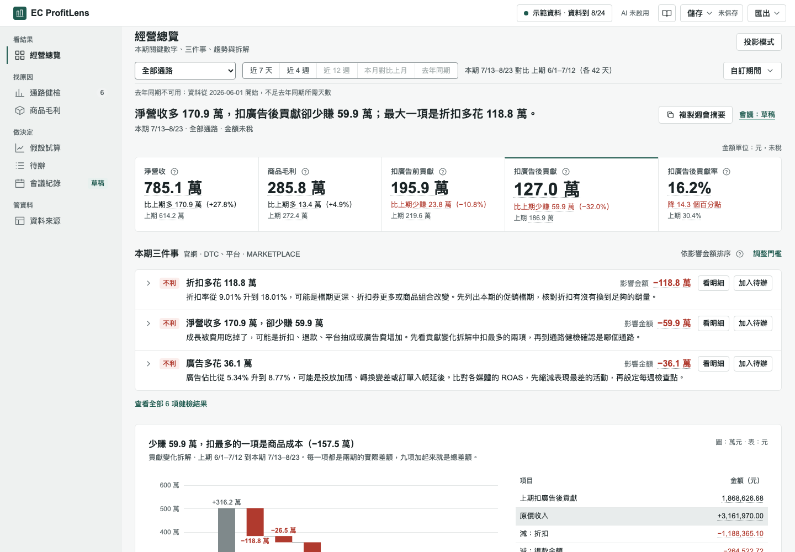

# EC ProfitLens｜電商獲利診斷與決策工作台

從銷售、通路費用與廣告資料，看清扣廣告後貢獻的變化，每個數字都能追到來源。

**正式站：[profitlens-tau.vercel.app](https://profitlens-tau.vercel.app)**



## 它回答三個問題（給營運／行銷主管）

1. 營收漲了，扣完平台抽成、物流、廣告之後，到底多賺還是少賺？
2. 問題在哪個通路、哪一項費用？金額多少？
3. 如果調廣告、調折扣、取消免運，扣廣告後貢獻會變多少？

每個數字都能點開「計算與來源」，看到公式、CSV 檔名與原始行號。

## 30 秒試用

1. 開正式站，在首頁按「載入示範資料」。
2. 先讀最上面的本期一句話與 KPI 帶（淨營收、商品毛利、扣廣告前貢獻、扣廣告後貢獻、扣廣告後貢獻率），再看下面的「本期三件事」。
3. 點任一數字或「看明細」，在「計算與來源」看算法、檔名與行號；標題下一行是到分的精確值。

示範資料是虛構的合成資料，不代表任何真實商家。

## 用自己的資料

需要三份**日粒度** CSV：商品銷售（`sales_daily.csv`）、通路費用（`channel_costs_daily.csv`）、廣告投放（`ad_spend_daily.csv`）。空白範本在 [templates/](templates/)，含三列示範的範例檔在 [templates/examples/](templates/examples/)；首頁的「需要的檔案」表、資料來源頁與頂欄「匯出」的匯入範本也能下載。

在首頁按「匯入資料」（已有資料時，從頂欄資料狀態的「匯入新資料」或資料來源頁進入），匯入精靈有四步：

1. **選檔**：拖放三份報表，依檔名自動歸位。
2. **對照欄位**：自動預選對照，已對照的欄位收合；只要確認沒對上的欄。
3. **金額基準與期間**：含稅報表選「含稅」，逐列換算成未稅（預設營業稅 5%，可改）；原值與換算值都看得到。
4. **檢核與套用**：看狀態一行與資料問題表（檔名、欄位、原始行號、修法），沒有阻擋的問題就套用。

- 資料只在你的瀏覽器裡，不會上傳；要不要存在這台電腦，由你決定。
- 平台匯出的是訂單明細？先用 [scripts/aggregate_orders.py](scripts/aggregate_orders.py) 整理成日粒度（見 [docs/ORDER_AGGREGATION.md](docs/ORDER_AGGREGATION.md)）。

## 指標定義（九條）

畫面上頂欄的「指標定義」是同樣的九條；v2 叫「口徑說明」。

1. 金額都是未稅、依結帳（入帳）日計算。
2. 四層數字：淨營收、商品毛利、扣廣告前貢獻、扣廣告後貢獻，一層一層往下扣。
3. 不包含：固定費（房租、人事）、所得稅、消費者付的運費收入、平台補貼。所以扣廣告後貢獻不是公司淨利。
4. 差額說明發生了什麼，原因還需要確認；差額也不是可以省下的錢。
5. 合計已包含各通路；各通路的差額不能再相加。
6. 退款金額比是金額比，不是件數退貨率，也不是同批訂單的最終退貨率。
7. 假設試算是「如果這樣做會變多少」，不是預測；方案之間不能相加。
8. 廣告效率（MER）＝淨營收 ÷ 廣告投放費，是全通路合計。算法和平台後台的 ROAS 不同；廣告費為 0 時顯示「不適用」。
9. 商品頁只看商品毛利；廣告與平台抽成不分到單一商品。

完整公式見 [docs/METRICS.md](docs/METRICS.md)；名詞與 v2 舊名的對照見 [名詞表](docs/revamp-v3/GLOSSARY.md)。

## 功能一覽

側欄分成四組：

| 分組 | 頁面 | 做什麼 |
|---|---|---|
| 看結果 | 經營總覽 | 本期一句話、KPI 帶、本期三件事、利潤結構與貢獻變化拆解瀑布圖、趨勢（含去年同期線）與各通路、其他常用指標與損益兩平 MER；「進階」裡有期間合計、日均與每日／每週管理損益表 |
| 找原因 | 通路健檢 | 健檢結果清單：哪個通路、哪項費用不利，影響金額多少，下一步做什麼 |
| 找原因 | 商品毛利 | 商品毛利最差與增加最多的前 10 名、完整商品表 |
| 做決定 | 假設試算 | 如果調銷量、折扣、物流費或廣告預算，扣廣告後貢獻會變多少；方案並排比較，可選入會議 |
| 做決定 | 待辦 | 看板與清單：要做什麼、誰負責、何時到期、何時喊停，可標廣告決策（暫停／調整／加碼） |
| 做決定 | 會議紀錄 | 文件式議程、決議、與上次會議比較、結束會議後固定成紀錄、匯出會議 |
| 管資料 | 資料來源 | 匯入資料、資料問題表、範圍與金額基準、前處理、來源預覽與範本 |

- 頂欄「匯出」分成目前檢視、一頁摘要（目前檢視）、決策工作稿、會議、匯入範本五組，可匯出 PDF、Excel、PowerPoint、Markdown 與 CSV；一頁摘要有標準版、老闆一頁版、客戶報告版。每份匯出開頭都有四行版頭（資料集、報表名、兩期期間與單位、指標版本與產出時間）。
- 頂欄「儲存」分成本機保存、備份檔、危險區三段；備份檔格式是 v5，v1–v4 的舊備份都能還原。
- 總覽與會議紀錄頁有「投影模式」，週會投影時字放大、只留結論，按 Esc 離開。
- v3 的名稱改了一些：「通路貢獻」改為「扣廣告前貢獻」、「口徑說明」改為「指標定義」、「金額口徑」改為「金額基準」、「怎麼算的／公式與來源」改為「計算與來源」（按鈕是「看明細」）、「行動」改為「待辦」、「廣告投報」改為「廣告效率（MER）」。完整對照見 [名詞表](docs/revamp-v3/GLOSSARY.md)；在「指標定義」的名詞小辭典輸入舊名也找得到。

## 示範資料

示範資料是合成的 12 週、2 個通路、20 個商品，不代表任何真實商家。畫面只換顯示名稱：通路顯示「官網 · DTC」「平台 · MARKETPLACE」，品類顯示「居家／保養／配件／3C」；CSV 裡的原始代碼不變。側欄標示示範資料是虛構的合成資料；匯出檔的資料集識別碼以 `synthetic-demo` 開頭。示範資料只有 12 週、沒有去年同期的期間，所以趨勢圖的去年同期線不可用（畫面會寫原因）。台灣化的新示範資料（官網／蝦皮／momo、商品名稱、檔期；F15）待提供商品與檔期設定後再做。

## 限制與不做的事

- 單一公司、新台幣（TWD）、未稅金額（含稅報表在匯入時換算成未稅）。
- 沒有登入、沒有雲端：資料不跨裝置同步，也不能多人共用。
- 不做 SKU 層級的廣告歸因；廣告與平台抽成不分到單一商品。
- 扣廣告後貢獻不是淨利（不含固定費與所得稅）。
- AI 解釋在公開版未啟用；所有計算與健檢都不需要 AI。
- 平台訂單明細需先整理成日粒度（`scripts/aggregate_orders.py`），畫面內不彙總。
- 九個來源預設中，只有 `shopee_orders`（蝦皮訂單匯出）以真實匯出檔驗證，其餘待驗證；自動預選的欄位對照請自行確認。

## 本機啟動（4 行）

需要 Node.js 24 以上、npm 10 以上。

```sh
npm ci
npm run dev
# 開 http://127.0.0.1:3000
npm run typecheck && npm run lint && npm test -- --run && npm run build
```

## 工程與驗收 → [docs/ENGINEERING.md](docs/ENGINEERING.md)

完整驗收命令（含 E2E 四尺寸）、Revamp v2 與 v3 的各批驗收紀錄、文件地圖，以及 M0–M6 與歷次改善的工程說明。

## 發布紀錄 → [docs/RELEASES.md](docs/RELEASES.md)

最新：v3.0.0（2026-10-08）——老闆 10 秒看懂、主管 3 分鐘找到原因、執行者 10 分鐘完成匯入與核對：首屏本期一句話與 KPI 帶、瀑布圖、健檢清單、方案並排、文件式會議紀錄、全版匯入精靈，加上損益兩平 MER、廣告決策標籤、管理損益表、去年同期線、下鑽、匯出範本變體與投影模式；財務口徑不變。Excel 工作表與部分名詞改名，備份升到 v5，見發布紀錄的「破壞性變更」。

正式站已是 v3.0.0（2026-10-08）；H4 可用性複測尚未執行。

## 安全與隱私

資料只在你的瀏覽器裡處理，原始 CSV 不會上傳，也沒有伺服器端保存。本機保存要先經你同意，之後可隨時在「儲存」選單按「刪除這台電腦上的資料」。公開站的 AI 解釋關閉、伺服器沒有 API key；若啟用使用分析，只記錄頁面瀏覽與互動事件，不含任何資料內容。

專案規則與安全邊界見 [AGENTS.md](AGENTS.md)。
