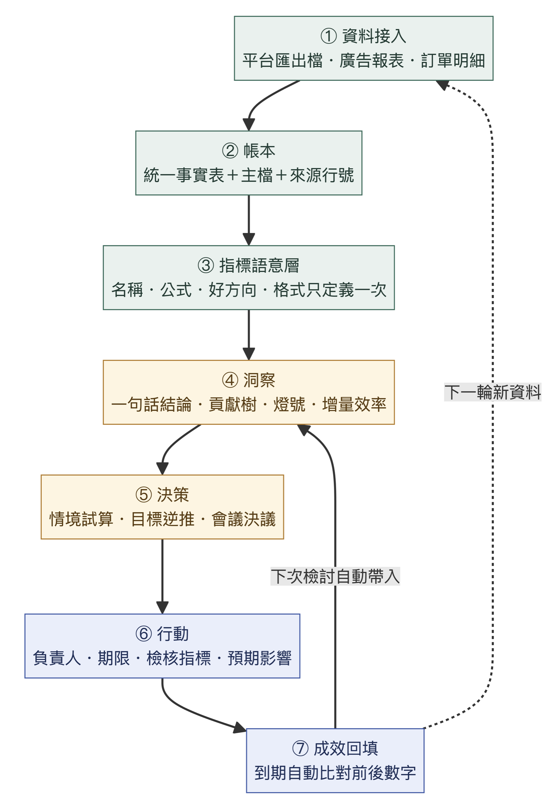
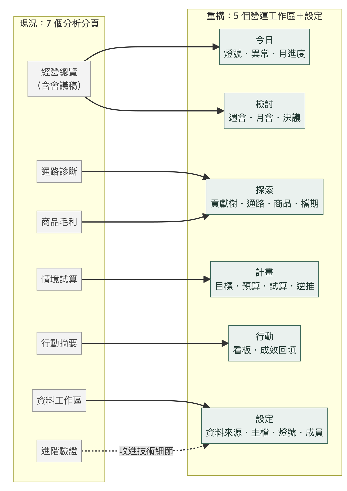
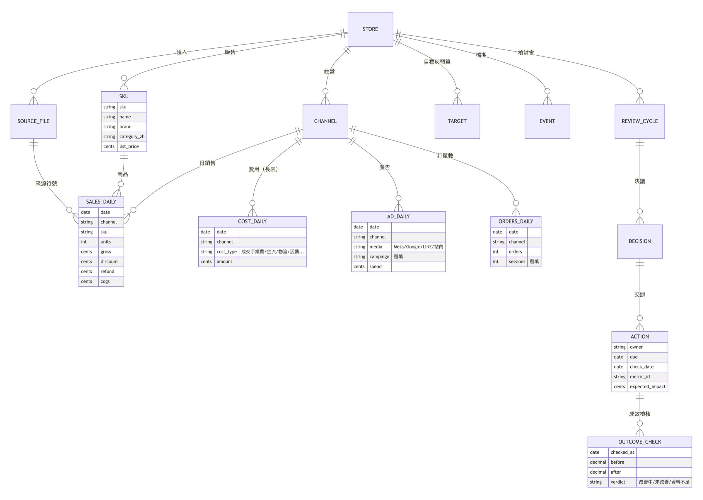
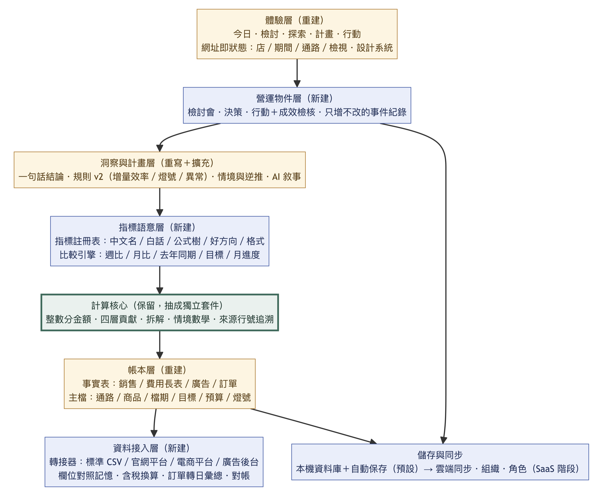
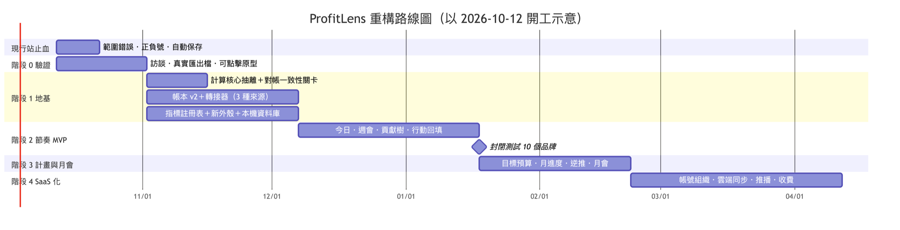

# ProfitLens 3 產品需求文件（PRD）

> **產品**：ProfitLens 3 — 台灣品牌電商的獲利營運系統
> **文件版本**：v3.0（開發基準版）
> **日期**：2026-10-03
> **狀態**：可開發。標記為「待驗證」的項目，會在階段 0（使用者驗證）後於 v3.0.1 更新
> **目標讀者**：Manus 開發代理（主要）、產品經理、設計師、測試人員
> **適用 repo**：`JLO916/profitlens`（main `5771104`；正式站產品版本 `6c11a42`，Review v2 A 批）
> **取代文件**：`docs/PRD.md`（v1）、`docs/revamp/`（R0–R7 改版套件的批次計畫）。v1 的財務口徑文件（`DATA_CONTRACT.md`、`METRICS.md`、`SCENARIOS.md`、`AI_CONTRACT.md`）**繼續有效**；本 PRD 只擴充，不修改既有口徑

---

## 文件導讀

### 給 Manus 的閱讀順序

| 順序 | 章節 | 目的 |
|---|---|---|
| 1 | 第 1–3 章 | 了解產品為什麼重構、要變成什麼 |
| 2 | 第 20 章〈Manus 開發指引〉 | 了解開發紀律、里程碑任務卡、完成定義與回報格式 |
| 3 | 當輪里程碑涉及的功能需求（第 9 章） | 每條需求都有 ID、優先級與驗收條件 |
| 4 | 第 10–13 章 | 指標、洞察規則、資料契約、營運物件的精確規格 |
| 5 | 第 14–15 章 | 畫面與文案規範（UI 里程碑必讀） |
| 6 | `spec/` 資料夾 | 機器可讀的指標註冊表、規則與文案模板、測試錨點 |

### 本 PRD 套件內容

| 檔案 | 用途 |
|---|---|
| `PRD_ProfitLens_v3.md`（本文件） | 完整產品需求 |
| `spec/metric_registry.v1.yaml` | 指標註冊表：名稱、白話、公式、好方向、格式、定義條件。開發時複製到 repo 的 `spec/`，作為唯一來源 |
| `spec/rule_templates.v2.yaml` | 洞察規則 v2：觸發條件、影響金額、標題模板、建議動作、注意事項 |
| `spec/test_anchors.v1.json` | 由示範資料與 golden 資料精確計算出的測試錨點 |
| `spec/tools/gen_test_anchors.py` | 從 repo fixtures 重新產生錨點的腳本（`--repo . --out spec/test_anchors.v1.json`） |
| `assets/*.png` | 營運閉環、資訊架構、系統架構、資料模型、路線圖 |
| `README.md` | 套件說明、放進 repo 的方式、第一個交辦提示 |

### 需求用語

| 用語 | 意義 |
|---|---|
| **必須（MUST）** | 不符合就不能驗收 |
| **應該（SHOULD）** | 預設要做；不做要在 `docs/DECISIONS.md` 寫明理由 |
| **可以（MAY）** | 選配 |
| **P0／P1／P2** | P0＝該版本不可缺；P1＝該版本應有；P2＝可延後到下一版 |
| **版本代號** | v2.1＝現行站止血；α＝階段 1 地基（內部）；β＝階段 2 節奏 MVP（封閉測試）；v3.1＝階段 3 計畫與月會；v3.2＝階段 4 SaaS 化 |

### 需求 ID 規則

`<模組>-<流水號>`，例如 `TOD-03`。模組代碼：HF 止血、GLB 全站、ING 資料接入、LED 帳本、MET 指標、TOD 今日、EXP 探索、INS 洞察、PLN 計畫、REV 檢討、ACT 行動、AI、SET 設定、ORG 多店、SAAS 雲端與收費、NFR 非功能。測試檔名與 commit 訊息應引用需求 ID。

### 變更紀錄

| 版本 | 日期 | 內容 |
|---|---|---|
| v3.0 | 2026-10-03 | 依據正式站實測、repo 盤點、〈經理人實測評審與優化建議〉與〈大幅重構方案〉建立 |

---

## 1. 摘要

**ProfitLens 3 要把現行的「CSV 分析工作台」重構成「每日、每週、每月都會用的獲利營運系統」。**

| 項目 | 內容 |
|---|---|
| 一句話定位 | 台灣品牌電商的獲利駕駛艙：每天 5 分鐘看燈號、每週 30 分鐘開會、每月 1 小時定預算；每個數字都能追到原始檔的那一行 |
| 核心問題 | 業績變好，錢有沒有變多？要做什麼？做了有沒有用？下個月目標怎麼訂？ |
| 重構原則 | **保留計算核心，重建產品外殼**。`src/domain` 的計算核心與測試原封不動抽出，作為唯一計算來源；重建資訊架構、資料地基與營運物件 |
| 骨架 | 5 個工作區：今日、檢討、探索、計畫、行動，再加設定 |
| 閉環 | 資料接入 → 帳本 → 指標語意層 → 洞察 → 決策 → 行動 → 成效回填 → 下次檢討自動帶入 |
| MVP（β） | 直接吃台灣平台匯出檔、今日燈號、週會模式、貢獻樹、行動與成效回填、PDF／PPT／LINE 文字匯出、本機自動保存 |
| 時程 | 約 26 週（含 3 週驗證）；β 封閉測試約在開工後第 14 週 |



---

## 2. 背景

### 2.1 現況（v2 A 批）

| 面向 | 現況 |
|---|---|
| 資料 | 三份日彙總 CSV：`sales_daily.csv`（日 × 通路 × SKU）、`channel_costs_daily.csv`（日 × 通路，4 個費用欄）、`ad_spend_daily.csv`（日 × 通路）；TWD、未稅、Asia/Taipei、入帳日 |
| 指標 | contribution-v1：淨營收、商品毛利、行銷前貢獻、行銷後貢獻、毛利率、貢獻率、折扣率、退款金額比、MER、物流費佔比、廣告佔比 |
| 洞察 | 8 條確定性規則；精確金額橋接（無殘差） |
| 試算 | scenario-v1（單通路、5 個輸入、最多 3 方案）＋ scenario-sensitivity-v1（銷量門檻、3 組敏感度） |
| 行動與會議 | 7 欄自由文字行動、單份會議稿、Markdown／CSV／列印匯出 |
| 保存 | 預設只在分頁記憶體；可下載備份 JSON（v1→v3 遷移鏈）；IndexedDB 需同意且不自動保存 |
| 品質 | 41 個測試檔（819 個單元測試、400 多個 E2E），金額以 bigint 分計算；真實資料、真實使用者與即時 AI 驗證皆未執行 |
| 技術 | Next.js 16.3.7（App Router）、React 19.3、Recharts 3.10、zod 4.6、decimal.js 10.6、openai 7.25、Tailwind 4、Vitest 4、Playwright 1.63；部署於 Vercel |

### 2.2 實測發現（2026-10-03，正式站，行動版寬度約 432px）

| 編號 | 發現 | 對經理人的影響 |
|---|---|---|
| F1 | 在情境試算點「編輯 MARKETPLACE 方案」，會靜默把**全站**通路篩選改成平台；回到總覽，「本期經營摘要」顯示全部通路 785.1 萬，下方 KPI 卻顯示平台 397.0 萬 | 同一頁出現兩種範圍，主管會直接質疑數字可信度 |
| F2 | 匯入新資料後，總覽的摘要仍是舊示範資料，KPI 卻是新資料 | 同一頁出現兩份資料 |
| F3 | 載入示範資料後，行動版要捲 6–7 屏才看到 KPI；會議表單排在 KPI 前面 | 首屏看不到答案 |
| F4 | 三件事「折扣率上升 +1,188,365.10」把壞事標成正號；拆解圖同一項卻是負號 | 正負號語意矛盾 |
| F5 | 所有金額都是兩位小數（7,850,657.90），沒有「萬」 | 主管閱讀負擔高 |
| F6 | 平台貢獻由正轉負時顯示 −108.48% | 數字無意義 |
| F7 | 繁中字典 `src/i18n/labels.zh-TW.ts`（269 行）被引用 0 次；DTC／MARKETPLACE、ELECTRONICS 等英文代碼直接出現在主畫面 | 「這不是給我用的」 |
| F8 | 診斷卡的建議幾乎都是「比對、核對」，不是業務行動；每張卡都有免責句 | 無法據以決策 |
| F9 | 行動草稿只帶入「折扣率上升」，沒有數字；負責人、指標、停止條件要手打；沒有成效追蹤 | 決議無法追蹤 |
| F10 | 重新整理就清空資料 | 無法每天使用 |
| F11 | 匯入要約 9 個動作；平台原始匯出檔（含稅、訂單級、中文欄名）無法直接使用 | 導入門檻高 |
| F12 | 情境試算的門檻顯示 12 位小數（−46.706808158415%）；結果沒有新折扣率、新貢獻率、新 MER | 看不懂、不完整 |

### 2.3 結構限制（為什麼不是繼續調整）

| 限制 | 證據 | 重構做法 |
|---|---|---|
| 單一頁面、全域狀態 | `page.tsx` 只渲染 `<Dashboard/>`；元件合計 86 個 `useState`；路由參數使用 0 次 | 多路由；網址即狀態；範圍隔離（GLB-01～05） |
| 資料契約寫死 | `FileName` 只允許三個檔名；費用為 4 欄寬表 | 帳本 v2：費用長表、主檔、轉接器（第 12 章） |
| 儀式性邏輯過重 | `application`＋`components` 約 41.4 萬字元，是 `domain` 的 5 倍 | 資料版本＋事件紀錄取代快照與重新綁定（第 13 章） |
| 文案與格式多頭 | 字典未接線；`presentation.ts` 另有一套標籤 | 指標註冊表為唯一來源（MET-01） |
| 會議與行動是附加功能 | 會議稿嵌在總覽；行動是自由文字 | 營運物件為一等公民（REV、ACT） |
| 不保存 | 預設記憶體 | 本機資料庫預設自動保存（GLB-06） |

### 2.4 示範資料要說出的商業故事（作為所有畫面的驗收情境）

示範資料：合成、84 天（2026-06-01～08-23）、官網與平台兩個通路、20 個 SKU；上期 6/1–7/12、本期 7/13–8/23（各 42 天，ISO W23–W28 vs W29–W34）；資料截至 8/24。

> **業績多了 170.9 萬（+27.8%），但扣完廣告反而少賺 59.9 萬（−32.0%）。主因是平台的折扣（多 96.0 萬）與廣告（多 34.1 萬）。**
> 平台多給的折扣（96.0 萬）比多做的業績（94.6 萬）還多；每多花 1 元廣告只多換回 2.8 元營收，低於打平所需的 9.0 倍；扣廣告後貢獻由賺 72.1 萬轉為虧 6.1 萬。官網維持健康，貢獻率 34.3%。
> 最近一週（W34），平台扣完廣告已連續 6 天虧損。

產品的每個主要畫面都必須能在 3 秒內讓主管讀到這個故事的對應部分（驗收錨點見附錄 A）。

---

## 3. 產品願景、定位與原則

### 3.1 願景

讓台灣每一個品牌電商團隊，都能在每週一的會議上用同一組可信的數字，決定這週要做什麼，並在下週看到做了有沒有用。

### 3.2 定位與差異化

| 替代方案 | 使用者現況 | ProfitLens 的差異 |
|---|---|---|
| Excel 樞紐分析 | 每週手動整理、公式常出錯、無法追溯 | 直接吃平台匯出檔；計算可驗證；每個數字追到原始行 |
| 平台後台報表 | 只看單一平台、只看營收與 ROAS | 跨通路、扣完所有變動費用與廣告的貢獻 |
| Looker Studio 等自建報表 | 需要技術人力；只有圖表沒有判讀 | 一句話結論、燈號、規則診斷、試算 |
| 會計系統 | 月結後才有數字，太慢 | 日彙總、每天可看 |
| 專案管理工具 | 行動與數字分離 | 行動綁定指標，到期自動回填成效 |

**差異化一句話**：同時做到「扣廣告後貢獻＋來源可追溯＋會議到行動的閉環」。

### 3.3 產品原則（所有設計與開發決策的判準）

| # | 原則 | 具體要求 |
|---|---|---|
| 1 | **數字可追溯** | 每個顯示的數字都能在 2 次點擊內打開公式與原始來源行 |
| 2 | **缺值不是零** | 缺資料顯示「資料待補」，不補零、不補成本、不畫零值折線 |
| 3 | **結論先講** | 每個畫面第一行是一句話結論，數字放在標題裡 |
| 4 | **一頁一個範圍** | 同一頁所有數字的店、期間、比較基準、通路、資料版本完全相同；不同時必須明確分區並標示 |
| 5 | **一個數字一個定義** | 名稱、公式、格式、正負號、紅綠色都來自指標註冊表 |
| 6 | **決策要閉環** | 每個洞察都能一鍵轉成試算或行動；每個行動都綁定指標與檢核日 |
| 7 | **本機優先** | 預設資料只存在使用者電腦；上傳雲端必須是使用者主動選擇 |
| 8 | **AI 不算數** | 金額、比率、排序全部由程式計算；AI 只寫文字，且只能引用指標 ID |
| 9 | **台灣白話** | 用老闆聽得懂的台灣電商用語；英文代碼與技術公式只出現在「技術細節」 |
| 10 | **刻意不做** | 不做預測模型、自動調預算、ERP、會計帳（第 6.3 節） |

---

## 4. 目標與成功指標

### 4.1 商業目標

| 目標 | 衡量 | 時點 |
|---|---|---|
| 驗證需求 | 10 位受訪者中至少 7 位表示願意每週使用；至少 3 家願意提供真實資料試點 | 階段 0 結束 |
| 建立習慣 | 封閉測試 10 個品牌中，連續 4 週、每週至少 6 家完成檢討閉環 | β 結束 |
| 驗證付費 | 試點品牌至少 3 家轉為付費 | v3.2 上線後 8 週 |

### 4.2 產品指標

| 類型 | 指標 | 定義 | 目標 |
|---|---|---|---|
| 北極星 | 每週完成檢討閉環的店數 | 該週內同一店依序完成：匯入資料、建立或開啟週會、至少 1 個決議、至少 1 個行動；且上週到期的行動有回填 | β 每週 ≥ 6 |
| 啟用 | 首次價值時間 | 從上傳第一份平台原始匯出檔，到看到一句話結論的中位數時間 | ≤ 10 分鐘 |
| 啟用 | 匯入成功率 | 匯入嘗試中成功套用的比例 | ≥ 85% |
| 習慣 | 每週活躍天數 | 每週至少開啟 3 天的使用者比例 | ≥ 40% |
| 閉環 | 成效回填率 | 已到檢核日的行動中有判定結果的比例 | ≥ 60% |
| 信任 | 追溯成功率 | 測試者被要求找出某數字的來源時，10 秒內找到的比例 | 100% |
| 品質 | 計算錯誤 | 與 golden／示範錨點不一致的計算缺陷數 | 0 |
| 品質 | 範圍混雜 | 同頁出現不同範圍或資料版本且未標示的缺陷數 | 0 |

### 4.3 護欄指標

| 指標 | 門檻 |
|---|---|
| 個資外洩或未經同意的資料傳送 | 0 |
| 未經使用者同意送出的 AI 請求 | 0 |
| 自動保存失敗造成資料遺失 | 0 |
| 今日頁載入時間（P75，1 年資料） | ≤ 2 秒 |

---

## 5. 目標客群與人物誌

### 5.1 理想客戶輪廓（待階段 0 驗證）

| 項目 | 假設 |
|---|---|
| 規模 | 年營收約 3,000 萬到 5 億台幣 |
| 通路 | 經營品牌官網（Shopline、Cyberbiz、91APP、Shopify 等），加上 1–3 個電商平台（蝦皮、momo、PChome、Yahoo 等） |
| 廣告 | 月廣告預算 30 萬以上，投放 Meta、Google、LINE 或平台站內廣告 |
| 團隊 | 老闆或營運長負責決策；有營運、行銷人員；財務可能外包 |
| 現況工具 | Excel、平台後台、廣告後台、可能有 Looker Studio |
| 第二客群 | 代營運公司與電商顧問：一位顧問同時服務 3–15 個品牌 |

### 5.2 人物誌

| 角色 | 代表 | 每日 | 每週 | 每月 | 主要痛點 | 預設首頁 | 主要裝置 |
|---|---|---|---|---|---|---|---|
| 老闆／總經理 | 陳總，45 歲，服飾品牌創辦人 | 早上用手機看一句話與燈號 | 主持週會、拍板 | 看月度成績單、定下月目標與預算 | 「業績報表很好看，但帳上的錢沒變多」 | 今日（精簡） | 手機、筆電 |
| 營運主管 | 林經理，32 歲 | 看異常、追行動 | 準備週會資料 | 檔期覆盤、月會資料 | 每週花半天整理 Excel | 檢討 | 筆電 |
| 行銷主管 | 王經理，29 歲 | 看廣告預算與 MER | 檢討廣告效益、提出試算 | 規劃下月預算 | 和老闆爭論「ROAS 很高為什麼不賺錢」 | 今日（廣告視角） | 筆電 |
| 財務 | 張會計，外包 | 確認資料完整 | 核對費用口徑 | 對帳 | 營運數字和帳對不起來 | 設定 → 資料健康 | 桌機 |
| 代營運顧問 | 黃顧問，負責 8 個品牌 | 看跨品牌燈號總表 | 為每個客戶產出週報 | 客戶月報 | 每個客戶的資料格式都不同 | 多店總表 | 桌機 |

### 5.3 待完成的工作（Jobs to be Done）

| 角色 | 當…的時候 | 我想要… | 以便… |
|---|---|---|---|
| 老闆 | 早上通勤時 | 30 秒內知道昨天和這週有沒有出事 | 決定今天要找誰 |
| 營運主管 | 週一開會前 | 10 分鐘內備好上週成績、三件事與上週行動成效 | 會議聚焦在決策 |
| 行銷主管 | 被質疑廣告效益時 | 拿出同口徑的 MER、打平倍數與增量效率 | 用數字溝通預算 |
| 老闆 | 月底定下月計畫時 | 從目標反推折扣上限和廣告預算 | 計畫有依據 |
| 代營運顧問 | 每週一 | 一次看完所有客戶哪裡亮紅燈 | 排定當週處理順序 |

---

## 6. 範圍與版本規劃

### 6.1 版本範圍總表

| 版本 | 階段 | 主要範圍 | 對象 |
|---|---|---|---|
| **v2.1** | 現行站止血 | 範圍混雜、正負號、由正轉負、自動保存、主按鈕降級、行動版三個 UI 問題（HF-01～07） | 公開示範站 |
| **α** | 階段 1 地基 | monorepo、計算核心抽離、帳本 v2、標準 CSV 轉接器、含稅換算、中文欄名對照、對照記憶、訂單級彙總與成本表、2 個平台轉接器、指標註冊表、新外殼與路由、本機資料庫自動保存、台灣化示範店 | 內部 |
| **β** | 階段 2 節奏 MVP | 今日、探索（貢獻樹、通路、商品）、洞察規則 v2、一句話結論、行動與成效回填、週會模式、PDF／PPTX／XLSX／LINE 文字匯出、使用分析（同意制） | 封閉測試 10 個品牌 |
| **v3.1** | 階段 3 計畫與月會 | 目標與預算、月進度、目標逆推、全公司合併試算、月會範本、檔期成效、本機多店、AI 週會摘要草稿 | 試點品牌 |
| **v3.2** | 階段 4 SaaS 化 | 帳號、組織與角色、雲端同步、Email 與 LINE 推播、收費、多店總表雲端版、白牌報告 | 公開銷售 |

### 6.2 MVP（β）必須包含

| 類別 | 需求 |
|---|---|
| 接入 | ING-01～18、ING-20、ING-21（ING-19 範本下載在 α 完成） |
| 帳本與指標 | LED-01～09、MET-01～08、MET-10～12 |
| 工作區 | TOD-01～08、TOD-10；EXP-01～07、EXP-09、EXP-13；INS-01～09；ACT-01～06；REV-01～06、REV-08～12 |
| 計畫 | PLN-03～05（試算沿用 scenario-v1，改新介面） |
| 全站 | GLB-01～11、GLB-13 |
| 設定 | SET-01～03、SET-05～09 |

### 6.3 非目標（本 PRD 範圍內都不做）

| 不做 | 理由 | 替代做法 |
|---|---|---|
| 銷量或營收預測模型 | 資料量與品質不足以支撐可信的預測 | 時間進度、線性推算（明確標示）、目標逆推 |
| 自動調整廣告出價或預算 | 責任歸屬與風險過高 | 試算與建議 |
| 完整 ERP、庫存、進銷存 | 非核心問題 | 商品主檔只做顯示與分組 |
| 會計帳、營業稅申報、損益表 | 非核心問題 | 明示「貢獻不等於公司淨利」；固定費用到營業利益列為 v3.2 之後再評估 |
| SKU 層級廣告歸因 | 需要像素或 API 層資料 | 廣告只到通路層，不分攤到 SKU（沿用 v1 規則） |
| 客戶層級分析（CLV、回購、cohort） | 需要訂單與客戶識別，涉及個資 | 不收客戶個資 |
| 即時串流資料 | 日彙總足以支撐每日決策 | 每日匯入 |
| 通用聊天機器人 | 無法保證數字正確 | 有邊界的 AI 摘要與問答（只能查指標） |
| 多幣別 | 目標客群以台幣為主 | 僅 TWD |

### 6.4 假設與相依

| # | 假設或相依 | 若不成立 |
|---|---|---|
| A1 | 試點品牌願意提供去識別化的平台匯出檔樣本 | 轉接器只能以公開欄位說明建立，標示 `verified: false`，並延後 β |
| A2 | 台灣主要平台的匯出檔可以下載為 CSV 或 XLSX | 補上人工整理範本（Excel 範本＋教學） |
| A3 | 使用者能把廣告帳戶或活動對應到銷售通路 | 未歸屬廣告費只計入全公司，通路貢獻標示「部分廣告未歸屬」 |
| A4 | 使用者接受「日彙總、入帳日」的分析口徑 | 提供下單日口徑切換（ING-07），但同一店只能選一種主口徑 |
| A5 | v3.2 的雲端與收費會另外取得使用者（產品擁有者）授權 | v3.2 不開工 |

---

## 7. 核心使用者旅程

### J1 首次啟用（目標 10 分鐘內）

| 步驟 | 使用者 | 系統 | 需求 |
|---|---|---|---|
| 1 | 打開網站 | 二選一：「用示範店試玩」、「匯入我的資料」 | GLB-09 |
| 2 | 選「匯入我的資料」，勾選自己的平台（例如 Shopline、蝦皮、Meta 廣告） | 每個平台顯示要下載哪份報表、在後台哪裡下載 | ING-01 |
| 3 | 拖入 4 個檔案 | 自動辨識檔案類型與來源；偵測編碼；套用建議對照 | ING-02～04 |
| 4 | 確認欄位對照（系統建議以藍色標示） | 記住對照；剔除個資欄位 | ING-04、05、20 |
| 5 | 確認金額口徑（含稅或未稅，逐檔）與日期口徑 | 換算並在對帳表顯示換算前後合計 | ING-06、07、10 |
| 6 | 把廣告帳戶對應到銷售通路 | 未對應的顯示「未歸屬廣告」 | ING-09 |
| 7 | 按「套用」 | 建立帳本與資料版本；跳到今日頁；顯示一句話結論 | ING-11、TOD-01 |
| 8 | 設定週會時間與成員（可略過） | 建立第一場週會草稿 | REV-02、SET-07 |

**成功標準**：步驟 3 到 7 的中位數時間 ≤ 10 分鐘；第二次匯入同樣格式的檔案，步驟 3 到 7 ≤ 3 次點擊。

### J2 每日晨檢（目標 5 分鐘）

| 步驟 | 使用者 | 系統 | 需求 |
|---|---|---|---|
| 1 | 早上打開今日頁（手機） | 一句話結論＋最重要的警訊；預設「近 7 天 vs 前 7 天」 | TOD-01 |
| 2 | 看 KPI 與月進度 | 5 張 KPI 卡、業績與貢獻達成率 vs 時間進度、廣告預算消耗 | TOD-02、05 |
| 3 | 看燈號 | 紅、黃、綠、灰（資料待補），依嚴重度排序 | TOD-03 |
| 4 | 點紅燈 | 進入探索頁，自動帶入該通路與指標的範圍 | TOD-03、EXP-01 |
| 5 | 看「待你處理」 | 今天到期、逾期的行動；缺漏的資料 | TOD-06、07 |

### J3 每週營運會議（目標 30–45 分鐘）

| 段落 | 時間 | 使用畫面 | 系統行為 | 產出 | 需求 |
|---|---|---|---|---|---|
| 會前 | 10 分鐘 | 匯入 → 檢討 | 週一自動建議建立上週（例如 W34）的週會草稿；自動帶入所有內容 | 週會資料 | REV-02 |
| 1. 上週追蹤 | 5 分鐘 | 行動成效 | 列出上週決議產生的行動與自動回填的成效判定 | 延續、調整或結案 | REV-04、ACT-04 |
| 2. 本週成績 | 5 分鐘 | 一句話＋KPI＋目標進度 | 範圍鎖定在週會範圍 | 對數字的共識 | REV-05 |
| 3. 三件事 | 15 分鐘 | 洞察卡＋貢獻樹＋公式抽屜 | 依影響金額排序 | 確認原因 | REV-06 |
| 4. 試算 | 10 分鐘 | 試算 | 從洞察卡一鍵帶入試算範本 | 選定方案 | REV-07、PLN-03 |
| 5. 決議與交辦 | 5 分鐘 | 決議 | 決議一鍵轉成行動（負責人、期限、檢核日、檢核指標） | 本週行動 | REV-08、ACT-02 |
| 6. 收尾與分享 | 5 分鐘（會後 10 分鐘內完成分享） | 匯出 | 一頁 PDF、PPTX、LINE 文字摘要 | 分享給未出席者 | REV-12、13 |

### J4 每月經營會議（v3.1，目標 60–90 分鐘）

| 頁 | 主題 | 內容 | 需求 |
|---|---|---|---|
| 1 | 月度成績單 | 淨營收、扣廣告後貢獻、貢獻率：實際 vs 目標 vs 去年同月；年累計 | REV-03、MET-04、05 |
| 2 | 通路損益結構 | 各通路拆解瀑布、增量效率、打平倍數 | EXP-04、MET-07、08 |
| 3 | 商品組合 | ABC 分級、四象限、警訊商品 | EXP-07～09 |
| 4 | 檔期與行動回顧 | 檔期成效卡；行動的預期影響 vs 實際影響 | EXP-10、ACT-07 |
| 5 | 下月決策 | 目標逆推、全公司合併試算、決議與負責人 | PLN-06、07、09 |

### J5 檔期前試算 → 檔期後覆盤（v3.1）

| 步驟 | 內容 | 需求 |
|---|---|---|
| 1 | 在檔期主檔建立「雙 11」（11/1–11/11，平台） | PLN-02 |
| 2 | 用範本「檔期加碼」試算：折扣 +8 個百分點、廣告 +50%、銷量自填 | PLN-03 |
| 3 | 採用方案，寫入 11 月計畫 | PLN-09 |
| 4 | 檔期結束後，檔期成效卡比較檔期前 2 週、檔期中、檔期後 2 週 | EXP-10 |
| 5 | 試算 vs 實際覆盤：銷量、折扣率、廣告的假設與實際差異 | PLN-10 |

### J6 代營運顧問週報（v3.1 本機多店；v3.2 雲端）

| 步驟 | 內容 | 需求 |
|---|---|---|
| 1 | 在多店總表看所有店的燈號，依最差排序 | ORG-02 |
| 2 | 逐店匯入本週資料（對照記憶讓每店 ≤ 3 次點擊） | ING-18 |
| 3 | 逐店產生週會資料與 PDF | REV-12 |
| 4 | （v3.2）報告換成客戶品牌 | ORG-03 |

---

## 8. 資訊架構、路由與全站框架

### 8.1 從 7 個分頁到 5 個工作區



| 工作區 | 回答的問題 | 主要內容 | 取代現行 |
|---|---|---|---|
| **今日** | 今天有沒有事？ | 一句話結論、KPI、燈號、異常、月進度、資料新鮮度、待你處理 | 經營總覽的 KPI |
| **檢討** | 這週或這個月怎麼了、要決定什麼？ | 週會、月會、檔期覆盤；議程、簡報模式、決議 | 總覽中的會議稿 |
| **探索** | 錢是在哪裡流掉的？ | 貢獻樹、通路、商品、檔期、自訂比較、趨勢 | 通路診斷、商品毛利 |
| **計畫** | 下個月怎麼做最划算？ | 目標與預算、試算、目標逆推、全公司合併 | 情境試算 |
| **行動** | 交辦的事做了沒、有沒有用？ | 看板、成效回填、逾期 | 行動摘要 |
| 設定 | 資料可不可靠？ | 資料來源、版本、主檔、燈號門檻、成員、技術細節 | 資料工作區、進階驗證 |

### 8.2 路由表

| 路由 | 畫面 | 版本 |
|---|---|---|
| `/` | 有資料時導向最後使用的店的今日頁；沒有資料時顯示啟用頁 | α |
| `/demo` | 載入台灣化示範店，導向 `/s/demo/today` | α |
| `/onboarding` | 匯入精靈（J1） | α |
| `/s/[store]/today` | 今日 | β |
| `/s/[store]/review` | 檢討清單（週會、月會、檔期覆盤） | β |
| `/s/[store]/review/[cycleId]` | 檢討會編輯 | β |
| `/s/[store]/review/[cycleId]/present` | 簡報模式（全螢幕） | β |
| `/s/[store]/explore` | 貢獻樹（預設） | β |
| `/s/[store]/explore/channels` | 通路比較 | β |
| `/s/[store]/explore/products` | 商品 | β |
| `/s/[store]/explore/trend` | 趨勢 | β |
| `/s/[store]/explore/events` | 檔期成效 | v3.1 |
| `/s/[store]/plan` | 目標與預算 | v3.1（試算子頁 β） |
| `/s/[store]/plan/scenarios` | 試算 | β |
| `/s/[store]/plan/goal-seek` | 目標逆推 | v3.1 |
| `/s/[store]/actions` | 行動看板 | β |
| `/s/[store]/actions/[actionId]` | 行動詳情與成效 | β |
| `/s/[store]/settings/data` | 匯入、資料版本、資料健康 | α |
| `/s/[store]/settings/catalog` | 通路與商品主檔 | α |
| `/s/[store]/settings/thresholds` | 燈號門檻 | β |
| `/s/[store]/settings/members` | 成員名單（本機） | β |
| `/s/[store]/settings/technical` | 技術細節（公式代號、版本、原因代碼、日誌） | α |
| `/glossary` | 口徑說明（全站一頁） | α |
| `/stores` | 多店總表 | v3.1 |

`[store]` 是店的短代碼（英數與連字號，例如 `brand-a`）。

### 8.3 網址參數契約

| 參數 | 意義 | 可用值 | 預設 |
|---|---|---|---|
| `p` | 期間 | 預設代碼（見 MET-02）或 `YYYY-MM-DD_YYYY-MM-DD` | 今日：`l7`；探索：`l28`；檢討：依檢討會 |
| `cmp` | 比較基準 | `prev`（上期）、`wow`（上週同日）、`yoy`（去年同期）、`target`（目標）、`none` | `prev` |
| `ch` | 通路 | `all` 或逗號分隔的通路代碼 | `all` |
| `view` | 角色檢視 | `owner`、`ops`、`mkt`、`fin` | 使用者偏好 |
| `m` | 聚焦指標 | 指標 ID | 無 |
| `node` | 貢獻樹展開節點 | 節點路徑 | 無 |

規則：所有影響數字的狀態都**必須**寫在網址裡。複製網址到新分頁，必須得到完全相同的畫面（資料版本不同時顯示橫幅，見 GLB-05）。參數無效時回到預設值，並顯示一次性提示「連結中的期間不在資料範圍內，已改為近 7 天」。

### 8.4 全站框架

```text
┌──────────────────────────────────────────────────────────────────────┐
│ ProfitLens  品牌 A ▾   今日  檢討  探索  計畫  行動        設定  ? │  ← 頂部導覽（桌面）
├──────────────────────────────────────────────────────────────────────┤
│ 近 7 天 8/17–8/23 ▾ ｜ vs 前 7 天 ▾ ｜ 全部通路 ▾ ｜ 資料到 8/23 ｜ 已保存 08:02 │  ← 範圍列（固定）
├──────────────────────────────────────────────────────────────────────┤
│ （資料版本不同時）有新資料（8/25 08:10）。這份週會用的是 8/24 版。［比較差異］［改用新資料］ │  ← 橫幅（必要時）
├──────────────────────────────────────────────────────────────────────┤
│ 工作區內容                                                            │
└──────────────────────────────────────────────────────────────────────┘
行動版：範圍列收成一行摘要（點開為底部抽屜）；底部 5 格分頁列：今日、檢討、探索、計畫、行動
```

---

## 9. 功能需求

> 每條需求的「驗收」欄都是可測試的條件。標示 `[E2E]` 的必須有 Playwright 測試；`[單元]` 的必須有 Vitest 測試；`[人工]` 的記錄在 `verification/` 下的驗收紀錄。

### 9.1 HF：現行站止血（v2.1，在現行程式碼上修）

| ID | 需求 | 優先 | 驗收 |
|---|---|---|---|
| HF-01 | 情境試算頁的「編輯〇〇方案」不得改變全站通路篩選；試算頁的通路選擇改為頁內狀態並標示「試算通路：平台」 | P0 | [E2E] 總覽為「全部通路」→ 到試算頁點「編輯 MARKETPLACE 方案」→ 回總覽，篩選仍為「全部通路」，KPI 淨營收為 7,850,657.90 |
| HF-02 | 總覽同一頁的「本期經營摘要」與 KPI 必須同範圍、同資料。會議稿固定舊資料時，摘要區改為「會議資料（8/24 版，與目前資料不同）」並使用不同底色，或移到獨立區塊 | P0 | [E2E] 載入示範資料 → 匯入替代資料 → 總覽上不得同時出現 7,850,657.90 與 600.00 而沒有版本標示 |
| HF-03 | 三件事、診斷卡、拆解圖的正負號與顏色一律依「對獲利的影響」：吃掉獲利顯示紅色「−」，增加獲利顯示綠色「+」 | P0 | [E2E] 三件事「折扣」項顯示「−1,188,365.10」且為紅色；拆解圖同一項同號同色 |
| HF-04 | 由正轉負（或由負轉正）時不顯示百分比變化，改為「由賺 X 轉為虧 Y」 | P0 | [單元] 平台扣廣告後貢獻變化顯示「由賺 721,100.88 轉為虧 61,169.93」，不出現 −108.48% |
| HF-05 | 首次載入資料後詢問「要把資料存在這台電腦嗎？（不會上傳）」；同意後每次變更自動保存，下次開啟自動恢復 | P0 | [E2E] 同意 → 載入示範資料 → 重新整理 → 資料仍在，頂部顯示「已保存 hh:mm」 |
| HF-06 | 已有資料時，「載入示範資料」改為次要按鈕並收進「更多」選單 | P1 | [E2E] 有資料時頁首不出現綠色主按鈕「載入示範資料」 |
| HF-07 | 行動版：替換保護對話框加遮罩並置中；套用匯入後捲回頁首；行動「執行狀態」下拉高度與其他欄位一致 | P1 | [E2E] 390×844 視窗下三項皆符合 |

### 9.2 GLB：全站框架

| ID | 需求 | 優先 | 版本 | 驗收 |
|---|---|---|---|---|
| GLB-01 | 依第 8.2 節建立多路由；每個工作區一個路由；瀏覽器上一頁與下一頁正常 | P0 | α | [E2E] 每個路由可直接開啟；上一頁回到前一個工作區與範圍 |
| GLB-02 | 範圍列固定在頁首，顯示店、期間（含日期）、比較基準（含日期）、通路、資料到、保存狀態；任何變更立即更新網址 | P0 | α | [E2E] 改期間 → 網址 `p` 參數更新 → 複製網址到新分頁得到相同數字 |
| GLB-03 | 網址即狀態：第 8.3 節所有參數可由網址還原；無效參數回到預設並提示 | P0 | α | [單元] 參數解析器涵蓋所有預設代碼與無效值；[E2E] 無效 `p` 顯示提示 |
| GLB-04 | 範圍隔離：頁面不得隱式修改全站範圍。頁內選擇（例如試算通路）必須是頁內狀態，並在該區塊標示範圍 | P0 | α | [E2E] 每個工作區各一個測試：操作頁內選擇後，範圍列與網址不變 |
| GLB-05 | 資料版本橫幅：物件（檢討會、決議、行動成效、試算）綁定的資料版本與目前版本不同時，顯示橫幅與「比較差異」「改用新資料」 | P0 | β | [E2E] 建立週會 → 匯入新資料 → 開啟週會出現橫幅；比較差異顯示 5 個 KPI 的新舊值 |
| GLB-06 | 自動保存：首次詢問同意（沿用 HF-05 文案）；同意後任何變更在 2 秒內寫入本機資料庫；頂部顯示「已保存 hh:mm」「保存中」「未保存（僅此分頁）」 | P0 | α | [E2E] 修改行動 → 2 秒內狀態變為已保存 → 重新整理後內容仍在 |
| GLB-07 | 數字格式一律經由指標註冊表的格式器（第 14.4 節）；主管層用「萬／億」，明細層用元；滑鼠移上（或長按）顯示精確值 | P0 | α | [單元] 格式器涵蓋第 14.4 節所有範例；[E2E] KPI 卡顯示「785.1 萬」，提示顯示「7,850,657.90」 |
| GLB-08 | 正負與顏色依指標的 `good_direction`：好的變化綠色，壞的變化紅色，持平灰色；不得只用顏色表達，必須搭配「多／少」文字或箭頭 | P0 | α | [單元] 折扣增加為紅、貢獻增加為綠；[人工] 色盲模擬下可辨識 |
| GLB-09 | 啟用頁：沒有資料時顯示二選一「用示範店試玩」「匯入我的資料」；示範店頁首固定標示「示範資料（合成）」；示範店使用固定時鐘（「今天」＝2026-08-24），使資料新鮮度、燈號與到期提醒可重現 | P0 | α | [E2E] 清除本機資料後首頁只出現兩個主要選項；示範店不出現「資料過期」 |
| GLB-10 | 錯誤處理：每張卡片有獨立錯誤邊界；計算失敗顯示「這張卡暫時無法計算」與技術細節連結，不得白屏 | P0 | α | [單元] 注入錯誤時其他卡片照常顯示 |
| GLB-11 | 口徑說明集中在 `/glossary` 一頁；每張卡片最多一句「注意」；頁尾只保留一句「貢獻還沒扣人事、房租等固定費用與稅，不等於公司淨利」 | P0 | α | [人工] 任一頁面的免責句數量 ≤ 卡片數 + 1 |
| GLB-12 | 鍵盤快捷鍵：`g t／g r／g e／g p／g a` 切換工作區；`?` 顯示說明 | P2 | v3.1 | [E2E] 快捷鍵可用 |
| GLB-13 | 行動版（< 768px）：底部 5 格分頁列；範圍列收成一行摘要；所有對話框有遮罩並置中；觸控目標 ≥ 44×44px | P0 | β | [E2E] 390×844 視窗下逐頁檢查 |
| GLB-14 | 角色檢視（老闆、營運、行銷、財務）：改變預設首頁、KPI 順序與燈號清單；不需登入，存在本機偏好 | P1 | β | [E2E] 切換為行銷後，今日頁第一張 KPI 為「廣告費（MER）」 |

### 9.3 ING：資料接入

| ID | 需求 | 優先 | 版本 | 驗收 |
|---|---|---|---|---|
| ING-01 | 來源目錄：使用者勾選自己用的平台（可多選）；每個來源顯示要下載的報表名稱、後台路徑、建議期間 | P0 | α | [E2E] 勾選「蝦皮」後顯示該來源的下載說明；說明文字標示「以平台實際畫面為準」 |
| ING-02 | 上傳：一次拖入多個檔案；支援 CSV 與 XLSX；自動偵測編碼 UTF-8、UTF-8 BOM、Big5（CP950），偵測不確定時讓使用者預覽並選擇 | P0 | α | [單元] 三種編碼的樣本解析結果相同；[E2E] Big5 檔案中文欄名正確顯示 |
| ING-03 | 檔案辨識：以「指紋欄名」比對來源預設（第 12.5 節），命中時顯示「看起來像〇〇的匯出檔，已套用建議對照」；同時判斷檔案角色（訂單、對帳／撥款、廣告、成本、標準 CSV） | P0 | α | [單元] 每個預設至少一份樣本的辨識測試 |
| ING-04 | 欄位對照：每檔一張表（來源欄名 → 標準欄位 → 前 3 列範例 → 狀態）；預選順序為①標準英文欄名完全相同 ②對照記憶 ③來源預設 ④中文欄名字典；非①的預選以藍色標示「系統建議，請確認」；必須按「確認對照」 | P0 | α | [E2E] 中文欄名檔案自動預選並以藍色標示；未確認不可進入下一步 |
| ING-05 | 對照記憶：鍵為 `sha256(檔案角色＋標準化標題列)`；同標題不同順序視為同鍵，多一欄視為不同鍵；命中時顯示「上次（9/28）用過同樣欄位的對照，已帶入」 | P0 | α | [單元] 鍵值規則；[E2E] 第二次匯入同格式檔案時對照已填 |
| ING-06 | 含稅換算：逐檔選擇「未稅」「含稅（系統換算成未稅）」「我不確定」；稅率預設 5%（可調 0–20%）；**每一列**換算後 ROUND_HALF_UP 到 2 位小數；預設勾選銷售金額與平台費用；**商品成本與廣告費預設不勾、逐檔確認**；保留換算前原值供追溯 | P0 | α | [單元] 第 12.6 節 golden 全部通過；[E2E] 來源抽屜顯示「含稅原值 → 未稅換算值」 |
| ING-07 | 日期口徑：使用者指定哪個日期欄是分析日期（預設入帳日）；若檔案同時有下單日、退款日，分別保存；同一店只能有一種主口徑，變更需重新計算並建立新資料版本 | P0 | α | [單元] 退款以退款日歸屬；[E2E] 口徑顯示在範圍列提示中 |
| ING-08 | 訂單級彙總（在瀏覽器內、Web Worker 執行）：依第 12.7 節規則將訂單明細轉成日 × 通路 × SKU；產出彙總紀錄（每條規則、排除列數與原因、合計對帳） | P0 | α | [單元] 彙總結果的商品金額、折扣、退款合計與原始檔一致（到分）；[E2E] 10 萬列訂單檔在 30 秒內完成 |
| ING-09 | 通路對應：檔案或帳戶對應到銷售通路；廣告依「帳戶」或「活動名稱前綴」對應通路；無法對應的廣告費列為「未歸屬廣告」，只計入全公司，受影響通路的扣廣告後貢獻標示「部分廣告未歸屬」，不得按營收分攤 | P0 | β | [單元] 未歸屬廣告不進入通路合計；[E2E] 有未歸屬廣告時通路卡出現標示 |
| ING-10 | 對帳表：每個檔案顯示「來源合計 → 換算後 → 帳本合計」；差異不為 0 時列出原因（排除列、換算、四捨五入） | P0 | α | [單元] 對帳差異計算；[E2E] 示範檔案對帳差異為 0 |
| ING-11 | 匯入模式：「新增期間」（預設；只新增帳本中沒有的日期）、「覆蓋重疊期間」（同來源、同事實類型、同日期 × 通路被取代）、「全部取代」；套用前顯示差異預覽（受影響日期、原合計 → 新合計）；每次套用建立新資料版本 | P0 | α | [E2E] 先匯入 8/1–8/16，再匯入 8/10–8/23（覆蓋重疊）→ 預覽列出 8/10–8/16 被覆蓋 |
| ING-12 | 檢核：沿用 v1 全部原因代碼（附錄 E）與 blocking／partial 分類；訊息改用白話（第 15.5 節），並附檔名、欄位、原始行號 | P0 | α | [單元] 每個原因代碼都有白話訊息；blocking 時不可套用且原資料不變 |
| ING-13 | 標準 CSV 轉接器：v1 三份 CSV 與 manifest 原樣支援，結果與 v2 完全一致 | P0 | α | [單元] golden、demo、refund_only、zero_ad、errors 五組 fixtures 的結果與 v2 一致（一致性關卡） |
| ING-14 | 舊備份匯入：支援 `profitlens-workspace` v1、v2、v3；新格式 v4（第 12.10 節） | P0 | α | [單元] 三個舊版本樣本都能匯入；匯入後指標與原版一致 |
| ING-15 | 檔案限制：標準 CSV 沿用每檔 5 MiB／50,000 列；訂單級與 XLSX 原始檔目標上限 50 MB／300,000 列（串流解析）；超過時友善拒絕，不截斷 | P1 | β | [E2E] 超限檔案顯示原因與建議（例如分月匯出） |
| ING-16 | 資料健康分數（第 12.9 節）：每次匯入後計算；分數與扣分原因顯示在設定 → 資料健康，也顯示在今日頁 | P0 | β | [單元] 計分公式；[E2E] 缺一天廣告費時分數下降並列出原因 |
| ING-17 | 資料新鮮度：每種事實類型各自顯示「資料到」；與今天相差超過 2 天顯示提醒 | P0 | β | [E2E] 廣告費比銷售少一天時，今日頁顯示「廣告費只到 8/22」 |
| ING-18 | 例行匯入：記住每店上次的來源組合與設定；「匯入本週資料」只需拖入檔案並按 1 次確認（對照、口徑、通路都沿用；有變動才要求確認） | P0 | β | [E2E] 第二次匯入相同格式，拖入後到套用 ≤ 3 次點擊 |
| ING-19 | 範本下載：標準 CSV 範本（含 3 列範例資料）與 Excel 範本，附一頁「怎麼從平台整理」說明 | P1 | α | [人工] 範本可直接匯入成功 |
| ING-20 | 個資剔除：依欄名字典辨識姓名、電話、地址、Email、身分證字號、收件人等欄位，**不讀入、不保存**，並在對照表標示「個資欄位，已排除」 | P0 | α | [單元] 個資欄位不出現在帳本、備份、匯出與 AI 輸入中 |
| ING-21 | 訂單級來源的商品成本：平台與官網訂單匯出檔通常沒有成本。使用者可以**明確選擇**以「商品成本表」（`sku_cost.csv`：sku、unit_cost、effective_from）計算，成本＝適用單位成本 × 售出件數；結果標示「成本依成本表計算」；成本表缺 SKU 時該列成本為缺值（MISSING_COGS），不得補 0 或補平均值；退款不自動沖回成本（沿用 v1）。此為財務口徑擴充，須先記入 `docs/DECISIONS.md`（D-04） | P0 | α | [單元] 生效日切換、缺 SKU、件數為 0 三種情況；[E2E] 來源抽屜顯示「成本表 v2026-09-01：單位成本 420 × 3 件」 |

### 9.4 LED：帳本與主檔

| ID | 需求 | 優先 | 版本 | 驗收 |
|---|---|---|---|---|
| LED-01 | 事實表依第 12.2 節：`sales_daily`、`cost_daily`（長表）、`ad_daily`、`orders_daily`（選填）；金額以整數分（bigint）保存 | P0 | α | [單元] schema 驗證；金額不使用浮點數 |
| LED-02 | 主檔：通路（代碼、顯示名稱、類型、顏色、排序、啟用）、商品（SKU、名稱、品牌、中文品類、定價）、檔期、目標、預算、燈號門檻 | P0 | α | [單元] 主檔 CRUD 與參照完整性 |
| LED-03 | 來源追溯：每筆事實保留 `source_file_id`、檔名、原始行號；含稅換算保留原值 | P0 | α | [E2E] 任一 KPI 的公式抽屜可以列出來源行 |
| LED-04 | 資料版本：帳本內容的正規化雜湊（排序後的事實＋主檔中影響計算的部分）即為版本 ID；顯示為「資料版本 8/24 08:00 · a1b2c3d4」；保留最近 20 個版本，可以回復 | P0 | α | [單元] 相同內容不同匯入順序產生相同版本 ID；[E2E] 回復上一版後數字還原 |
| LED-05 | 核心轉接：帳本 → 計算核心的 `Dataset` 輸入；**結果必須與 v2 到分一致** | P0 | α | [單元] 一致性關卡（第 20.5 節） |
| LED-06 | 費用長表 → 核心 4 欄的對應（第 12.3 節）；細項（成交手續費、活動費、免運補助等）在貢獻樹中顯示為子節點 | P0 | α | [單元] 細項加總等於對應的核心欄位 |
| LED-07 | 涵蓋範圍：每個日期 × 通路 × 事實類型記錄「有資料」「確認為 0」「未知」；未知不得當成 0 | P0 | α | [單元] 缺一天費用時相關指標為 null 並帶原因代碼 |
| LED-08 | 多店：所有資料都以 `store_id` 區隔；不同店的資料不得混用 | P0 | α | [單元] 跨店查詢回傳錯誤 |
| LED-09 | 刪除：可刪除單一店或全部本機資料；刪除前顯示將刪除的內容；同時清除對照記憶 | P0 | α | [E2E] 刪除後 IndexedDB 中沒有該店資料 |

### 9.5 MET：指標語意層

| ID | 需求 | 優先 | 版本 | 驗收 |
|---|---|---|---|---|
| MET-01 | 指標註冊表 `spec/metric_registry.v1.yaml` 為唯一來源，建置時產生 TypeScript；UI、匯出、AI、推播都只能透過指標 ID 取得名稱、格式與數值。CI 檢查：元件中不得出現寫死的指標中文名稱 | P0 | α | [單元] 註冊表 schema 驗證；lint 規則攔截寫死名稱 |
| MET-02 | 期間預設：`yd` 昨日、`l7` 近 7 天、`l28` 近 4 週、`l84` 近 12 週、`tw` 本週至今、`lw` 上週、`mtd` 本月至今、`lm` 上月、`qtd` 本季至今、`ytd` 今年至今、自訂 | P0 | α | [單元] 以 data_as_of＝2026-08-24 計算各預設的起迄日（附錄 A.4） |
| MET-03 | 時間定義：週為週一到週日，週次採 ISO 8601（8/17–8/23 為 W34）；「資料到」＝最後一個完整日；所有計算使用 Asia/Taipei | P0 | α | [單元] 跨年週次（例如 2026-12-28～2027-01-03 為 2026-W53） |
| MET-04 | 比較基準：上期（緊接在前、等長）；上週同日（−7 天）；去年同期（週與日：−364 天，對齊星期；月、季、年：曆年同期）；目標；完整自然月比較沿用 v1 `calendar_months` 規則 | P0 | α | [單元] `yoy` 在週與月兩種期間的日期計算 |
| MET-05 | 進度：時間進度＝已過天數 ÷ 當期天數；達成率＝累計實際 ÷ 目標；進度差＝達成率 − 時間進度（個百分點）；線性推算＝累計 ÷ 已過天數 × 當期天數，固定標示「依日均線性推算，不是預測」 | P0 | v3.1 | [單元] 附錄 A.5 錨點 |
| MET-06 | 可用性：指標無法計算時回傳 null 與原因代碼，UI 顯示白話原因（例如「沒有廣告費，無法計算 MER」） | P0 | α | [單元] 每個指標的 `defined_when` 條件 |
| MET-07 | 增量指標：折扣換營收（ΔN ÷ ΔD，ΔD > 0）、廣告換營收（ΔN ÷ ΔA，ΔA > 0）、增量貢獻率（ΔCM ÷ ΔN，ΔN > 0）；固定注意「兩期差額的比值，不代表因果」 | P0 | β | [單元] 附錄 A.2：平台 0.99、2.8 倍、−82.7% |
| MET-08 | 打平廣告倍數＝N ÷ 扣廣告前貢獻（扣廣告前貢獻 > 0 且 N > 0）；白話「MER 至少要到這個倍數，扣完廣告才不虧」 | P0 | β | [單元] 全部 4.0 倍、官網 2.6 倍、平台 9.0 倍 |
| MET-09 | 訂單相關指標（需 `orders_daily`）：客單價＝N ÷ 訂單數；每單物流費＝物流費 ÷ 訂單數；轉換率＝訂單數 ÷ 工作階段數（需選填 sessions） | P1 | β | [單元] 沒有訂單檔時不顯示，不估算 |
| MET-10 | 件數指標：件均淨營收＝N ÷ 件數；件均毛利＝GP ÷ 件數；每件貢獻（只在通路層） | P1 | β | [單元] 件數為 0 時為 null |
| MET-11 | 由正轉負規則：前期 ≤ 0 或兩期異號時不算百分比，改用「由賺 X 轉為虧 Y」「由虧 X 轉為賺 Y」「虧損擴大 X」「虧損縮小 X」 | P0 | α | [單元] 四種情況的文字 |
| MET-12 | 日均：沿用 v1 PL-02 規則（完整期間金額 ÷ 日曆天數；只對金額） | P0 | α | [單元] 沿用 v2 測試 |
| MET-13 | 目標折算：月目標在週或自訂期間按天數比例折算，固定標示「依天數比例折算」；使用者可以改用週目標 | P1 | v3.1 | [單元] 8 月目標 600 萬折算到 8/17–8/23 為 135.5 萬 |

### 9.6 TOD：今日

| ID | 需求 | 優先 | 版本 | 驗收 |
|---|---|---|---|---|
| TOD-01 | 一句話結論：預設「近 7 天 vs 前 7 天」；由「變化句＋最重要警訊句」組成（演算法見第 11.1 節） | P0 | β | [單元] 示範資料 W34 vs W33 產生附錄 A.3 的句子 |
| TOD-02 | KPI 卡 5 張（預設順序：淨營收、扣廣告後貢獻、貢獻率、廣告費與 MER、折扣率）；每張顯示本期值、比較值、變化（依 GLB-08 上色）、近 14 天迷你趨勢；有目標時加進度條 | P0 | β | [E2E] 示範資料下 5 張卡數值與附錄 A.3 一致 |
| TOD-03 | 燈號清單：通路 × 指標（貢獻率、折扣率、廣告佔比、退款率、MER、預算進度）；紅、黃、綠、灰（資料待補）；排序為紅 → 黃 → 灰 → 綠，同色依影響金額；點擊進入探索並帶入範圍 | P0 | β | [E2E] 示範資料 W34：平台貢獻率、折扣率、廣告佔比、退款率、MER 皆為紅燈；官網皆為綠燈 |
| TOD-04 | 異常清單：近 7 天內觸發的 WOW_ANOMALY、CONSECUTIVE_NEGATIVE_DAYS、DATA_STALE 等規則（第 11.2 節） | P0 | β | [E2E] 示範資料顯示「平台扣完廣告連 6 天虧損（8/18–8/23）」 |
| TOD-05 | 月進度：業績、扣廣告後貢獻的達成率 vs 時間進度（雙進度條）；廣告預算消耗 vs 時間進度；線性推算月底值 | P0 | v3.1 | [E2E] 示範店 8 月目標 600 萬時顯示「業績達成 73.6%｜時間進度 74.2%」 |
| TOD-06 | 資料狀態：各事實類型的「資料到」、資料健康分數、缺漏清單 | P0 | β | [E2E] 刪除 8/23 廣告列後顯示「廣告費只到 8/22」 |
| TOD-07 | 待你處理：今天到期、逾期、待檢核的行動；本週尚未建立的週會 | P0 | β | [E2E] 到期行動出現在清單中，點擊開啟行動詳情 |
| TOD-08 | 行動版首屏（390×844）必須包含：一句話結論、前 3 張 KPI、前 3 個燈號 | P0 | β | [E2E] 截圖檢查首屏不需捲動即可看到三者 |
| TOD-09 | 角色版面：老闆（精簡：一句話、3 張 KPI、紅燈）；營運（全部）；行銷（廣告卡優先、MER 與打平倍數）；財務（資料健康優先） | P1 | β | [E2E] 四種角色各一張截圖 |
| TOD-10 | 點任一數字開啟公式抽屜（EXP-02） | P0 | β | [E2E] 點 KPI 數字開啟抽屜 |

### 9.7 EXP：探索

| ID | 需求 | 優先 | 版本 | 驗收 |
|---|---|---|---|---|
| EXP-01 | 貢獻樹：根節點為扣廣告後貢獻，子節點依公式樹（原價營收、折扣、退款、商品成本、平台抽成、金流、物流、其他、廣告）；每個節點顯示本期值、比較值、對獲利的影響；可依通路、品類、商品、檔期拆開；標出「吃掉最多」的節點 | P0 | β | [E2E] 示範資料本期 vs 上期，根節點「127.0 萬（比上期少 59.9 萬）」，折扣節點標示吃掉最多（比例惡化 90.3 萬） |
| EXP-02 | 公式抽屜：先顯示中文階梯（例如「淨營收 785.1 萬 − 商品成本 499.3 萬 ＝ 商品毛利 285.8 萬 − …＝ 扣廣告後貢獻 127.0 萬」），註明「萬元四捨五入，加總可能差 0.1 萬」；再顯示精確金額表；原始來源收合，可分頁瀏覽與搜尋 | P0 | β | [E2E] 抽屜第一屏為中文階梯；展開後顯示來源檔名與行號 |
| EXP-03 | 通路比較表：每通路一列，欄位為淨營收、扣廣告後貢獻、貢獻率、折扣率、廣告佔比、MER、打平倍數、增量三指標；可排序；表頭有白話提示 | P0 | β | [E2E] 平台列 MER 7.9 倍、打平倍數 9.0 倍，MER 低於打平倍數時標紅 |
| EXP-04 | 通路拆解瀑布：選定通路的 bridge（沿用 v1 精確橋接），金額到分可加回 | P0 | β | [單元] 每通路瀑布加總等於該通路扣廣告後貢獻差額 |
| EXP-05 | 趨勢：日／週切換；前後期以色塊與分隔線區分；檔期以色帶標示；第二軸為貢獻率；提示顯示營收、貢獻、貢獻率；缺資料的區段不畫線 | P0 | β | [E2E] 示範資料週趨勢在 7/13 有分隔線 |
| EXP-06 | 商品表：預設 7 欄（商品名稱或 SKU、品類、件數、淨營收、商品毛利、毛利率、毛利率變化）；其餘收進「更多欄位」；商品名稱來自商品主檔，沒有時顯示 SKU；不顯示扣廣告後貢獻（廣告不分攤到 SKU） | P0 | β | [E2E] 示範店顯示中文商品名稱；欄位中沒有廣告相關欄 |
| EXP-07 | ABC 分級：依本期商品毛利由大到小累計，前 80% 為 A、80%–95% 為 B、其餘為 C；負毛利商品一律列為 C 並加標籤 | P1 | β | [單元] 分級計算；[E2E] 篩選 A 級 |
| EXP-08 | 四象限：橫軸為淨營收成長率、縱軸為毛利率變化（個百分點），以 0 為分界；象限名稱：成長且毛利改善「主力」、成長但毛利下滑「犧牲毛利換業績」、衰退但毛利改善「利潤型」、衰退且毛利下滑「警訊」 | P1 | v3.1 | [E2E] 示範資料平台 SKU-020 位於「犧牲毛利換業績」或「警訊」象限 |
| EXP-09 | 自動標籤：負毛利、毛利率下降超過 5 個百分點、退款率高於 5%、本期新品（上期無銷售）、本期停賣（本期無銷售） | P0 | β | [單元] 每個標籤的條件 |
| EXP-10 | 檔期成效卡：檔期中 vs 檔期前 2 週 vs 檔期後 2 週，比較日均淨營收、日均扣廣告後貢獻、折扣率、MER | P1 | v3.1 | [單元] 日均計算沿用 MET-12 |
| EXP-11 | 價量組合分析：將淨營收變化拆成價格、銷量、組合三項，精確加回（公式見第 10.5 節） | P2 | v3.1 | [單元] 三項加總等於 ΔN（到分） |
| EXP-12 | 自訂比較：任意兩期、任意通路組合；結果可存成「我的檢視」 | P1 | v3.1 | [E2E] 存檔後可由網址開啟 |
| EXP-13 | 匯出目前檢視：CSV（表頭為「中文名稱 (英文 key)」）與 XLSX；文字欄做公式注入防護（沿用 v1） | P0 | β | [單元] 以 `=`、`+`、`-`、`@` 開頭的文字被跳脫 |

### 9.8 INS：洞察引擎

| ID | 需求 | 優先 | 版本 | 驗收 |
|---|---|---|---|---|
| INS-01 | 一句話結論引擎（第 11.1 節）：純函式、確定性、不使用 AI；輸出結構化結果（句型 ID、參數、引用的指標 ID），由文案模板組句 | P0 | β | [單元] 附錄 A.1、A.3 的句子逐字相符 |
| INS-02 | 規則 v2（第 11.2 節與 `spec/rule_templates.v2.yaml`）：保留 v1 八條規則語意，新增 11 條，共 19 條；版本代號 `rules-v2` | P0 | β | [單元] 每條規則至少一個觸發與一個不觸發的測試 |
| INS-03 | 洞察卡固定四段：結論（含數字）、可能原因（待確認）、建議動作（分成「立即止血」「本週驗證」「下次檔期」）、注意（最多一句） | P0 | β | [E2E] 每張卡都有四段；建議動作不得只有「核對」類動詞 |
| INS-04 | 合併卡：同一規則在「全部通路」與各通路同時觸發時合併成一張卡，卡內列出各通路拆分 | P0 | β | [E2E] 示範資料不再出現 14 張重複卡 |
| INS-05 | 排序：資料缺漏優先；其餘依影響金額（第 11.3 節）由大到小 | P0 | β | [單元] 排序穩定且可重現 |
| INS-06 | 影響門檻：只列出影響金額超過門檻的洞察（預設 1 萬元，可在設定調整）；未達門檻的收進「其他較小的變化」 | P1 | β | [E2E] 調高門檻後清單變短 |
| INS-07 | 洞察卡中的每個數字都能點開公式抽屜 | P0 | β | [E2E] |
| INS-08 | 洞察卡動作：「開始試算」（帶入對應範本與通路）、「轉成行動」（帶入問題、數字、檢核指標） | P0 | β | [E2E] 從折扣卡轉成行動，問題欄為「平台折扣率 11.0% → 24.0%，多給 96.0 萬」 |
| INS-09 | 燈號引擎：依燈號門檻（第 11.4 節）計算各通路 × 指標的燈號；資料不足為灰色 | P0 | β | [單元] 附錄 A.3 燈號結果 |

### 9.9 PLN：計畫

| ID | 需求 | 優先 | 版本 | 驗收 |
|---|---|---|---|---|
| PLN-01 | 月目標與預算：每通路每月可設定淨營收、扣廣告後貢獻、貢獻率、廣告預算；可在表格中直接編輯或匯入 `targets.csv` | P0 | v3.1 | [E2E] 設定後今日頁出現進度條 |
| PLN-02 | 檔期主檔：名稱、起迄日、通路、類型；提供台灣常見檔期清單（年貨節、母親節、618、88 節、99、雙 11、雙 12、週年慶等）供選用，日期由使用者確認 | P1 | v3.1 | [E2E] 從清單建立檔期後趨勢圖出現色帶 |
| PLN-03 | 試算（沿用 scenario-v1 公式，新介面）：進頁面直接顯示目前選定通路的表單；銷量變化必填（不替使用者猜）；其他欄位預設 0 並顯示「沿用現況」；範本一鍵帶入：降折扣、廣告減碼、檔期加碼、物流費調整、KOL／一次性費用 | P0 | β | [單元] golden 錨點 284.00 與 264.00 不變；[E2E] 從進入頁面到看到結果 ≤ 2 次操作（選範本、填銷量） |
| PLN-04 | 絕對值輸入：可以直接填「新折扣率 19%」或「廣告費 30 萬」，系統換算成百分點或百分比 | P1 | β | [單元] 平台折扣率 24% → 19% 換算為 −5 個百分點 |
| PLN-05 | 結果卡：試算後淨營收、扣廣告後貢獻、貢獻率、折扣率、MER，以及與現況的差額；銷量門檻顯示 1 位小數（精確值在技術細節）；固定一句假設摘要＋「看完整假設」 | P0 | β | [E2E] 平台「折扣 −5 個百分點、廣告 −30%、銷量 −10%」顯示扣廣告後貢獻 24.3 萬（比現況多 30.5 萬）、銷量最多可少 46.7% 仍不虧 |
| PLN-06 | 目標逆推：輸入目標（扣廣告後貢獻金額或貢獻率）與其他假設，反推「折扣率上限」或「廣告費上限」；使用封閉解（第 10.6 節），結果再以 scenario-v1 重算驗證；超出輸入範圍時明示 | P0 | v3.1 | [單元] 逆推結果代回 scenario-v1，誤差 ≤ 0.01 元 |
| PLN-07 | 全公司合併檢視：每個通路選一個方案（或「維持現況」），合計扣廣告後貢獻；標示「各通路各自的假設合計」 | P1 | v3.1 | [單元] 合計等於各通路結果相加 |
| PLN-08 | 敏感度：沿用 scenario-sensitivity-v1，3 組銷量變化可以和方案一起保存（v2 為不保存；此為產品決策變更，記入 DECISIONS） | P1 | β | [E2E] 重新整理後敏感度輸入仍在 |
| PLN-09 | 方案採用：把方案寫入下月計畫（目標與預算），並保留來源連結 | P1 | v3.1 | [E2E] 採用後計畫頁顯示來源方案 |
| PLN-10 | 試算 vs 實際覆盤：期間結束後，並列方案假設（銷量、折扣率、廣告）與實際值 | P2 | v3.1 | [E2E] 覆盤表顯示假設與實際 |
| PLN-11 | 價格變化輸入（scenario-v2）：新增「平均售價變化」輸入。**需先在 `docs/DECISIONS.md` 完成公式審核**，不得自行修改 scenario-v1 | P2 | v3.1 之後 | [人工] 公式審核紀錄 |

### 9.10 REV：檢討

| ID | 需求 | 優先 | 版本 | 驗收 |
|---|---|---|---|---|
| REV-01 | 檢討會物件（第 13.2 節）：類型（週會、月會、檔期覆盤）、期間、比較、通路範圍、資料版本、參與者、議程、狀態 | P0 | β | [單元] 物件 schema 與狀態機 |
| REV-02 | 自動建議：每週一（或資料到週日時）建議建立上週週會草稿；每月 1–5 日建議建立上月月會草稿 | P0 | β | [E2E] 示範資料（資料到 8/23，週日）建議「W34 週會（8/17–8/23）」 |
| REV-03 | 議程範本：週會 6 段（第 7 章 J3）、月會 5 頁（J4）；每段有建議時間與計時器；可以新增自訂段落 | P0 | β | [E2E] 建立週會後出現 6 段議程 |
| REV-04 | 上次追蹤：自動列出先前檢討會產生、本期間內到期或待檢核的行動，以及成效判定；每項可選「延續」「調整」「結案」 | P0 | β | [E2E] 上週建立的行動出現在本週追蹤段 |
| REV-05 | 本週成績：一句話結論、5 張 KPI、目標進度；範圍鎖定在檢討會範圍，不受範圍列影響 | P0 | β | [E2E] 修改範圍列不改變檢討會內容 |
| REV-06 | 三件事：預設取洞察引擎前三名；可以釘選、取消、調整順序、加註 | P0 | β | [E2E] 釘選第 4 名後顯示在前三 |
| REV-07 | 試算段：每通路最多選一個已計算的方案；不同通路的改善金額不相加（沿用 v2 規則），除非使用 PLN-07 合併檢視 | P1 | β | [單元] 相容性檢查（同資料版本、同期間） |
| REV-08 | 決議：決議物件（標題、內容、選定方案、狀態：草稿／採用／補資料再議／不採用）；「採用」的決議可一鍵產生 1 到多個行動 | P0 | β | [E2E] 採用決議 → 產生行動 → 行動看板出現 |
| REV-09 | 簡報模式：全螢幕；一段一頁；鍵盤 ←／→ 翻頁；顯示計時；講者備註 | P0 | β | [E2E] 進入簡報模式後鍵盤可翻頁 |
| REV-10 | 鎖定與結束：結束會議時保存關鍵數值快照（第 13.2 節）並設為唯讀；之後資料更新只顯示差異橫幅，不改變已結束的內容；更正以「補充紀錄」附加 | P0 | β | [E2E] 結束後匯入新資料，會議內容不變並出現橫幅 |
| REV-11 | 會議紀錄：出席者、每段備註、自由文字 | P1 | β | [E2E] 備註會被保存與匯出 |
| REV-12 | 匯出：一頁 PDF（摘要）＋附錄；PPTX（週會 3 張、月會 5 張，版型見第 14.7 節）；XLSX（摘要、通路、拆解、商品、行動、口徑）；Markdown；LINE 文字摘要（≤ 1,000 字） | P0 | β | [E2E] 五種匯出都能產生並開啟；[人工] PPTX 在 PowerPoint 與 Keynote 中正常顯示中文 |
| REV-13 | 會後分享文字：自動產生可貼到 LINE 群組的摘要（一句話、5 個 KPI、三件事、決議與負責人） | P0 | β | [單元] 字數上限與格式 |
| REV-14 | 與上次比較：顯示本次 vs 上次檢討會的 KPI 變化 | P1 | v3.1 | [E2E] 第二次週會顯示與第一次的差異 |

### 9.11 ACT：行動

| ID | 需求 | 優先 | 版本 | 驗收 |
|---|---|---|---|---|
| ACT-01 | 行動物件（第 13.3 節）：標題、問題（自動帶數字）、來源（洞察或決議）、負責人（從成員名單選）、角色、期限、檢核日（預設期限後 14 天）、綁定指標（1–2 個，含範圍與好方向）、預期影響（選填，可由試算帶入）、停止條件（選填）、狀態、進度紀錄 | P0 | β | [單元] schema；必填為標題、負責人、期限、檢核日、至少一個綁定指標 |
| ACT-02 | 建立來源：洞察卡、決議、手動；從洞察或決議建立時自動帶入問題、數字、通路、綁定指標 | P0 | β | [E2E] INS-08 驗收 |
| ACT-03 | 看板：待辦、進行中、待檢核、已完成（已取消預設隱藏）；可依負責人、通路、期限篩選；行動版改為清單 | P0 | β | [E2E] 拖曳或下拉變更狀態 |
| ACT-04 | 成效檢核：檢核日當天或之後，資料涵蓋檢核期間時自動計算（第 13.4 節）；判定為「改善中」「未改善」「資料不足」；判定附上前後數值與「時間先後不代表因果」 | P0 | β | [單元] 判定演算法錨點；[E2E] 檢核日後匯入資料，判定自動出現 |
| ACT-05 | 逾期提醒：今日頁「待你處理」與檢討會追蹤段顯示逾期行動 | P0 | β | [E2E] |
| ACT-06 | 延續、調整、結案：在檢討會中處理；調整會建立新版本並保留舊紀錄 | P0 | β | [E2E] |
| ACT-07 | 行動成效彙總：月會中列出各行動的預期影響 vs 實際變化 | P1 | v3.1 | [E2E] |
| ACT-08 | 匯出行動清單為 XLSX／CSV | P1 | β | [E2E] |

### 9.12 AI：AI 敘事（選配）

| ID | 需求 | 優先 | 版本 | 驗收 |
|---|---|---|---|---|
| AI-01 | 沿用 `docs/AI_CONTRACT.md`：程式算數、AI 寫字；`{{fact:F_ID:metric_key}}` 占位符由程式填數；預覽後經同意才送出最小彙總；PUBLIC_DEMO 後端關閉 | P0 | v3.1 | [單元] 沿用 v2 AI 測試；未授權的數字字面值被拒絕 |
| AI-02 | 週會摘要草稿：依檢討會的 facts 產生敘事草稿，標示「AI 草稿」，使用者可編輯後放入會議紀錄 | P1 | v3.1 | [單元] mock provider；[人工] live 測試需標示模型、提示版本與時間 |
| AI-03 | 公開站範例：顯示一份預先產生並標示「範例（預先產生，非即時 AI）」的週會摘要 | P1 | β | [E2E] 公開站可看到範例且標示清楚 |
| AI-04 | 問答：只能呼叫 `query_metric(metric_id, scope, period, compare)`，回答必須引用指標 ID 與資料版本 | P2 | v3.1 | [單元] 工具呼叫白名單 |
| AI-05 | 失敗降級：schema 或語意驗證失敗重試一次，再降級成規則摘要並標示 | P0 | v3.1 | [單元] |
| AI-06 | 用量上限：每店每月呼叫上限（設定值），到達時停用並提示 | P1 | v3.1 | [單元] |

### 9.13 SET：設定

| ID | 需求 | 優先 | 版本 | 驗收 |
|---|---|---|---|---|
| SET-01 | 通路設定：代碼、顯示名稱（例如 DTC → 官網、MARKETPLACE → 蝦皮）、類型（官網、電商平台、社群團購、實體、其他）、顏色、排序 | P0 | α | [E2E] 改名後全站顯示新名稱 |
| SET-02 | 商品主檔：匯入 `sku_master.csv`（sku、name、brand、category_zh、list_price）或逐筆編輯；**不得用主檔資料回填缺漏的商品成本** | P0 | α | [單元] 主檔不影響任何金額計算 |
| SET-03 | 燈號門檻：預設值見第 11.4 節；可依店、通路調整；顯示「建議依品類毛利結構調整」 | P0 | β | [E2E] 調整後燈號立即更新 |
| SET-04 | 目標、預算、檔期入口（連到計畫） | P1 | v3.1 | [E2E] |
| SET-05 | 資料管理：匯入紀錄、資料版本清單、回復、刪除 | P0 | α | [E2E] |
| SET-06 | 備份：匯出與匯入 v4 JSON；可選擇是否包含原始檔 | P0 | α | [E2E] 匯出後在另一個瀏覽器匯入，數字一致 |
| SET-07 | 成員名單（本機，不需登入）：姓名、角色；供行動負責人選擇 | P0 | β | [E2E] |
| SET-08 | 技術細節：公式代號、指標版本、規則版本、原因代碼、匯入日誌、精確分數（取代 v2「進階驗證」） | P0 | α | [E2E] 一般頁面不出現技術代號 |
| SET-09 | 口徑設定：分析日期口徑（ING-07）、金額未稅（固定）、時區（固定 Asia/Taipei） | P0 | α | [E2E] |

### 9.14 ORG：多店

| ID | 需求 | 優先 | 版本 | 驗收 |
|---|---|---|---|---|
| ORG-01 | 本機多店：建立多個店、在範圍列切換；資料完全隔離（LED-08） | P1 | v3.1 | [E2E] 兩店資料互不影響 |
| ORG-02 | 多店總表：每店一列，顯示一句話、紅燈數、業績與貢獻達成率、資料到；預設依紅燈數排序 | P1 | v3.1 | [E2E] |
| ORG-03 | 白牌報告：匯出檔可換成客戶品牌名稱與標誌 | P2 | v3.2 | [人工] |

### 9.15 SAAS：帳號、雲端與收費（v3.2；開工前必須取得產品擁有者書面授權）

| ID | 需求 | 優先 | 驗收 |
|---|---|---|---|
| SAAS-01 | 帳號：Email 一次性登入連結與 Google 登入 | P0 | [E2E] |
| SAAS-02 | 組織、店、角色：擁有者、管理者、編輯者、檢視者、外部顧問；權限矩陣（第 17.8 節） | P0 | [單元] 權限測試涵蓋每個角色 × 每個動作 |
| SAAS-03 | 雲端同步：帳本與營運物件同步；事件紀錄只增不改；備註類欄位以最後寫入為準；傳輸與儲存加密；**隱私模式**：原始檔只留本機，只同步帳本 | P0 | [E2E] 兩台裝置同步 |
| SAAS-04 | 推播：每週 Email 摘要；LINE 官方帳號 Messaging API 推播（LINE Notify 已於 2025 年 3 月停止服務，不得使用） | P1 | [人工] 實際收到訊息 |
| SAAS-05 | 收費：方案、14 天試用、升降級；金流供應商待決策（第 21.3 節 D-09）；須符合台灣統一發票（電子發票）規定 | P0 | [人工] 測試環境完成付款與開立發票 |
| SAAS-06 | 稽核紀錄：誰在何時改了什麼 | P1 | [E2E] |
| SAAS-07 | 資料保留與刪除：帳號刪除後 30 天內刪除所有資料 | P0 | [人工] |
| SAAS-08 | API 直連（Shopify、Shopline、Meta 行銷 API 等） | P2 | 另立 PRD |
---

## 10. 指標規格

> 本章是 `spec/metric_registry.v1.yaml` 的人讀版本。兩者衝突時以 YAML 為準，並回報衝突。contribution-v1 的公式**不得修改**；本章只新增指標與顯示規則。

### 10.1 符號

| 符號 | 意義 | 來源 |
|---|---|---|
| G | 原價營收（折扣前） | `sales_daily.gross_sales` |
| D | 折扣 | `sales_daily.discounts` |
| R | 退款金額（依退款入帳日） | `sales_daily.refunds` |
| C | 商品成本 | `sales_daily.cogs_net` |
| P | 平台抽成 | `cost_daily` 對應 `platform_fees` 的細項合計 |
| Q | 金流手續費 | 對應 `payment_fees` |
| F | 物流與包材費 | 對應 `fulfillment_costs` |
| O | 其他變動費用 | 對應 `other_variable_costs` |
| A | 廣告費 | `ad_daily.spend`（已歸屬通路） |
| U | 件數 | `sales_daily.units_sold` |
| Ord | 訂單數（選填） | `orders_daily.orders` |
| S | 工作階段數（選填） | `orders_daily.sessions` |

### 10.2 指標總表

| 指標 ID | 顯示名稱 | 公式 | 可計算條件 | 好方向 | 主管格式 | 核心對應 |
|---|---|---|---|---|---|---|
| `gross_sales` | 原價營收 | G | 有銷售資料 | 上升 | 萬 | 同名 |
| `discounts` | 折扣 | D | 同上 | 下降 | 萬 | 同名 |
| `refunds` | 退款金額 | R | 同上 | 下降 | 萬 | 同名 |
| `net_revenue` | 淨營收 | N＝G−D−R | 同上 | 上升 | 萬 | 同名 |
| `cogs_net` | 商品成本 | C | 無 MISSING_COGS | 下降 | 萬 | 同名 |
| `gross_profit` | 商品毛利 | GP＝N−C | 同上 | 上升 | 萬 | 同名 |
| `platform_fees` | 平台抽成 | P | 費用涵蓋完整 | 下降 | 萬 | 同名 |
| `payment_fees` | 金流手續費 | Q | 同上 | 下降 | 萬 | 同名 |
| `fulfillment_costs` | 物流與包材費 | F | 同上 | 下降 | 萬 | 同名 |
| `other_variable_costs` | 其他變動費用 | O | 同上 | 下降 | 萬 | 同名 |
| `contribution_before_ads` | 通路貢獻（扣廣告前） | GP−P−Q−F−O | 成本與費用完整 | 上升 | 萬 | `contribution_before_marketing` |
| `ad_spend` | 廣告費 | A | 廣告涵蓋完整 | 下降（KPI 卡用中性色） | 萬 | 同名 |
| `contribution_after_ads` | 扣廣告後貢獻 | CMb−A | 成本、費用、廣告完整 | 上升 | 萬 | `contribution_after_marketing` |
| `gross_margin` | 毛利率 | GP÷N | N>0 | 上升 | 1 位小數 % | 同名 |
| `contribution_margin` | 貢獻率 | CMa÷N | N>0 | 上升 | 1 位小數 % | 同名 |
| `discount_rate` | 折扣率 | D÷G | G>0 | 下降 | 1 位小數 % | 同名 |
| `refund_ratio` | 退款率（金額） | R÷(G−D) | G−D>0 | 下降 | 1 位小數 % | 同名 |
| `platform_fee_rate` | 平台抽成率 | P÷N | N>0 | 下降 | 1 位小數 % | 新增 |
| `fulfillment_burden` | 物流費佔比 | F÷N | N>0 | 下降 | 1 位小數 % | 同名 |
| `marketing_burden` | 廣告佔比 | A÷N | N>0 | 下降 | 1 位小數 % | 同名 |
| `mer` | 整體廣告效益（MER） | N÷A | A>0 且 N>0 | 上升 | 1 位小數＋「倍」 | 同名 |
| `breakeven_mer` | 打平廣告倍數 | N÷CMb | CMb>0 且 N>0 | 參考值 | 1 位小數＋「倍」 | 新增 |
| `platform_reported_roas` | 廣告後台回報 ROAS | 後台轉換營收÷花費 | 有 reported_revenue 且花費>0 | 參考值（不參與貢獻計算） | 1 位小數＋「倍」 | 新增 |
| `inc_rev_per_discount` | 折扣換營收 | ΔN÷ΔD | ΔD>0 | 上升 | 2 位小數 | 新增 |
| `inc_rev_per_ad` | 廣告換營收 | ΔN÷ΔA | ΔA>0 | 上升 | 1 位小數＋「倍」 | 新增 |
| `inc_contribution_margin` | 增量貢獻率 | ΔCMa÷ΔN | ΔN>0 | 上升 | 1 位小數 % | 新增 |
| `units_sold` | 件數 | U | 有件數 | 上升 | 千分位整數 | 同名 |
| `revenue_per_unit` | 件均淨營收 | N÷U | U>0 | 上升 | 元整數 | 新增 |
| `gross_profit_per_unit` | 件均毛利 | GP÷U | U>0 | 上升 | 元整數 | 新增 |
| `orders` | 訂單數 | Ord | 有 orders_daily | 上升 | 千分位整數 | 新增 |
| `aov` | 客單價 | N÷Ord | Ord>0 | 上升 | 元整數 | 新增 |
| `fulfillment_per_order` | 每單物流費 | F÷Ord | Ord>0 | 下降 | 元整數 | 新增 |
| `conversion_rate` | 轉換率 | Ord÷S | S>0 | 上升 | 2 位小數 % | 新增 |
| `attainment` | 達成率 | 實際÷目標 | 目標>0 | 上升 | 1 位小數 % | 新增 |
| `time_progress` | 時間進度 | 已過天數÷當期天數 | — | — | 1 位小數 % | 新增 |
| `pacing_gap` | 進度差 | 達成率−時間進度 | 有目標 | 上升 | 個百分點 | 新增 |
| `budget_used` | 預算已用 | 當月廣告費÷廣告預算 | 預算>0 | 參考值 | 1 位小數 % | 新增 |
| `linear_projection` | 照目前速度推算 | 累計÷已過天數×當期天數 | 已過天數>0 | 上升 | 萬 | 新增 |
| `data_health_score` | 資料健康分數 | 第 12.9 節 | — | 上升 | 整數分 | 新增 |

### 10.3 計算規則（沿用 v1，新增項目以粗體標示）

| 規則 | 內容 |
|---|---|
| 精確計算 | 金額以 bigint 分計算；比率與倍數以 decimal.js 計算；只在顯示時四捨五入（ROUND_HALF_UP） |
| 比率合計 | 先加總分子與分母，再相除；不得平均各列比率 |
| 成長率 | 只在前期 > 0 時計算；其餘依 MET-11 用文字 |
| 比率差 | 以個百分點表示 |
| 橋接 | ΔCMa＝ΔG−ΔD−ΔR−ΔC−ΔP−ΔQ−ΔF−ΔO−ΔA，精確加回、無殘差 |
| 廣告 | 只到通路層；不分攤到 SKU；未歸屬廣告只計入全公司 |
| **增量指標** | 一律固定注意「兩期差額的比值，不代表因果」；分母 ≤ 0 時為 null |
| **打平倍數** | 解讀為「MER 至少要到這個倍數，扣完廣告才不虧」；用於增量比較時，固定注意「假設多做的業績與平均一樣賺錢」 |
| **線性推算** | 固定注意「依日均線性推算，不是預測」 |

### 10.4 期間與比較

| 預設 | 以 data_as_of＝2026-08-24（資料到 8/23）為例 | 比較基準「上期」 |
|---|---|---|
| `yd` 昨日 | 8/23 | 8/22 |
| `l7` 近 7 天 | 8/17–8/23 | 8/10–8/16 |
| `l28` 近 4 週 | 7/27–8/23 | 6/29–7/26 |
| `l84` 近 12 週 | 6/1–8/23 | 資料不足（顯示「上期資料不足」） |
| `lw` 上週 | 8/17–8/23（W34） | 8/10–8/16（W33） |
| `tw` 本週至今 | 8/24 起尚無完整日 → 顯示「本週還沒有完整資料」 | — |
| `mtd` 本月至今 | 8/1–8/23 | 7/1–7/23 |
| `lm` 上月 | 7/1–7/31 | 6/1–6/30 |
| `ytd` 今年至今 | 1/1–8/23（示範資料只涵蓋 6/1 起 → 標示「資料只涵蓋 6/1 起」） | — |

去年同期（`yoy`）：週與日期間 −364 天（對齊星期，例如 8/17–8/23 對 2025-08-18～2025-08-24）；月、季、年對齊曆年同期。資料不足時不顯示比較值，改顯示「去年同期無資料」。

### 10.5 價量組合分析（EXP-11，P2）

只計算兩期都有銷售的商品（集合 K）；本期新品與本期停賣分別列為獨立項目。對 K 中每個商品 i：件數 U、淨營收 N、件均淨營收 p＝N÷U。

| 項目 | 公式 |
|---|---|
| 銷量影響 | (ΣU₁ − ΣU₀) × (ΣN₀ ÷ ΣU₀) |
| 組合影響 | ΣU₁ × Σᵢ (s₁ᵢ − s₀ᵢ) × p₀ᵢ，其中 s＝件數佔比 |
| 價格影響 | Σᵢ U₁ᵢ × (p₁ᵢ − p₀ᵢ) |
| 新品 | 本期新品的 N₁ |
| 停賣 | −（本期停賣的 N₀） |
| 其他 | 件數為 0 但有金額（例如只有退款）的商品淨營收變化 |

以有理數精確計算；六項加總必須等於 ΔN（到分）；四捨五入差額併入「價格影響」並在技術細節中列出。

### 10.6 目標逆推（PLN-06）

沿用 scenario-v1 的符號：d＝D÷G、r＝R÷(G−D)、s＝1+v、k＝(P+Q)÷N。令

> N′(δ) ＝ G·s·(1−d−δ)·(1−r)
> X(a) ＝ C·s ＋ F·s·(1+f) ＋ O·s ＋ A·(1+a) ＋ K
> 試算後扣廣告後貢獻 ＝ N′(δ)·(1−k) − X(a)

| 求解 | 目標 | 封閉解 | 前提 |
|---|---|---|---|
| 折扣率上限 d+δ | 金額 T | N′＝(T＋X(a))÷(1−k)；δ＝1−d−N′÷(G·s·(1−r)) | 1−k>0；G·s·(1−r)>0；新折扣率在 [0,1) |
| 折扣率上限 | 貢獻率 t | N′＝X(a)÷(1−k−t)；δ 同上 | 1−k−t>0 |
| 廣告費上限 A·(1+a) | 金額 T | A·(1+a)＝N′(δ)·(1−k) − C·s − F·s·(1+f) − O·s − K − T | A>0；a 在 [−100%, +200%] |
| 廣告費上限 | 貢獻率 t | A·(1+a)＝N′(δ)·(1−k−t) − C·s − F·s·(1+f) − O·s − K | 同上 |

說明：在 1−k>0 時，扣廣告後貢獻隨折扣率遞減、隨廣告費遞減，所以解就是「上限」。解出後必須以 scenario-v1 重算，兩者差 ≤ 0.01 元；超出輸入範圍時顯示「在目前假設下達不到這個目標」。

---

## 11. 洞察引擎

### 11.1 一句話結論演算法（INS-01）

**輸入**：範圍（店、通路集合）、本期、比較期、資料完整性、燈號與異常結果（今日頁才用）。
**輸出**：`{ template_id, params, metric_refs[], warning?: {...} }`，由 `spec/rule_templates.v2.yaml` 的 `headline` 模板組句。

```text
步驟 0  若扣廣告後貢獻因缺資料無法計算 → H_MISSING：「{範圍}的{缺漏項目}還沒有資料，獲利先不判讀」，結束
步驟 1  ΔN、ΔCM；pctN、pctCM（前期 > 0 才算）
步驟 2  持平：|pctN| < 3% 且 |pctCM| < 3%（前期 ≤ 0 時改用 |Δ| < 1 萬）→ H_FLAT
步驟 3  依正負號選句型：
          ΔN>0、ΔCM<0 → H_UP_DOWN「業績多了 {ΔN}，但扣完廣告反而少賺 {|ΔCM|}，主因是{主因}」
          ΔN>0、ΔCM≥0 → H_UP_UP  「業績多了 {ΔN}，扣完廣告也多賺 {ΔCM}，貢獻率 {cm}」
          ΔN≤0、ΔCM>0 → H_DOWN_UP「業績少了 {|ΔN|}，但扣完廣告反而多賺 {ΔCM}，主因是{主因（改善項）}」
          ΔN≤0、ΔCM≤0 → H_DOWN_DOWN「業績少了 {|ΔN|}，扣完廣告也少賺 {|ΔCM|}，主因是{主因}」
          扣廣告後貢獻正負翻轉時，「少賺 {|ΔCM|}」改為 MET-11 的「由賺 X 轉為虧 Y」
步驟 4  主因：計算各費用項的比例惡化金額（第 11.3 節），取 > 0 且 ≥ 20% × |ΔCM| 的前兩項（沒有則取第一項；DOWN 句型沒有符合項時，主因＝「業績下滑」）
          範圍為多通路時，若某通路佔該項正值合計 ≥ 70%，主因寫成「{通路}的{項目}（多 {該通路該項的 Δ}）」；
          兩項同一通路時合併成「{通路}的{項目1}（多 …）與{項目2}（多 …）」；否則寫「{項目}（多 {範圍的 Δ}）」
步驟 5  （僅今日頁）警訊句：優先順序 CONSECUTIVE_NEGATIVE_DAYS（紅）> 其他紅燈異常 > 最嚴重紅燈 > 無
          句型：「需要注意：{通路}扣完廣告連 {n} 天虧損」或「需要注意：{通路}{指標} {值}（警戒線 {門檻}）」
步驟 6  合併：「{變化句}；{警訊句}」
```

| 錨點 | 範圍與期間 | 預期輸出 |
|---|---|---|
| A.1 | 全部通路，7/13–8/23 vs 6/1–7/12 | 業績多了 170.9 萬，但扣完廣告反而少賺 59.9 萬，主因是平台的折扣（多 96.0 萬）與廣告（多 34.1 萬） |
| A.3 | 全部通路，近 7 天 8/17–8/23 vs 8/10–8/16（今日頁） | 業績和獲利與前 7 天差不多（業績 −1.8%、扣廣告後貢獻 −2.1%）；需要注意：平台扣完廣告連 6 天虧損 |

A.1 推導：比例惡化金額前兩名為折扣 903,369.82 與廣告 269,674.57（皆 ≥ 20% × 598,833.95 ＝ 119,766.79）；平台佔折扣正值合計 82.3%（726,190.40 ÷ 882,021.60），佔廣告正值合計 100%（官網為 −19,951.82）；平台折扣 Δ＝959,955.80、廣告 Δ＝340,757.00。

### 11.2 規則 v2（INS-02）

| # | 代碼 | 中文名 | 觸發條件 | 用於 | 嚴重度 |
|---|---|---|---|---|---|
| 1 | `REV_UP_CM_DOWN` | 業績升、獲利降 | ΔN>0 且 ΔCMa<0 | 三件事、探索 | 依影響 |
| 2 | `NEGATIVE_CHANNEL_CM` | 通路扣完廣告虧損 | 通路本期 CMa<0 | 三件事、探索 | 紅 |
| 3 | `DISCOUNT_BURDEN_UP` | 折扣負擔上升 | 折扣率上升（沿用 v1 條件） | 三件事、探索 | 依影響 |
| 4 | `REFUND_BURDEN_UP` | 退款負擔上升 | 退款率上升（沿用 v1） | 同上 | 依影響 |
| 5 | `FULFILLMENT_BURDEN_UP` | 物流負擔上升 | 物流費佔比上升（沿用 v1） | 同上 | 依影響 |
| 6 | `MARKETING_BURDEN_UP` | 廣告負擔上升 | 廣告佔比上升（沿用 v1） | 同上 | 依影響 |
| 7 | `SKU_NEGATIVE_GP` | 商品賣越多虧越多 | SKU 本期毛利 < 0 | 三件事、商品 | 紅 |
| 8 | `MISSING_CRITICAL_DATA` | 缺關鍵資料 | 沿用 v1 | 全部（最優先） | 灰 |
| 9 | `DISCOUNT_EXCEEDS_GROWTH` | 多給的折扣比多做的業績多 | ΔD>0 且 ΔD ≥ ΔN | 三件事、探索 | 紅 |
| 10 | `AD_INCREMENT_BELOW_BREAKEVEN` | 加碼的廣告沒賺回來 | ΔA>0、打平倍數可算，且 ΔN÷ΔA < 本期打平倍數（或 ΔN ≤ 0） | 三件事、探索 | 紅 |
| 11 | `PLATFORM_FEE_RATE_UP` | 平台抽成率上升 | 平台抽成率上升 ≥ 1 個百分點 | 三件事、探索 | 依影響 |
| 12 | `THRESHOLD_BREACH` | 燈號轉紅 | 指標在本期為紅燈，且比較期不是紅燈 | 今日（不進三件事，避免重複） | 紅 |
| 13 | `PACING_BEHIND` | 目標進度落後 | 進度差 < −5 個百分點（黃）、< −15（紅） | 今日、月會 | 黃／紅 |
| 14 | `BUDGET_OVERPACE` | 廣告預算花太快 | 預算消耗 − 時間進度 > +5（黃）、> +15（紅）；< −15 為黃「預算可能花不完」 | 今日、月會 | 黃／紅 |
| 15 | `WOW_ANOMALY` | 週對週異常 | 近 7 天 vs 前 7 天，N 或 CMa 的 變化幅度（絕對值） ≥ 30% 且 ≥ 3 萬（黃）；≥ 50%（紅） | 今日 | 黃／紅 |
| 16 | `CONSECUTIVE_NEGATIVE_DAYS` | 連續虧損 | 某通路每日 CMa < 0，連續 ≥ 3 天且延續到資料最後一天（3–4 天黃、≥ 5 天紅） | 今日 | 黃／紅 |
| 17 | `DATA_STALE` | 資料過期 | 任一事實類型的「資料到」早於今天 − 2 天 | 今日 | 黃 |
| 18 | `DATA_HEALTH_LOW` | 資料健康偏低 | 分數 < 90（黃）、< 70（紅） | 今日、設定 | 黃／紅 |
| 19 | `UNALLOCATED_AD_SPEND` | 有廣告費沒歸屬通路 | 未歸屬廣告 > 0（≥ 總廣告 5% 為黃） | 今日、探索 | 資訊／黃 |

示範資料（本期 vs 上期）觸發情形：規則 1（全部、平台）、2（平台）、3–5（全部、官網、平台）、6（全部、平台；官網廣告佔比由 5.3% 降到 4.7%，不觸發），合計 14 組，與 v2 現行 14 張診斷卡一致；新規則 9（平台；全部與官網不觸發）、10（平台；全部 4.7 倍 > 4.0 倍、官網 37.9 倍 > 2.6 倍皆不觸發）、11（平台 10.0% → 14.0%）。近 7 天觸發規則 16（平台連 6 天，紅）。完整期望值見 `spec/test_anchors.v1.json`。

### 11.3 影響金額與比例惡化金額

| 用途 | 定義 |
|---|---|
| 影響金額（排序用） | 規則 1–8 沿用 v1 `ranking_amount`；規則 9 ＝ 該範圍折扣的比例惡化金額；規則 10 ＝ ΔA − ΔN ÷ 本期打平倍數（平台：340,757.00 − 946,226.93 ÷ 8.9506 ＝ 235,040.71）；規則 11 ＝ 平台抽成的比例惡化金額（平台：158,794.82）；規則 12–19 不參與金額排序（依嚴重度） |
| 比例惡化金額 | 費用項 X 的本期值，減去「若維持上期比例應有的金額」：excess(X)＝X₁ − X₀ × (B₁ ÷ B₀) |
| 基數 B | 折扣、商品成本用原價營收 G；退款用 G−D；平台抽成、金流、物流、其他、廣告用淨營收 N |
| 白話顯示 | 「比照上期比例，多吃掉 90.3 萬」 |
| 為什麼不用絕對差額 | 商品成本會隨業績自然成長（示範資料商品成本多 157.5 萬，但佔原價營收的比例幾乎不變，比例惡化只有 0.4 萬）；用比例惡化金額才能找出真正的原因 |

### 11.4 燈號門檻（INS-09、SET-03）

| 指標 | 綠 | 黃 | 紅 | 備註 |
|---|---|---|---|---|
| 貢獻率 | ≥ 20% | 10%（含）–20% | < 10% | |
| 折扣率 | ≤ 12% | 12%–20%（含） | > 20% | |
| 廣告佔比 | ≤ 8% | 8%–12%（含） | > 12% | |
| 退款率（金額） | ≤ 3% | 3%–5%（含） | > 5% | |
| MER | ≥ 12 倍 | 8（含）–12 倍 | < 8 倍 | 另顯示與打平倍數比較 |
| 平台抽成率 | ≤ 12% | 12%–16%（含） | > 16% | 只對電商平台類通路 |
| 業績與貢獻的進度差 | ≥ −5 個百分點 | −15（含）～ −5 | < −15 | 有目標才顯示 |
| 預算消耗 − 時間進度 | ≤ +5 個百分點 | +5～+15（含） | > +15 | 有預算才顯示 |

規則：門檻為起始建議值，可依店與通路調整；指標無法計算或資料不完整時為灰色「資料待補」；沒有設定目標或預算時，進度類燈號不顯示（不是灰色）。

示範資料近 7 天（8/17–8/23）燈號：

| 通路 | 貢獻率 | 折扣率 | 廣告佔比 | 退款率 | MER | 平台抽成率 |
|---|---|---|---|---|---|---|
| 官網 | 綠 34.5% | 綠 10.5% | 綠 4.5% | 綠 2.7% | 綠 22.1 倍 | 不適用 |
| 平台 | 紅 −1.8% | 紅 24.0% | 紅 12.6% | 紅 6.4% | 紅 7.9 倍 | 黃 14.0% |

以上數值皆由示範資料精確計算（例如官網貢獻率 34.4543%、平台 MER 7.9084 倍）。

### 11.5 建議動作庫

每條規則提供三種時間尺度的建議動作，寫在 `spec/rule_templates.v2.yaml` 的 `actions` 欄位：

| 時間尺度 | 定義 | 範例（折扣負擔上升） |
|---|---|---|
| 立即止血 | 今天或明天可以做 | 暫停平台上折扣最深的 3 個活動或優惠券 |
| 本週驗證 | 本週內確認原因 | 列出 7/13 之後的檔期與折扣深度，找出折扣率最高的活動 |
| 下次檔期 | 下次活動前調整規則 | 平台折扣率先控制在 15% 以內，並先試算 |

動作文字可以帶參數（例如 `{channel}`、`{period_start}`）。不得只有「比對」「核對」「確認」類動詞；至少一項必須是可交辦的業務動作。

---

## 12. 資料契約 v2

> v1 契約（`docs/DATA_CONTRACT.md`）繼續有效，透過「標準 CSV 轉接器」接入。v2 是帳本的內部結構，加上來源轉接規則。



### 12.1 不變的口徑

| 項目 | 規定 |
|---|---|
| 幣別 | 只有 TWD |
| 金額 | 未稅；含稅來源必須在匯入時換算（ING-06） |
| 時區 | Asia/Taipei |
| 粒度 | 日 |
| 分析日期 | 每店一種主口徑，預設入帳日（ING-07） |
| 缺值 | 缺值不是 0；「確認為 0」必須是使用者或來源明確提供 |
| 運費收入 | 不計入原價營收 |
| 廣告 | 只到通路層；未歸屬廣告只計入全公司 |
| 成本 | 不得自動補成本；成本表計算必須由使用者明確選擇（ING-21） |

### 12.2 事實表

**`sales_daily`**（主鍵：store_id＋date＋channel＋sku）

| 欄位 | 型別 | 必填 | 說明 |
|---|---|---|---|
| `store_id` | string | 是 | |
| `date` | date | 是 | 分析日期 |
| `channel` | string | 是 | 通路代碼（主檔） |
| `sku` | string | 是 | |
| `category` | string | 否 | 品類代碼；顯示名稱來自主檔 |
| `units_sold` | int | 是 | 可為 0 |
| `gross_sales` | money（分） | 是 | |
| `discounts` | money | 是 | ≤ gross_sales |
| `refunds` | money | 是 | 依退款日 |
| `cogs_net` | money \| null | 否 | null＝缺成本（MISSING_COGS） |
| `cogs_source` | enum | 是 | `source`（來源提供）、`unit_cost_table`（成本表計算）、`missing` |
| `source_refs` | SourceRef[] | 是 | 彙總列可有多個來源行 |

**`cost_daily`**（長表；主鍵：store_id＋date＋channel＋cost_type）

| 欄位 | 型別 | 必填 | 說明 |
|---|---|---|---|
| `store_id`、`date`、`channel` | | 是 | |
| `cost_type` | enum | 是 | 第 12.3 節 |
| `amount` | money | 是 | 可為 0；可為負（平台補貼退回），負值需要使用者確認 |
| `source_refs` | SourceRef[] | 是 | |

**`ad_daily`**（主鍵：store_id＋date＋channel＋media＋account_id＋campaign_key）

| 欄位 | 型別 | 必填 | 說明 |
|---|---|---|---|
| `channel` | string | 是 | 通路代碼或 `UNALLOCATED` |
| `media` | enum | 是 | `meta`、`google`、`line`、`tiktok`、`platform_ads`（平台站內廣告）、`other` |
| `account_id` | string | 否 | |
| `campaign_key` | string | 否 | 活動名稱或 ID；沒有時為空字串 |
| `spend` | money | 是 | ≥ 0 |
| `reported_revenue` | money | 否 | 廣告平台回報的轉換營收，只供參考（顯示為「廣告後台回報 ROAS」），**不參與任何貢獻計算** |
| `source_refs` | SourceRef[] | 是 | |

**`orders_daily`**（選填；主鍵：store_id＋date＋channel）

| 欄位 | 型別 | 必填 | 說明 |
|---|---|---|---|
| `orders` | int | 是 | 有效訂單數 |
| `sessions` | int | 否 | 工作階段數（官網） |
| `source_refs` | SourceRef[] | 是 | |

**`SourceRef`**：`{ source_file_id, file_name, row, original?: { column: value } }`；含稅換算時 `original` 保留含稅原值。

**涵蓋範圍 `coverage`**：`{ store_id, fact_type, channel, date, status: 'present' | 'confirmed_zero' | 'unknown' }`，由匯入過程產生（LED-07）。

### 12.3 費用類型與核心欄位對應（LED-06）

| `cost_type` | 中文 | 對應核心欄位 | 常見來源欄名 |
|---|---|---|---|
| `platform_commission` | 成交手續費 | `platform_fees` | 成交手續費、平台抽成、佣金 |
| `platform_campaign` | 活動服務費 | `platform_fees` | 活動服務費、促銷活動費 |
| `platform_shipping_program` | 平台免運計畫費 | `platform_fees` | 免運計畫、運費補助方案 |
| `platform_other` | 平台其他費用 | `platform_fees` | 其他平台費用 |
| `payment_fee` | 金流手續費 | `payment_fees` | 金流服務費、信用卡手續費、超商代收 |
| `installment_fee` | 分期手續費 | `payment_fees` | 分期手續費 |
| `shipping` | 出貨運費（商家負擔） | `fulfillment_costs` | 運費、物流費、宅配費 |
| `packaging` | 包材 | `fulfillment_costs` | 包材 |
| `warehousing` | 倉儲與出貨處理 | `fulfillment_costs` | 倉儲費、出貨處理費 |
| `return_shipping` | 逆物流（退貨運費） | `fulfillment_costs` | 退貨運費 |
| `affiliate_commission` | 分潤（聯盟、團購） | `other_variable_costs` | 分潤、團購抽成；提示「若你把分潤視為廣告，請改匯入廣告費」 |
| `gift_sample` | 贈品與樣品 | `other_variable_costs` | 贈品 |
| `other_variable` | 其他變動費用 | `other_variable_costs` | 其他 |
| `custom:<名稱>` | 自訂 | 使用者在 4 個核心欄位中選一個 | |

標準 CSV 轉接：v1 `channel_costs_daily.csv` 的 4 欄依序轉成 `platform_other`、`payment_fee`、`shipping`、`other_variable`。

### 12.4 來源轉接器介面

```ts
type FileRole =
  | 'orders' | 'settlement' | 'ads' | 'sku_master' | 'sku_cost'
  | 'standard_sales' | 'standard_costs' | 'standard_ads' | 'orders_daily' | 'targets' | 'events';

interface SourceAdapter {
  id: string;                    // 例如 'shopee_orders'
  label: string;                 // 例如 '蝦皮 訂單報表'
  version: string;               // 例如 '2026.10'
  verified: boolean;             // 有真實去識別化樣本並通過測試才為 true
  verifiedWith?: string;         // 樣本描述與日期
  role: FileRole;
  granularity: 'order_line' | 'order' | 'daily' | 'settlement_line';
  fingerprint: { required: string[]; any?: string[] };  // 標準化後的欄名
  defaultMapping: Record<string, StandardField>;
  taxDefault: 'exclusive' | 'inclusive' | 'ask';
  statusValues?: { valid: string[]; cancelled: string[]; refunded: string[] }; // 訂單狀態預設分類（使用者可改）
  transform(input: ParsedTable, ctx: TransformContext): AdapterResult;
}

interface AdapterResult {
  facts: { sales: SalesRow[]; costs: CostRow[]; ads: AdRow[]; orders: OrdersRow[] };
  coverage: CoverageRow[];
  log: AggregationLogEntry[];        // 規則、影響列數、原因
  reconciliation: ReconciliationRow[]; // 來源合計 → 換算後 → 帳本合計
  issues: ValidationIssue[];         // 沿用 v1 原因代碼＋新增代碼
}
```

轉接器必須是純函式，可在 Web Worker 執行；同樣輸入必須得到同樣輸出。

### 12.5 來源預設（全部 `verified: false`，直到取得樣本）

| ID | 來源 | 角色 | 粒度 | 含稅預設 | 備註 |
|---|---|---|---|---|---|
| `standard_v1` | ProfitLens 標準 CSV | 標準三檔 | daily | exclusive | `verified: true`（既有 fixtures） |
| `shopline_orders` | Shopline 訂單 | orders | order_line | inclusive | |
| `cyberbiz_orders` | Cyberbiz 訂單 | orders | order_line | inclusive | |
| `91app_orders` | 91APP 訂單 | orders | order_line | inclusive | |
| `shopify_orders` | Shopify 訂單 | orders | order_line | ask | 候選欄名 `Name`、`Created at`、`Lineitem sku`、`Lineitem quantity`、`Lineitem price`、`Discount Amount`、`Refunded Amount`，待樣本確認 |
| `shopee_orders` | 蝦皮 訂單 | orders | order_line | inclusive | |
| `shopee_income` | 蝦皮 撥款／對帳 | settlement | settlement_line | inclusive | 提供成交手續費、金流、活動費 |
| `momo_settlement` | momo 對帳 | settlement | settlement_line | inclusive | |
| `pchome_settlement` | PChome 對帳 | settlement | settlement_line | inclusive | |
| `yahoo_mall_settlement` | Yahoo 購物中心 對帳 | settlement | settlement_line | inclusive | 候選 |
| `meta_ads` | Meta 廣告 | ads | daily | ask | 依付款方式不同可能含稅或不含稅 |
| `google_ads` | Google Ads | ads | daily | ask | 同上 |
| `line_ads` | LINE 廣告 | ads | daily | ask | 候選 |
| `sku_master` | 商品主檔 | sku_master | — | — | |
| `sku_cost` | 商品成本表 | sku_cost | — | exclusive | ING-21 |

`verified: false` 的來源在 UI 標示「格式依公開資料建立，第一次使用請仔細核對對帳表」。取得樣本的流程見第 20.9 節。

### 12.6 含稅換算（ING-06）

| 規則 | 內容 |
|---|---|
| 公式 | 未稅＝含稅 ÷ (1＋稅率)；稅率預設 5% |
| 捨入 | **每一列**換算後 ROUND_HALF_UP 到 2 位小數，再加總；不得先加總再換算 |
| 預設勾選 | 銷售金額欄（原價、折扣、退款）與平台費用：預設換算；商品成本與廣告費：預設不換算、逐檔詢問 |
| 追溯 | SourceRef.original 保留含稅原值 |
| 對帳表 | 顯示「來源含稅合計 → 換算後合計」 |

| 錨點 | 輸入（含稅） | 輸出（未稅） |
|---|---|---|
| T1 | 105.00 | 100.00 |
| T2 | 1.00 | 0.95 |
| T3 | 1050.37 | 1000.35 |
| T4 | 0.01 | 0.01 |
| T5 | 空白 | 空白（缺值） |
| T6 | `abc` | `abc`（交給後續檢核報 INVALID_AMOUNT） |
| T7 | 三列各 1.00 | 逐列換算合計 2.85（不是 3.00 ÷ 1.05 ＝ 2.86） |

### 12.7 訂單級彙總規則（ING-08）

| # | 規則 | 細節 |
|---|---|---|
| 1 | 有效訂單 | 使用者把訂單狀態值分成「有效」「取消／未付款」「退貨退款」；取消與未付款不計入；分類結果寫入對照記憶 |
| 2 | 分析日期 | 依店的主口徑選欄位（入帳日 → 完成日 → 下單日）；所選欄位缺值的列列入 partial 並要求確認 |
| 3 | 原價營收 | 商品單價 × 數量（折扣前）；只有折扣後小計時，必須有折扣欄才能還原，否則 blocking 並說明 |
| 4 | 訂單層折扣分攤 | 優惠券、滿額折等訂單層折扣，依各明細原價營收比例分攤到 SKU；捨入差額歸給原價營收最大的明細（同額取行號最小者） |
| 5 | 運費 | 向顧客收取的運費不計入營收；商家負擔的運費補貼，若來源提供，寫入 `cost_daily.shipping` |
| 6 | 退款 | 依退款日歸屬；明細層退款直接歸 SKU；只有訂單層退款時，依明細淨額比例分攤；退款日缺值為 partial |
| 7 | 成本 | 來源有成本則用來源；否則依 ING-21 由使用者選擇是否用成本表；都沒有則為缺值 |
| 8 | 訂單數 | 有效訂單依分析日期計數，寫入 `orders_daily` |
| 9 | 個資 | 依 ING-20 剔除 |
| 10 | 紀錄 | 每條規則的影響列數與金額寫入彙總紀錄；對帳表顯示來源合計、排除合計、帳本合計 |

### 12.8 廣告通路對應（ING-09）

| 優先 | 規則類型 | 範例 |
|---|---|---|
| 1 | 帳戶 → 通路 | Meta 帳戶 `act_123` → 官網 |
| 2 | 活動名稱前綴或包含字串 → 通路 | 活動名稱以 `[蝦皮]` 開頭 → 蝦皮 |
| 3 | 來源預設 | 蝦皮站內廣告 → 蝦皮 |
| 4 | 無法對應 | `UNALLOCATED`（未歸屬廣告） |

規則存在店的設定中，下次匯入自動套用；匯入預覽顯示每條規則對應的金額。

### 12.9 資料健康分數（ING-16）

起始 100 分，依下表扣分，最低 0 分；分數與扣分明細一起顯示。

| 扣分項 | 扣分 |
|---|---|
| 分析期間內，任一事實類型 × 通路有「未知」的日期 | 每個缺漏日 × 通路 −2，最多 −30 |
| 有 MISSING_COGS 的銷售列 | 佔淨營收比例 × 100，最多 −20 |
| 未歸屬廣告佔總廣告的比例 | 比例 × 100，最多 −15 |
| 使用 `verified: false` 的來源且尚未勾選「我已核對對帳表」 | −10 |
| 含稅口徑選「我不確定」的檔案 | 每檔 −5，最多 −15 |
| 資料到早於今天 − 2 天 | −10 |

分數 ≥ 90 綠、70–89 黃、< 70 紅（DATA_HEALTH_LOW）。

### 12.10 備份格式 v4（SET-06）

```json
{
  "format": "profitlens-workspace",
  "version": 4,
  "exported_at": "2026-10-03T09:00:00+08:00",
  "app_version": "3.0.0",
  "metric_version": "contribution-v1",
  "rules_version": "rules-v2",
  "stores": [{
    "store": { "id": "brand-a", "name": "品牌 A", "analysis_date_basis": "settlement_date" },
    "dimensions": { "channels": [], "skus": [], "events": [], "targets": [], "budgets": [], "thresholds": [] },
    "facts": { "sales_daily": [], "cost_daily": [], "ad_daily": [], "orders_daily": [], "coverage": [] },
    "sources": [{ "id": "...", "file_name": "...", "adapter_id": "...", "imported_at": "...", "raw_included": false }],
    "mappings": { "column_memory": [], "ad_rules": [], "status_values": [] },
    "versions": [{ "id": "a1b2c3d4", "created_at": "...", "note": "匯入 W34" }],
    "ops": { "review_cycles": [], "decisions": [], "actions": [], "outcome_checks": [], "scenarios": [], "members": [] },
    "event_log": []
  }],
  "checksum": "sha256:..."
}
```

金額在 JSON 中以字串表示（元，2 位小數），避免浮點誤差。v1–v3 舊備份透過遷移鏈升級到 v4。

### 12.11 新增檢核原因代碼

| 代碼 | 類型 | 白話訊息 |
|---|---|---|
| `ENCODING_UNCERTAIN` | 提醒 | 這個檔案的文字編碼不確定，請看預覽確認中文是否正常 |
| `TAX_BASIS_UNCONFIRMED` | blocking | 請選擇這個檔案的金額是含稅還是未稅 |
| `ORDER_STATUS_UNMAPPED` | blocking | 有訂單狀態還沒分類（例如「待出貨」），請選擇要不要計入 |
| `GROSS_NOT_RECOVERABLE` | blocking | 這個檔案只有折扣後金額，沒有折扣欄，無法算出原價營收 |
| `REFUND_DATE_MISSING` | partial | 有退款沒有退款日期，請確認要用哪個日期 |
| `UNIT_COST_MISSING` | partial | 成本表裡沒有這些商品的成本：{sku 清單} |
| `AD_UNALLOCATED` | 提醒 | 有 {金額} 廣告費還沒對應到通路 |
| `PII_COLUMN_DROPPED` | 提醒 | 已排除個資欄位：{欄名} |
| `NEGATIVE_COST_CONFIRM` | partial | 有負數費用（例如平台補貼退回），請確認 |
| `OVERLAP_REPLACED` | 提醒 | {日期範圍} 的資料將被新檔案取代 |

---

## 13. 營運物件模型

### 13.1 共同欄位

所有營運物件都有：`id`（ULID）、`store_id`、`created_at`、`updated_at`、`created_by`（成員 ID；v3.2 為使用者 ID）、`data_version`（建立或最後重算時綁定的資料版本）。所有變更寫入事件紀錄（13.6）。

### 13.2 檢討會 `ReviewCycle`

```ts
interface ReviewCycle {
  id: string; store_id: string;
  type: 'weekly' | 'monthly' | 'campaign';
  title: string;                       // 例如 'W34 週會'
  period: { start: string; end: string };
  compare: 'prev' | 'yoy' | 'target';
  channels: 'all' | string[];
  data_version: string;
  status: 'draft' | 'in_meeting' | 'closed';
  agenda: AgendaSection[];             // 依範本產生
  pinned_insights: { insight_key: string; order: number; note?: string }[];
  scenario_selections: { channel: string; scenario_id: string }[];
  attendees: string[];                 // 成員 ID
  notes: Record<string, string>;       // 依段落
  closed_snapshot?: KeyValueSnapshot;  // 結束時保存的關鍵數值
  addenda: { at: string; by: string; text: string }[]; // 結束後的補充紀錄
}
```

| 狀態 | 進入條件 | 可以做的事 | 離開 |
|---|---|---|---|
| draft | 建立 | 編輯一切；資料版本跟著最新資料 | 「開始會議」→ in_meeting |
| in_meeting | 開始會議 | 鎖定資料版本；編輯備註、決議、行動 | 「結束會議」→ closed |
| closed | 結束會議 | 唯讀；可加補充紀錄；可匯出 | 不可回到前一狀態（只能複製成新的草稿） |

`KeyValueSnapshot`：結束時保存一句話結論、5 張 KPI 的值、三件事、決議與行動清單、資料版本。之後資料更新時，以此快照與新資料比較並顯示橫幅（GLB-05），不改寫快照。

### 13.3 決議與行動

```ts
interface Decision {
  id: string; review_cycle_id: string;
  title: string; detail?: string;
  scenario_id?: string;                // 選定的試算方案
  status: 'draft' | 'adopted' | 'need_data' | 'rejected';
  action_ids: string[];
}

interface Action {
  id: string; store_id: string;
  title: string;                       // 例如 '平台下一檔折扣上限 15%'
  problem: string;                     // 自動帶數字，例如 '平台折扣率 11.0% → 24.0%，多給 96.0 萬'
  source: { type: 'insight' | 'decision' | 'manual'; ref?: string };
  owner_member_id: string;
  role: 'ops' | 'marketing' | 'merchandising' | 'finance' | 'cs' | 'other';
  due_date: string;
  check_date: string;                  // 預設 due_date + 14 天
  metrics: { metric_id: string; channels: 'all' | string[] }[]; // 1–2 個
  expected_impact?: { amount: string; source_scenario_id?: string };
  stop_condition?: string;
  status: 'todo' | 'doing' | 'to_check' | 'done' | 'cancelled';
  started_at?: string;                 // 第一次進入 doing 的日期
  progress_log: { at: string; by: string; text: string }[];
  supersedes?: string;                 // 調整時指向舊版本
}
```

| 行動狀態 | 轉換 |
|---|---|
| todo → doing | 使用者開始執行（記錄 `started_at`） |
| doing → to_check | 到期或使用者標記完成；等待檢核日 |
| to_check → done | 成效檢核完成，並在檢討會中選擇「結案」 |
| 任一 → cancelled | 使用者取消（需填原因） |
| 調整 | 建立新行動（`supersedes` 指向舊行動），舊行動改為 done 並註明「已調整」 |

### 13.4 成效檢核 `OutcomeCheck`（ACT-04）

| 項目 | 規則 |
|---|---|
| 執行期間 | `started_at`（沒有時用建立日）到 `check_date` |
| 對照期間 | 執行期間之前、等長的期間；長度上限 28 天（超過時取最後 28 天） |
| 資料條件 | 兩段期間在綁定指標所需的事實類型上都完整；否則判定「資料不足」並說明缺什麼 |
| 最小變化 | 比率指標 1.0 個百分點；金額指標 5%；倍數指標 5%（可在設定調整） |
| 判定 | 往好方向變化 ≥ 最小變化 →「改善中」；往壞方向 ≥ 最小變化 →「未改善（變差）」；其餘 →「未改善（變化不明顯）」 |
| 顯示 | 「平台折扣率：執行前 24.0% → 執行後 17.5%，改善中」，並固定注意「時間先後不代表因果」 |
| 重算 | 資料版本改變時重新計算，保留歷次結果 |

| 錨點 | 設定 | 預期 |
|---|---|---|
| O1 | 平台折扣率，started_at＝8/10，check_date＝8/23 | 對照 7/27–8/9 為 24.0%，執行 8/10–8/23 為 24.0% →「未改善（變化不明顯）」 |
| O2 | 官網貢獻率，同上期間 | 34.2% → 34.5%（+0.3 個百分點 < 1.0）→「未改善（變化不明顯）」 |
| O3 | 任一指標，check_date＝9/6（資料只到 8/23） | 「資料不足：執行期間的資料只到 8/23」 |

### 13.5 計畫物件

| 物件 | 欄位 |
|---|---|
| `Target` | store_id、month（YYYY-MM）、channel（或 all）、metric_id（net_revenue／contribution_after_ads／contribution_margin）、value |
| `Budget` | store_id、month、channel、media（選填）、amount |
| `Event`（檔期） | store_id、name、start、end、channels、type（平台檔期、品牌活動、節慶） |
| `Threshold` | store_id、channel（或 all）、metric_id、green、yellow、red 的邊界 |
| `Scenario` | 沿用 scenario-v1 輸入＋名稱、範本 ID、敏感度輸入、data_version、computed_result |

### 13.6 事件紀錄 `EventLog`

只增不改：`{ id, at, store_id, actor, type, object_type, object_id, diff }`。`type` 包含 `import.applied`、`version.restored`、`review.closed`、`decision.adopted`、`action.status_changed`、`outcome.computed`、`threshold.changed` 等。用途：審計、檢討會的「上次以來發生什麼事」、v3.2 雲端同步的衝突處理。

---

## 14. UX 與設計系統

### 14.1 版面與斷點

| 斷點 | 寬度 | 版面 |
|---|---|---|
| 行動版 | < 768px | 單欄；底部 5 格分頁列；範圍列收成一行；卡片全寬 |
| 平板 | 768–1279px | 兩欄；頂部導覽 |
| 桌面 | ≥ 1280px | 12 欄網格，內容最寬 1440px；頂部導覽；探索頁左側可收合篩選欄 |

### 14.2 關鍵畫面線框（以示範資料實際數值繪製）

**今日（桌面）**

```text
┌ 範圍列：近 7 天 8/17–8/23 ｜ vs 前 7 天 8/10–8/16 ｜ 全部通路 ｜ 資料到 8/23 ｜ 已保存 08:02 ┐
│ 業績和獲利與前 7 天差不多（業績 −1.8%、扣廣告後貢獻 −2.1%）；                                 │
│ 需要注意：平台扣完廣告連 6 天虧損                                          ［看原因］          │
├──────────┬──────────┬──────────┬──────────────┬──────────┤
│ 淨營收     │ 扣廣告後貢獻 │ 貢獻率     │ 廣告費        │ 折扣率     │
│ 133.5 萬   │ 21.9 萬     │ 16.4%      │ 11.4 萬       │ 17.9%      │
│ 少 2.5 萬  │ 少 4,709 元 │ 持平       │ MER 11.7 倍   │ 降 0.2 個百分點 │
├──────────┴──────────┴──────────┴──────────────┴──────────┤
│ 燈號                                   │ 待你處理                                │
│ 紅 平台 貢獻率 −1.8%（低於 10%）        │ 逾期 1：平台退款原因報表（客服主管）      │
│ 紅 平台 折扣率 24.0%（高於 20%）        │ 今天到期 1：平台廣告降預算（行銷經理）    │
│ 紅 平台 MER 7.9 倍（低於 8 倍）         │ 本週週會還沒建立 ［建立 W34 週會］        │
│ 紅 平台 廣告佔比 12.6%  紅 平台 退款率 6.4% │ 資料：銷售、費用、廣告都到 8/23；健康 100 分 │
│ 黃 平台 抽成率 14.0%                    │                                         │
│ 綠 官網 全部正常（5 項）                │                                         │
└────────────────────────────────────────┴─────────────────────────────────────────┘
```

**檢討（週會簡報模式，第 3 段）**

```text
W34 週會｜8/17–8/23 vs W33｜全部通路｜資料版本 8/24 08:00        第 3／6 段　三件事　⏱ 12:40
──────────────────────────────────────────────────────────────────────────
1 平台多給的折扣（96.0 萬）比多做的業績（94.6 萬）還多                 （本期 6 週 vs 上期）
  可能原因：檔期折扣加深、優惠券發放變多
  建議：立即 暫停折扣最深的 3 個活動｜本週 列出 7/13 後檔期與折扣深度｜下一檔 折扣上限 15% 並先試算
  ［開始試算］［轉成行動］
2 平台每多花 1 元廣告只多換回 2.8 元營收，低於打平所需的 9.0 倍
3 平台抽成率由 10.0% 升到 14.0%，多付 25.3 萬
──────────────────────────────────────────────────────────────────────────
← 上一段：本週成績                                                     下一段：試算 →
```

**探索（貢獻樹）**

```text
扣廣告後貢獻 127.0 萬（比上期少 59.9 萬）
├─ 淨營收 785.1 萬（多 170.9 萬）
│   ├─ 原價營收 1,003.8 萬（多 316.2 萬）
│   ├─ 折扣 −180.8 萬（多 118.8 萬）◀ 吃掉最多：比照上期比例，多吃掉 90.3 萬［依通路拆開］
│   └─ 退款 −38.0 萬（多 26.5 萬）
├─ 商品成本 −499.3 萬（多 157.5 萬；比照上期比例只多 0.4 萬）
├─ 平台抽成 −55.6 萬（多 25.3 萬）
├─ 金流 −15.7 萬　物流 −14.8 萬　其他 −3.9 萬
└─ 廣告 −68.9 萬（多 36.1 萬）
註：萬元四捨五入，加總可能差 0.1 萬。點任一節點看公式與來源。
```

**計畫（試算結果卡）**

```text
平台｜方案：折扣降 5 個百分點、廣告減 3 成，銷量假設少 1 成
試算後扣廣告後貢獻　24.3 萬（現況 −6.1 萬，多 30.5 萬）
試算後淨營收 380.8 萬｜折扣率 19.0%｜貢獻率 6.4%｜MER 10.8 倍
在這個方案下，銷量最多可以少 46.7% 仍不虧；少 55.9% 以內，仍比現在好。
這個試算假設：售價與商品組合不變、抽成與金流費率不變、廣告增減不會自動影響銷量。［看完整假設］
［存成方案］［放進週會］［轉成行動］
```

> 試算結果卡中的「折扣率 19.0%」「貢獻率 6.4%」「MER 10.8 倍」由 scenario-v1 輸出計算：N′＝3,807,942.46、CM＝243,335.93、A′＝504,700 × 0.7＝353,290 → 貢獻率 6.39%、MER 10.78 倍。

**行動（看板卡片）**

```text
┌ 平台下一檔折扣上限 15% ───────────────────┐
│ 來源：W34 週會決議 #1                          │
│ 依據：平台折扣率 11.0% → 24.0%，多給 96.0 萬    │
│ 負責：營運經理｜期限 9/6｜檢核日 9/20           │
│ 檢核指標：平台 折扣率、平台 貢獻率               │
│ 成效：尚未到檢核日                              │
└───────────────────────────────────────────┘
```

### 14.3 設計標記（Design Tokens）

| 類別 | 標記 | 值 |
|---|---|---|
| 色彩 | `text.primary`／`text.secondary`／`text.muted` | #111827／#4B5563／#6B7280 |
| 色彩 | `bg.page`／`bg.card`／`border` | #F8FAFC／#FFFFFF／#E5E7EB |
| 色彩 | `brand` | #0F4C81 |
| 色彩 | `good`／`good.bg` | #15803D／#DCFCE7 |
| 色彩 | `bad`／`bad.bg` | #B91C1C／#FEE2E2 |
| 色彩 | `warn`／`warn.bg` | #B45309／#FEF3C7 |
| 色彩 | `neutral`／`neutral.bg`（持平、資料待補） | #6B7280／#F3F4F6 |
| 字型 | 介面 | "Noto Sans TC", "PingFang TC", "Microsoft JhengHei", sans-serif |
| 字型 | 數字 | 同上，`font-variant-numeric: tabular-nums` |
| 字級 | KPI 數字 | 桌面 32px、行動 28px，字重 700 |
| 字級 | 一句話結論 | 桌面 22px、行動 18px，字重 600 |
| 字級 | 內文／表格／最小 | 16px／14px／12px |
| 間距 | 基準 | 4px 倍數；卡片內距 16px（行動）、24px（桌面） |
| 圓角 | 卡片／按鈕 | 12px／8px |

所有文字與背景組合必須符合 WCAG 2.2 AA 對比（一般文字 ≥ 4.5:1）。

### 14.4 數字格式規範（GLB-07）

| 情境 | 規則 | 範例 |
|---|---|---|
| 主管層金額（標題、KPI、摘要、簡報、LINE） | 金額絕對值 ≥ 1 億：「億」2 位小數；1 萬 ≤ 絕對值 < 1 億：「萬」1 位小數；絕對值 < 1 萬：元整數加千分位 | 1.25 億、785.1 萬、4,709 元 |
| 明細層金額（表格、公式抽屜、匯出） | 元，千分位，2 位小數 | 7,850,657.90 |
| 負數 | 使用減號「−」（U+2212）；變化用「多／少」文字優先 | −6.1 萬、少 59.9 萬 |
| 比率 | 1 位小數 | 16.2% |
| 比率差 | 「個百分點」，1 位小數 | 降 14.3 個百分點 |
| 倍數 | 1 位小數＋「倍」 | MER 11.4 倍 |
| 增量比值（折扣換營收） | 2 位小數 | 0.99 |
| 門檻與敏感度 | 1 位小數；精確值在技術細節 | 銷量最多可少 46.7% |
| 正負翻轉 | 不算百分比，依 MET-11 | 由賺 72.1 萬轉為虧 6.1 萬 |
| 日期 | 月/日；期間附週數或週次；跨年時加年份 | 7/13–8/23（6 週）、W34（8/17–8/23） |
| 時間 | 24 小時制 | 08:02 |
| 件數、訂單數 | 千分位整數 | 7,420 件 |

萬元四捨五入造成的加總差異，在任何「加總關係」旁標示「萬元四捨五入，加總可能差 0.1 萬」。

### 14.5 圖表規範

| 圖表 | 規範 |
|---|---|
| 趨勢 | 折線或長條；比較期以淺色顯示；期間分界畫垂直虛線並標註；檔期以淺色帶標示；缺資料不連線並標示「資料待補」 |
| 貢獻樹 | 樹狀列表（不是圓餅圖）；每節點顯示值、變化、比例惡化金額；行動版預設只展開第一層 |
| 瀑布 | 由上期扣廣告後貢獻到本期；增加為綠、減少為紅；每根柱子可點擊 |
| 四象限 | 散點；點大小＝淨營收；象限名稱固定顯示 |
| 進度 | 雙進度條：實際（實心）與時間進度（細線） |
| 共通 | 不使用 3D、圓餅（除非項目 ≤ 4 且為佔比）；所有圖表有文字替代摘要 |

### 14.6 狀態設計

| 狀態 | 規範 |
|---|---|
| 空狀態 | 說明「還沒有資料」與下一步按鈕；示範店入口 |
| 載入中 | 骨架畫面；超過 1 秒顯示進度文字（例如「正在彙總 120,000 列訂單…」） |
| 資料待補 | 灰色卡片＋缺什麼＋「去匯入」 |
| 錯誤 | 卡片內顯示「這張卡暫時無法計算」＋技術細節連結；不白屏 |
| 唯讀 | 已結束的檢討會顯示鎖頭圖示與「已結束（8/24 10:30）」 |
| 版本不同 | 橫幅（GLB-05） |

### 14.7 匯出版型

| 格式 | 版型 |
|---|---|
| PDF 一頁摘要 | A4 直式。標題列（店、期間、比較、通路、資料版本、「金額未稅」）→ 一句話結論 → 5 張 KPI → 通路摘要（每通路 1 行）→ 三件事 → 決議與交辦表 → 頁尾一句「貢獻不等於公司淨利」 |
| PDF 附錄 | 貢獻樹、通路比較表、商品警訊、口徑說明 |
| PPTX 週會（3 張，16:9） | ① 一句話＋KPI＋燈號 ② 三件事＋貢獻樹摘要 ③ 上週行動成效＋本週決議與交辦 |
| PPTX 月會（5 張） | 依 J4 的 5 頁 |
| PPTX 字型 | 主字型 "Microsoft JhengHei"，替代 "PingFang TC"；不嵌入字型 |
| XLSX | 工作表：摘要、通路、拆解、商品、行動、口徑；表頭「中文名稱 (英文 key)」；金額為數值格式（非文字） |
| LINE 文字 | ≤ 1,000 字；不使用表格；每段以【】標題開頭 |

**LINE 文字摘要範例（示範資料，本期 vs 上期）**

```text
【品牌 A｜7/13–8/23 檢討】全部通路，金額未稅
業績多了 170.9 萬，但扣完廣告反而少賺 59.9 萬，主因是平台的折扣（多 96.0 萬）與廣告（多 34.1 萬）。

【成績】
淨營收 785.1 萬（+27.8%）
扣廣告後貢獻 127.0 萬（−32.0%）
貢獻率 16.2%（降 14.3 個百分點）
廣告費 68.9 萬，MER 11.4 倍

【三件事】
1. 平台多給的折扣比多做的業績還多
2. 平台加碼的廣告沒賺回來（每 1 元換回 2.8 元，打平要 9.0 倍）
3. 平台抽成率由 10.0% 升到 14.0%

【交辦】
・平台下一檔折扣上限 15%｜營運經理｜9/6
・平台成效最差 3 個廣告活動降預算 3 成｜行銷經理｜9/3

詳細：（店內連結）
```

---

## 15. 文案與在地化

### 15.1 文案原則

| 原則 | 說明 | 範例 |
|---|---|---|
| 結論先講、數字放標題 | 標題直接寫結果與金額 | 「平台折扣多給 96.0 萬」，而不是「折扣率上升」 |
| 老闆聽得懂 | 用業績、毛利、抽成、運費、廣告費、客單價 | 「平台抽成」，而不是「平台費用」 |
| 一句話一件事 | 每句 ≤ 30 字；長句拆行 | |
| 免責集中 | 全站一個口徑頁；每張卡最多一句「注意」 | 「注意：這是金額退款率，不是件數退貨率」 |
| 台灣用字 | 佔比、個百分點、檔期、上期／本期、撥款、對帳 | 「降 5 個百分點」 |
| 代碼後退 | 英文代碼與公式只在技術細節 | `CM_after` 不出現在主畫面 |
| 不說滿 | 試算、推算、增量比值都要標示性質，但一個畫面只說一次 | 「依你填的假設計算」 |

### 15.2 名詞對照表（UI 必須使用「建議用語」）

| 舊用語（v2） | 建議用語 | 白話提示 |
|---|---|---|
| 行銷後貢獻 | 扣廣告後貢獻（短名：廣告後貢獻） | 業績扣掉商品成本、平台抽成、金流、物流和廣告後留下來的錢，要拿來付人事、房租 |
| 行銷前貢獻 | 通路貢獻（扣廣告前） | 商品毛利再扣掉平台抽成、金流、物流和其他變動費用 |
| 行銷後貢獻率 | 貢獻率 | 每 100 元營收，最後留下幾元 |
| 商品淨營收 | 淨營收 | 扣掉折扣與退款後的商品營收（未稅） |
| 折扣前商品收入 | 原價營收（折扣前） | 售價 × 件數，還沒扣折扣和退款 |
| 已入帳退款 | 退款金額 | 依退款日期計算，可能是上期訂單的退款 |
| 銷貨成本淨額 | 商品成本 | 進貨或製造成本 |
| 平台費用 | 平台抽成 | 蝦皮、momo 等平台的成交手續費、活動費 |
| 金流費用 | 金流手續費 | 刷卡、超商代收、行動支付的手續費 |
| 履約費用 | 物流與包材費（短名：物流費） | 出貨運費、包材、倉儲 |
| 其他變動成本 | 其他變動費用 | 隨訂單增加的其他費用 |
| 混合行銷效率 MER | 整體廣告效益（MER） | 淨營收 ÷ 廣告費，全通路合計；**不要稱為「廣告投報率」**，以免和廣告後台的 ROAS 混淆 |
| （無） | 廣告後台回報 ROAS | Meta、Google 後台自己算的轉換營收 ÷ 花費，只供參考 |
| 退款金額比 | 退款率（金額） | 退款金額 ÷ 折扣後營收；不是件數退貨率 |
| 履約費用占淨營收比 | 物流費佔比 | 每 100 元營收要付幾元物流費 |
| 廣告費占淨營收比 | 廣告佔比 | 每 100 元營收花多少廣告費 |
| DTC | 官網（可自訂） | 自有官網或品牌 App |
| MARKETPLACE | 電商平台（預設顯示自訂名稱，例如蝦皮） | 第三方電商平台 |
| HOME／CARE／ELECTRONICS／ACCESSORIES | 居家／保養／3C／配件 | |
| 前期 | 上期 | |
| 相同天數／完整自然月 | 等天數比較／整月比較 | |
| 入帳日 | 入帳日（保留） | 財務記帳的日期，不一定是下單日；**不要改成「結帳日」**（電商語境的結帳指消費者下單付款） |
| 情境試算 | 試算 | 如果調整折扣、廣告，貢獻會變多少 |
| 條件行銷後貢獻 | 試算後扣廣告後貢獻 | |
| 相對原始基準差額 | 比現況多／少 | |
| 不可變更的基準 | 現況（本期實際） | |
| 售出量變化等式門檻 | 銷量最多可以少多少還不虧 | |
| 一次性投入 | 一次性費用（例如 KOL、拍攝、贈品） | |
| 單位履約成本變化 | 每件物流費變化 | |
| 行動摘要 | 行動 | |
| 證據／本快照證據 | 依據數字 | |
| 預覽重新綁定目前資料 | 用最新資料重新核對 | |
| 稽核資訊、進階驗證 | 技術細節 | |
| 快照 | 資料版本 | |
| 會議稿 | 週會／月會 | |
| 金額重要性門檻 | 只列出影響超過 ___ 元的問題 | |
| 待驗證假說 | 可能原因（待確認） | |
| 資料限制 | 注意 | |
| 工作區保存與恢復 | 存檔與還原 | |
| 載入示範資料 | 用示範店試玩 | |
| 清空工作區 | 清除這台電腦上的資料 | |

### 15.3 固定文案

| 位置 | 文案 |
|---|---|
| 首頁標語 | 業績變好，錢有沒有變多？3 分鐘看懂 |
| 首頁副標 | 直接匯入官網、平台和廣告後台的報表，算出扣完廣告後真正賺多少 |
| 保存詢問 | 要把資料存在這台電腦嗎？資料不會上傳，你隨時可以刪除 |
| 頁尾 | 貢獻還沒扣人事、房租等固定費用與稅，不等於公司淨利 |
| 試算假設摘要 | 這個試算假設：售價與商品組合不變、抽成與金流費率不變、廣告增減不會自動影響銷量（銷量請自己填） |
| 增量指標注意 | 這是兩期差額的比值，不代表因果 |
| 線性推算注意 | 依日均線性推算，不是預測 |
| 成效檢核注意 | 時間先後不代表因果 |
| 匯入確認（取代 v2 兩個確認） | 我確認這段期間每天、每個通路的銷售都有匯出／我確認金額口徑已正確選擇（含稅或未稅），也沒有含運費收入 |
| 示範站 AI 說明 | 示範站沒有開啟 AI；所有計算與診斷照常可用 |
| 未歸屬廣告 | 有 {金額} 廣告費還沒對應到通路，這部分只算在全公司 |
| 通路名稱提醒 | 通路是「賣東西的地方」（例如官網、蝦皮），不是廣告平台（例如 Meta、Google） |

### 15.4 洞察與句型模板

完整模板在 `spec/rule_templates.v2.yaml`。撰寫規則：

| 規則 | 說明 |
|---|---|
| 參數 | 用 `{名稱}`；金額參數自動用主管層格式；比率參數自動加 % |
| 範圍 | 有通路時以「{通路}」開頭；全部通路時省略 |
| 方向詞 | 金額增加用「多」，減少用「少」；比率用「升到／降到」或「→」；不使用「+／−」作為主要表達 |
| 長度 | 標題 ≤ 40 字；可能原因 ≤ 3 項；每個建議動作 ≤ 30 字 |

### 15.5 錯誤與檢核訊息

| 原則 | 範例 |
|---|---|
| 說發生什麼、在哪裡、怎麼修 | 「sales.csv 第 12 行：日期『2026/13/01』看不懂。請改成 2026-01-13 這種格式」 |
| 不責怪使用者 | 不用「錯誤的」「非法」 |
| 原因代碼放後面 | 訊息後以小字顯示（INVALID_DATE），供客服與技術人員查詢 |

v1 原因代碼的白話訊息，由開發者依此原則補齊在 `src/i18n/messages.zh-TW.ts`，並由產品負責人審閱（第 20.3 節任務卡 M1.4）。

### 15.6 台灣電商在地詞彙（供檔期、範本、欄名字典使用）

| 類別 | 詞彙（實際名稱以各平台對帳單為準） |
|---|---|
| 檔期 | 年貨節、情人節、婦女節、母親節、618、七夕、88 節、99 購物節、中秋、週年慶、雙 11、雙 12、黑五、聖誕、跨年 |
| 平台費用 | 成交手續費、金流服務費、活動服務費、免運計畫費、站內廣告 |
| 金流 | 信用卡手續費、超商代收、LINE Pay、街口支付、Apple Pay、分期手續費 |
| 物流 | 超商取貨、宅配、包材、倉儲、出貨處理費、逆物流 |
| 行銷 | ROAS、CPA、CPC、KOL、團購、聯盟分潤、折價券、滿額折、免運門檻、加價購、組合價 |
| 營運 | 客單價、轉換率、回購率、件單價、退貨率、毛利率、達成率、時間進度 |
| 匯入欄名同義詞 | 日期、訂單日期、撥款日；商品編號、貨號、SKU、料號；數量、件數；商品金額、小計；折扣、折抵、優惠券；退款、退貨金額；成本、進貨成本 |

---

## 16. 非功能需求

| ID | 類別 | 需求 | 驗收 |
|---|---|---|---|
| NFR-01 | 效能 | 今日頁在 1 年資料（2 通路、200 SKU、約 146,000 列銷售）下，P75 首次可互動 ≤ 2 秒（桌面、中階筆電） | Playwright 效能測試＋大型 fixture |
| NFR-02 | 效能 | 改變範圍列後數字更新 ≤ 300ms（同上資料量） | 同上 |
| NFR-03 | 效能 | 訂單級匯入 100,000 列 ≤ 30 秒；解析與彙總在 Web Worker 執行，主執行緒不卡頓 | 同上 |
| NFR-04 | 容量 | 單店 3 年日彙總資料可保存於本機資料庫；超過瀏覽器配額時提示並建議匯出備份 | 配額模擬測試 |
| NFR-05 | 相容 | Chrome、Edge、Safari 最新兩版；iOS Safari 17 以上；Android Chrome 最新版 | 跨瀏覽器 E2E |
| NFR-06 | 離線 | 載入後在離線狀態仍可瀏覽與編輯本機資料（AI 與雲端功能除外） | 離線 E2E |
| NFR-07 | 安全 | 匯入內容一律視為不可信；匯出防公式注入；不使用 `dangerouslySetInnerHTML`；CSP 設定；API key 只在伺服器環境變數 | 安全檢查清單＋測試 |
| NFR-08 | 隱私 | 預設零上傳；個資欄位不讀入（ING-20）；分析事件不含任何金額、檔名、商品名稱 | 網路請求攔截測試 |
| NFR-09 | 法規 | 符合台灣《個人資料保護法》告知義務：隱私說明頁列出蒐集目的、項目、保存方式與刪除方法；v3.2 收費須符合統一發票相關規定 | 法務審閱紀錄 |
| NFR-10 | 可靠 | 自動保存使用交易寫入；寫入失敗時顯示「未保存」並重試；不得部分寫入 | 故障注入測試 |
| NFR-11 | 可用性 | WCAG 2.2 AA；所有功能可用鍵盤操作；圖表有文字替代 | axe 自動檢查＋人工 |
| NFR-12 | 正確性 | golden、demo、alternative fixtures 與附錄 A 錨點全部通過；計算核心測試覆蓋率 ≥ 95% | CI |
| NFR-13 | 可維護 | 依賴方向檢查（第 17.3 節）；指標名稱不得寫死（MET-01）；元件不直接呼叫計算核心以外的計算 | lint 規則 |
| NFR-14 | 可觀測 | 前端錯誤以匿名方式記錄（同意制），不含資料內容 | 錯誤上報測試 |
| NFR-15 | 版本 | 每個匯出檔與備份都記錄 app、指標、規則、schema 版本 | 單元測試 |
---

## 17. 技術架構與實作規範

### 17.1 分層架構



| 層 | 責任 | 來源 |
|---|---|---|
| 體驗層 | 5 個工作區、範圍列、設計系統、匯出畫面 | 重建 |
| 營運物件層 | 檢討會、決議、行動、成效檢核、事件紀錄 | 新建 |
| 洞察層 | 一句話結論、規則 v2、燈號、比例惡化金額 | 新建（沿用 v1 八條規則語意） |
| 指標語意層 | 指標註冊表、格式器、期間與比較 | 新建 |
| 計算核心 | contribution-v1、bridge、scenario-v1、sensitivity-v1、v1 規則 | **由 `src/domain` 原樣抽出** |
| 帳本 | 事實表、主檔、涵蓋範圍、資料版本 | 新建 |
| 資料接入 | 解析、轉接器、對照、換算、彙總、檢核 | 新建（沿用 v1 檢核） |

### 17.2 技術選型

| 項目 | 選擇 | 理由與限制 |
|---|---|---|
| 框架 | 沿用 Next.js 16（App Router）、React 19、TypeScript strict | 降低遷移風險 |
| 套件管理 | 沿用 npm，改用 npm workspaces | 不更換工具鏈 |
| Node | ≥ 24（沿用） | |
| 網址狀態 | 自建型別化解析器（zod）＋ `useSearchParams` | 網址是範圍的唯一來源 |
| 本機資料庫 | IndexedDB，透過 Dexie（含 `liveQuery`） | 反應式查詢、版本遷移 |
| 背景計算 | Web Worker＋Comlink | 匯入與大量計算不卡主執行緒 |
| 精確計算 | 沿用 bigint（分）與 decimal.js | |
| CSV 解析 | Papa Parse（串流、Worker 模式） | |
| 編碼 | `TextDecoder`（`utf-8`、`big5`）＋啟發式判斷 | 台灣舊系統匯出常見 Big5 |
| XLSX 讀取 | SheetJS Community Edition（由官方 CDN 安裝，不用過期的 npm 版本） | 動態載入 |
| XLSX 寫出 | ExcelJS 或 SheetJS（擇一，需支援數值格式） | 動態載入 |
| PPTX | pptxgenjs | 純前端；動態載入 |
| PDF | β：專用列印路由＋列印樣式（使用者另存 PDF）；v3.1 評估伺服器端產生 | 中文字型嵌入成本高，先用瀏覽器排版 |
| 圖表 | 沿用 Recharts | |
| 表格 | TanStack Table | 排序、欄位顯示切換 |
| ID | ULID | 可排序 |
| 雜湊 | Web Crypto SHA-256 | 資料版本、對照記憶 |
| 測試 | Vitest、Playwright、fast-check（性質測試）、axe-core | |
| 依賴檢查 | dependency-cruiser 或 eslint-plugin-boundaries | 第 17.3 節規則 |
| 雲端（v3.2） | Postgres＋列層級權限（例如 Supabase） | 需另行授權 |

新增相依套件前必須確認授權條款相容（MIT、Apache-2.0、BSD 優先），並記入 `docs/DECISIONS.md`。

### 17.3 Repo 結構與相依規則

```text
apps/web/             Next.js 體驗層（路由、元件、設計系統、Worker 進入點）
packages/kernel/      計算核心（由 src/domain 原樣搬移；不得相依於其他 package）
packages/metrics/     指標註冊表編譯產物、格式器、期間與比較
packages/ledger/      帳本 schema、轉接器、匯入管線、資料版本、Dexie 存取
packages/insights/    一句話結論、規則 v2、燈號、比例惡化金額
packages/ops/         營運物件、狀態機、成效檢核、事件紀錄
packages/exporters/   PDF、PPTX、XLSX、Markdown、LINE 文字
packages/ai/          AI 契約與伺服器端呼叫（沿用 src/ai）
spec/                 metric_registry.v1.yaml、rule_templates.v2.yaml、test_anchors.v1.json、schema
fixtures/             golden、demo、demo_tw、alternative、errors、presets/<adapter_id>/
docs/                 沿用；新增 PRD_v3.md（本文件）、DECISIONS.md、STATUS.md
```

| 規則 | 內容 |
|---|---|
| R1 | `kernel` 不得 import 任何其他 package |
| R2 | `metrics` 只能 import `kernel` |
| R3 | `ledger`、`insights` 只能 import `kernel`、`metrics` |
| R4 | `ops` 可以 import `kernel`、`metrics`、`insights` |
| R5 | `exporters` 可以 import `metrics`、`insights`、`ops`；不得 import `apps/web` |
| R6 | 任何 package 不得 import `apps/web` |
| R7 | `apps/web` 的元件不得自行計算指標，只能呼叫 package 的公開 API |
| R8 | `packages/ai` 只在伺服器端執行；瀏覽器端不得 import |

### 17.4 狀態管理

| 狀態類型 | 存放 | 規則 |
|---|---|---|
| 範圍（店、期間、比較、通路、檢視） | 網址 | 唯一來源；元件只讀不寫，透過 `setScope()` 更新網址 |
| 持久資料（帳本、營運物件、設定） | IndexedDB（Dexie） | 透過 repository 存取；寫入一律走交易 |
| 衍生計算 | Worker＋記憶快取 | 快取鍵＝(資料版本, 範圍, 指標集合)；資料版本改變即失效 |
| 頁內暫態（展開、輸入中的表單） | React state | 不得影響範圍 |
| 偏好（角色檢視、保存同意） | IndexedDB `prefs` | |

禁止：模組層級的可變變數保存使用者資料（沿用 AGENTS.md）；以全域 store 保存範圍。

### 17.5 本機資料庫結構

| 資料表 | 主要索引 |
|---|---|
| `stores`、`channels`、`skus`、`events`、`targets`、`budgets`、`thresholds`、`members` | `store_id` |
| `sales_daily` | `[store_id+date]`、`[store_id+channel+date]`、`[store_id+sku]` |
| `cost_daily`、`ad_daily`、`orders_daily`、`coverage` | `[store_id+date]`、`[store_id+channel+date]` |
| `sources`、`raw_files`（選擇保存原始檔時） | `store_id` |
| `import_batches` | `store_id`、`created_at` |
| `versions` | `store_id`、`created_at` |
| `column_memory`、`ad_rules`、`status_values` | `store_id`、`key` |
| `review_cycles`、`decisions`、`actions`、`outcome_checks`、`scenarios` | `store_id`、狀態 |
| `event_log` | `[store_id+at]` |
| `prefs` | `key` |

資料版本的實作建議：每筆事實帶 `import_batch_id`；一個資料版本＝「有效批次集合＋影響計算的主檔雜湊」。回復版本只需切換有效批次集合，不需複製資料。保留最近 20 個版本，超過時清除不再被任何版本引用的批次。

### 17.6 從 v2 遷移的步驟

| 步驟 | 內容 | 關卡 |
|---|---|---|
| 1 | 建立 workspaces；把 `src/domain` 與其測試**原樣**搬到 `packages/kernel` | 819 個單元測試全數通過 |
| 2 | 建立一致性測試工具：同一份 fixtures 分別以 v2 管線與 v3 管線（標準 CSV 轉接器 → 帳本 → 核心）計算，比對所有指標、bridge、規則與試算結果 | golden、demo、alternative、refund_only、zero_ad 全部到分一致 |
| 3 | v3 外殼以 `/s/...` 路由與 v2 並存；v2 移到 `/classic` | 公開站 v2 功能不退步 |
| 4 | β 期間 v3 為預設，`/classic` 保留並標示「舊版」 | |
| 5 | v3.0 正式版後移除 `/classic` 與 v2 應用層程式 | 舊備份 v1–v3 仍可匯入 |

### 17.7 環境與部署

| 環境 | 用途 | 規則 |
|---|---|---|
| 本機 | 開發 | `npm run dev` |
| Vercel Preview | 每個 PR | 自動建立；附在 PR 說明 |
| Production | 公開站 | **只有產品擁有者可以核准部署**；Manus 不得自行部署正式環境 |

| 環境變數 | 說明 |
|---|---|
| `PUBLIC_DEMO` | `true` 時伺服器端關閉 live AI（沿用） |
| `OPENAI_API_KEY` 等模型金鑰 | 只在伺服器端；不得使用 `NEXT_PUBLIC_` 前綴 |
| `ANALYTICS_ENDPOINT` | 使用分析收集端點（選填） |
| `FEATURE_FLAGS` | 例如 `v3_shell,orders_import,ai_summary` |

### 17.8 權限矩陣（v3.2）

| 動作 | 擁有者 | 管理者 | 編輯者 | 檢視者 | 外部顧問 |
|---|---|---|---|---|---|
| 檢視數字與報告 | 是 | 是 | 是 | 是 | 是（被授權的店） |
| 匯入資料、回復版本 | 是 | 是 | 是 | 否 | 是 |
| 建立與編輯檢討會、決議、行動 | 是 | 是 | 是 | 否 | 是 |
| 修改燈號門檻、目標、預算 | 是 | 是 | 否 | 否 | 否 |
| 管理成員與角色 | 是 | 是 | 否 | 否 | 否 |
| 收費與方案 | 是 | 否 | 否 | 否 | 否 |
| 刪除店或全部資料 | 是 | 否 | 否 | 否 | 否 |

### 17.9 版本代號

| 對象 | 代號 | 規則 |
|---|---|---|
| App | 語意化版本，例如 3.0.0 | |
| 指標 | `contribution-v1` | 不變；新增指標不改代號，改公式才升版且需審核 |
| 規則 | `rules-v2` | 規則條件或影響金額定義改變時升版 |
| 試算 | `scenario-v1`、`scenario-sensitivity-v1` | 不變；價格輸入為 `scenario-v2`（PLN-11） |
| 帳本 schema | `ledger-v2` | Dexie 版本遷移 |
| 備份 | `profitlens-workspace` v4 | |
| 轉接器 | 各自 `version` | 平台改版時升版並保留舊版 |

---

## 18. 分析埋點（同意制）

| 規則 | 內容 |
|---|---|
| 同意 | 首次使用時詢問；預設不開啟；可隨時關閉 |
| 內容 | 只記錄事件名稱、時間、匿名工作區 ID、畫面、非敏感屬性；**不含金額、檔名、商品名稱、通路名稱** |
| 公開示範站 | 可以記錄（匿名），但同樣需同意 |

| 事件 | 觸發 | 屬性 | 用於 |
|---|---|---|---|
| `onboarding_started` | 進入匯入精靈 | 選擇的來源 ID 清單 | 啟用漏斗 |
| `file_recognized` | 檔案辨識完成 | adapter_id、是否命中、編碼 | 轉接器品質 |
| `mapping_confirmed` | 確認欄位對照 | 是否使用對照記憶、手動修改欄數 | 匯入摩擦 |
| `import_applied` | 套用匯入 | 模式、耗時（秒）、是否 partial | 匯入成功率 |
| `import_failed` | 檢核阻擋 | 原因代碼清單 | 失敗原因 |
| `headline_viewed` | 一句話結論顯示 | 工作區、句型 ID | 首次價值時間 |
| `formula_opened` | 開啟公式抽屜 | 指標 ID | 信任 |
| `insight_to_action` | 洞察轉成行動 | 規則代碼 | 閉環 |
| `scenario_computed` | 試算完成 | 範本 ID | 計畫使用 |
| `review_closed` | 結束檢討會 | 類型、決議數、行動數 | 北極星 |
| `outcome_computed` | 成效檢核完成 | 判定 | 回填率 |
| `export_created` | 匯出 | 格式 | 匯出使用 |
| `presentation_started` | 進入簡報模式 | 類型 | 會議使用 |
| `role_view_changed` | 切換角色檢視 | 角色 | 人物誌驗證 |

北極星計算：同一匿名工作區在同一 ISO 週內依序出現 `import_applied` → `review_closed`（決議數 ≥ 1 且行動數 ≥ 1），且該週到期的行動有 `outcome_computed`。

---

## 19. 發布計畫與里程碑



| 階段 | 週次（開工後） | 版本 | 主要範圍 | 出口條件 |
|---|---|---|---|---|
| 止血 | 第 1–2 週（與階段 0 並行） | v2.1 | HF-01～07 | HF 的 E2E 全數通過並部署（需擁有者核准） |
| 0 驗證 | 第 1–3 週 | — | 訪談 10 位（老闆 3、營運 3、行銷 2、代營運 2）；收集 5 種真實匯出檔；觀察 2 場週會；可點擊原型測試今日與週會 | 10 位中 ≥ 7 位願意每週使用；≥ 3 家願意試點；指標註冊表 v1 定稿；本 PRD 更新為 v3.0.1 |
| 1 地基 | 第 4–8 週 | α | 第 6.1 節 α 範圍 | 一致性關卡通過；用真實樣本在 10 分鐘內完成匯入並在新外殼看到正確 KPI；附錄 A 中 α 相關錨點通過 |
| 2 節奏 MVP | 第 9–14 週 | β | 第 6.2 節 | β 範圍需求全部驗收；封閉測試 10 個品牌開始（第 14 週末） |
| β 觀察 | 第 15–18 週（與階段 3 並行） | β.x | 修正回饋 | 連續 4 週、每週 ≥ 6 家完成檢討閉環 |
| 3 計畫與月會 | 第 15–19 週 | v3.1 | 第 6.1 節 v3.1 範圍 | ≥ 5 家用它開過一次月會 |
| 4 SaaS 化 | 第 20–26 週 | v3.2 | SAAS-01～07、ORG-03 | ≥ 3 家轉付費（上線後 8 週內） |

人力假設：標準團隊（產品 1、設計 1、前端 2、資料／後端 1、測試 0.5）約 26 週；若以 1 位全端工程師搭配 AI 輔助開發，時程約乘以 1.8，建議把階段 4 延後，先以「單店、本機、手動分享」驗證付費意願。

---

## 20. Manus 開發指引

### 20.1 開發原則

| # | 原則 |
|---|---|
| 1 | **一次只做一張任務卡**（第 20.3 節）；不在卡片範圍內的需求不要做，發現時記到 `docs/STATUS.md` 的「待辦」 |
| 2 | **先核心、後介面**：先寫純函式與測試，再接 UI |
| 3 | **計算核心不重寫**：`packages/kernel` 只能搬移與加上轉接，不得修改 contribution-v1、bridge、scenario-v1、sensitivity-v1 的公式 |
| 4 | **錨點優先**：附錄 A 與 `spec/test_anchors.v1.json` 的值是驗收標準；不得修改錨點或 golden 期望值來讓測試通過 |
| 5 | **網址是範圍的唯一來源**：任何畫面都不得隱式修改全站範圍 |
| 6 | **名稱與格式只來自註冊表**：元件中不得寫死指標中文名稱或格式 |
| 7 | **矛盾就記錄**：PRD、repo 文件、程式之間有矛盾時，記入 `docs/DECISIONS.md`，採用較保守的做法，並在回報中列出 |
| 8 | **誠實回報**：沒有執行的測試寫「未執行」並說明原因；不得宣稱已驗證真實資料或 live AI，除非真的做了 |

### 20.2 `AGENTS.md` 修訂（M1.1 時套用）

以下文字取代 repo `AGENTS.md` 中「不自行加入登入、訂閱收費、資料庫、多代理、即時廣告操作或生產部署」一句：

```markdown
## 範圍授權（依 docs/PRD_v3.md）
- 允許：瀏覽器本機資料庫（IndexedDB）與經使用者同意後的自動保存；Web Worker；npm workspaces 多 package 結構；
  PRD v3 第 17.2 節列出的相依套件（新增其他套件需記入 docs/DECISIONS.md 並確認授權條款）。
- 仍然禁止，直到產品擁有者以書面授權 v3.2：登入與帳號、訂閱收費與金流、雲端資料庫與同步、Email／LINE 推播、
  多代理架構、即時廣告操作、正式環境部署、自訂網域變更。
- 功能需求來源：docs/PRD_v3.md（需求 ID）；財務口徑來源：docs/DATA_CONTRACT.md、METRICS.md、SCENARIOS.md、AI_CONTRACT.md；
  指標名稱與格式來源：spec/metric_registry.v1.yaml。
- 測試檔名、commit 訊息與 PR 說明必須引用需求 ID（例如 TOD-03）。
```

既有的不可協商規則（程式算數、AI 不算數、缺值不是 0、廣告不分攤到 SKU、bridge 精確加回等）、檢查指令、安全規則與完成回報格式**全部保留**。

### 20.3 里程碑任務卡

> 工作天為「1 位工程師搭配 AI 輔助」的估計；標準團隊可平行進行同一階段內沒有相依的卡片。

| 卡片 | 名稱 | 版本 | 範圍（需求 ID） | 主要產出 | 相依 | 工作天 |
|---|---|---|---|---|---|---|
| **M0** | 現行站止血 | v2.1 | HF-01～07 | 修正後的 v2；E2E 測試 | 無 | 4 |
| **M1.1** | Workspaces 與核心抽離 | α | LED-05、NFR-12、NFR-13 | `packages/kernel`；一致性測試工具；依賴檢查；AGENTS.md 修訂 | M0 | 4 |
| **M1.2** | 帳本 v2 與本機資料庫 | α | LED-01～04、LED-06～09、ING-13、ING-14、SET-05、SET-06 | `packages/ledger`；Dexie schema；標準 CSV 轉接器；資料版本；備份 v4 與遷移 | M1.1 | 7 |
| **M1.3** | 指標註冊表、範圍與新外殼 | α | MET-01～04、MET-06、MET-11、MET-12、GLB-01～11、SET-08、SET-09 | `packages/metrics`；格式器；網址狀態；5 個工作區路由（內容可為空殼）；範圍列；自動保存；設計標記；口徑頁 | M1.2 | 7 |
| **M1.4** | 匯入精靈 | α | ING-01～07、ING-10～12、ING-19、ING-20 | 精靈 UI；編碼偵測；XLSX；辨識；對照與記憶；含稅換算；個資剔除；對帳表；匯入模式；白話檢核訊息 `messages.zh-TW.ts` | M1.2、M1.3 | 8 |
| **M1.5** | 訂單彙總、平台轉接器與台灣化示範店 | α | ING-08、ING-21、SET-01、SET-02；2 個來源轉接器（依階段 0 取得的樣本選擇） | 訂單彙總 Worker；成本表；轉接器與樣本測試；`fixtures/demo_tw`（中文通路、品類、商品名稱，數值與 demo 相同） | M1.4 | 9 |
| **M2.1** | 洞察引擎 | β | INS-01、INS-02、INS-05、INS-09、MET-07、MET-08、SET-03 | `packages/insights`；比例惡化金額；一句話；規則 v2；燈號；`rule_templates.v2.yaml` 接線 | M1.3 | 6 |
| **M2.2** | 今日 | β | TOD-01～04、TOD-06～10、GLB-13、GLB-14 | 今日頁（桌面與行動版）；角色檢視 | M2.1 | 4 |
| **M2.3** | 探索 | β | EXP-01～07、EXP-09、EXP-13、INS-03、INS-04、INS-06～08、MET-09、MET-10 | 貢獻樹；公式抽屜；通路比較；瀑布；趨勢；商品表與 ABC；洞察卡；CSV／XLSX 匯出 | M2.1 | 8 |
| **M2.4** | 試算新介面 | β | PLN-03～05、PLN-08 | 試算頁；範本；絕對值輸入；結果卡 | M1.3 | 4 |
| **M2.5** | 行動與成效檢核 | β | ACT-01～06、ACT-08、SET-07 | `packages/ops`（行動部分）；看板；成效檢核；成員名單 | M2.1 | 5 |
| **M2.6** | 檢討會與簡報模式 | β | REV-01～11、GLB-05 | 檢討會物件與狀態機；自動建議；議程；簡報模式；鎖定與橫幅 | M2.3、M2.4、M2.5 | 7 |
| **M2.7** | 匯出 | β | REV-12、REV-13、AI-03 | `packages/exporters`；列印路由；PPTX；XLSX；Markdown；LINE 文字；預先產生的 AI 範例 | M2.6 | 5 |
| **M2.8** | 資料營運與 β 強化 | β | ING-09、ING-15～18、第 18 章埋點、NFR-01～11、NFR-14、NFR-15 | 廣告對應；資料健康；新鮮度；例行匯入；埋點；效能、無障礙、跨瀏覽器、離線 | M2.2～M2.7 | 7 |
| **M3.1** | 目標、預算與月進度 | v3.1 | PLN-01、MET-05、MET-13、TOD-05、SET-04、規則 13–14 | 計畫頁；進度條；進度規則 | M2.8 | 5 |
| **M3.2** | 目標逆推與合併試算 | v3.1 | PLN-06、PLN-07、PLN-09 | 逆推；全公司合併；方案採用 | M3.1 | 5 |
| **M3.3** | 月會與檔期 | v3.1 | REV-03（月會）、REV-14、PLN-02、PLN-10、EXP-08、EXP-10～12、ACT-07 | 月會範本與 5 頁匯出；檔期主檔與成效；四象限；價量組合；自訂比較 | M3.1 | 8 |
| **M3.4** | 多店與 AI 敘事 | v3.1 | ORG-01、ORG-02、AI-01、AI-02、AI-04～06、GLB-12 | 本機多店；多店總表；AI 週會摘要草稿；問答 | M3.3 | 7 |
| **M4.x** | SaaS 化 | v3.2 | SAAS-01～07、ORG-03 | **需產品擁有者書面授權後另開任務卡** | M3.4 | 約 35 |

刻意不排入任務卡的需求：PLN-11（價格變化輸入，須先在 `docs/DECISIONS.md` 完成公式審核）、SAAS-08（API 直連，另立 PRD）。全部 155 條功能需求與 15 條非功能需求，除上述 2 條外，都已分配到任務卡。

### 20.4 完成定義（Definition of Done）

| # | 條件 |
|---|---|
| 1 | 任務卡範圍內每條需求的驗收條件都通過，回報中列出對應的測試檔與測試名稱 |
| 2 | `npm run typecheck`、`npm run lint`、`npm test -- --run`、`npm run build`、`npm run test:e2e` 全部通過；任何沒有執行的項目寫「未執行」與原因 |
| 3 | 觸及計算、帳本或轉接的卡片：一致性關卡通過（第 20.5 節） |
| 4 | 附錄 A 中與本卡相關的錨點全部通過 |
| 5 | UI 卡片：390×844 與 1440×900 兩種尺寸的截圖存到 `verification/<卡片>/` |
| 6 | 主畫面文字掃描通過：不得出現 `DTC`、`MARKETPLACE`、`CM_after`、`CM_before`、`ELECTRONICS`、`HOME`、`CARE`、`ACCESSORIES`、「行銷後貢獻」「行銷前貢獻」「履約費用」「快照」「重新綁定」「待驗證假說」等舊用語（技術細節頁除外） |
| 7 | axe 檢查沒有 serious 或 critical 問題 |
| 8 | `docs/STATUS.md` 已更新；偏離 PRD 的地方已記入 `docs/DECISIONS.md` |
| 9 | 沒有新增未記錄的相依套件 |
| 10 | PR 說明包含需求 ID、截圖、測試結果與已知限制 |

### 20.5 測試策略

| 類型 | 內容 | 工具 |
|---|---|---|
| 核心單元測試 | 沿用 v2 全部測試（819 個） | Vitest |
| 一致性關卡 | 同一份 fixtures（golden、demo、alternative、refund_only、zero_ad）以 v2 管線與 v3 管線計算，比對所有指標、bridge、規則觸發、試算與敏感度結果；**到分一致** | Vitest＋自建比對工具 |
| 錨點測試 | `spec/test_anchors.v1.json` 中每個錨點一個測試 | Vitest |
| 性質測試 | 隨機資料集：bridge 精確加回；價量組合六項加總＝ΔN；含稅逐列換算；比例惡化金額在比例不變時為 0 | fast-check |
| 規則測試 | 19 條規則各至少一個觸發與一個不觸發的案例 | Vitest |
| 轉接器測試 | 每個轉接器至少一份去識別化樣本：辨識、對照、對帳合計到分 | Vitest |
| E2E | 所有標示 [E2E] 的驗收；J1、J2、J3 全流程；每個工作區的範圍隔離測試 | Playwright |
| 視覺回歸 | 今日、檢討簡報、貢獻樹、試算、行動看板 × 兩種尺寸 | Playwright 截圖比對 |
| 效能 | 以固定亂數種子產生 1 年、2 通路、200 SKU 的大型 fixture（`scripts/gen-large-fixture.ts`），量測 NFR-01～03 | Playwright＋performance API |
| 無障礙 | 每個路由跑 axe；鍵盤操作走查 | axe-core |
| 文字掃描 | DoD 第 6 條的禁用詞清單 | Playwright |

### 20.6 每次交辦給 Manus 的提示範本

```text
你是 ProfitLens 3 的開發代理。請完成任務卡 {卡片 ID：例如 M2.1 洞察引擎}。

必讀：
1. repo 根目錄 AGENTS.md
2. docs/PRD_v3.md：第 20 章，以及 {本卡相關章節，例如 9.8、11、附錄 A}
3. spec/{本卡相關檔案，例如 rule_templates.v2.yaml、test_anchors.v1.json}

範圍：{需求 ID 清單}。範圍以外的需求不要做；發現的問題記到 docs/STATUS.md。
限制：不得修改 contribution-v1、bridge、scenario-v1、sensitivity-v1 的公式，也不得修改 golden 或錨點期望值；
     不得部署正式環境；不得新增登入、收費、雲端資料庫或推播。
完成條件：PRD 第 20.4 節的完成定義。
回報：依 PRD 第 20.7 節格式，以繁體中文回報。
```

### 20.7 完成回報格式

```markdown
## {卡片 ID} 完成回報
### 完成的需求
| 需求 ID | 狀態（完成／部分／未做） | 測試檔與測試名稱 | 備註 |
### 變更的檔案
### 驗收指令與結果
| 指令 | 結果（通過／失敗／未執行） | 備註 |
### 錨點與一致性關卡
### 截圖（verification/{卡片}/）
### 偏離 PRD 的地方與理由（已記入 docs/DECISIONS.md）
### 已知限制
### 建議的下一張卡片
```

### 20.8 必須停下來詢問產品擁有者的情況

| # | 情況 |
|---|---|
| 1 | 需要修改財務口徑、公式、規則語意、golden 或錨點期望值 |
| 2 | PRD 與 repo 文件矛盾，而且會影響任何顯示的數字 |
| 3 | 需要新增付費服務、雲端資源、帳號、金流，或寄送訊息給外部 |
| 4 | 需要部署正式環境或修改網域 |
| 5 | 需要使用未去識別化的真實客戶資料 |
| 6 | 新相依套件的授權條款不明 |
| 7 | 任務卡實際工作量超出估計 50% 以上 |
| 8 | 平台樣本不足以建立轉接器，或樣本與 PRD 的欄位假設差異很大 |

### 20.9 平台樣本的取得與去識別化

| 步驟 | 內容 |
|---|---|
| 1 | 試點品牌從平台後台匯出檔案（至少涵蓋 2 週、含退款與取消訂單） |
| 2 | 在品牌自己的電腦上執行去識別化腳本 `scripts/deidentify.ts`：刪除個資欄位；訂單編號以雜湊取代；商品名稱改為代碼；金額保留；日期可以整體平移 |
| 3 | 存入 `fixtures/presets/<adapter_id>/<YYYYMM>/`，附 `README.md`（來源、後台匯出路徑、匯出日期、去識別化方式、平台介面語言） |
| 4 | 建立轉接器測試：辨識正確、對照完整、來源合計與帳本合計到分一致 |
| 5 | 產品擁有者確認後，把轉接器改為 `verified: true` 並填 `verifiedWith` |
| 6 | 平台格式改版時，新增新版本樣本與轉接器版本，保留舊版測試 |

---

## 21. 風險、決策與待解問題

### 21.1 風險

| 風險 | 影響 | 可能性 | 對策 |
|---|---|---|---|
| 平台匯出格式改版 | 匯入失敗 | 高 | 轉接器版本化；樣本回歸測試；匯入失敗原因埋點；保留標準 CSV 路徑 |
| 使用者不相信數字 | 不使用 | 中 | 每個數字可追溯；對帳表；一致性關卡；資料健康分數 |
| 第二系統效應（重構無止境） | 半年後仍無法上線 | 中 | 核心不重寫；每階段出口條件；刻意不做清單 |
| 本機資料遺失（清除瀏覽器資料） | 失去信任 | 中 | 自動保存＋定期提醒匯出備份；v3.2 雲端同步 |
| 瀏覽器效能不足（大型訂單檔） | 匯入卡住 | 中 | Web Worker；串流解析；檔案上限；分月匯入建議 |
| 個資與法規 | 法律責任 | 低 | 個資欄位不讀入；零上傳預設；隱私說明 |
| AI 寫錯 | 誤導決策 | 中 | AI 不算數；占位符；預覽同意；失敗降級 |
| 需求驗證不足 | 做錯東西 | 中 | 階段 0 出口條件；β 北極星門檻 |
| 主管只看手機 | 桌面功能用不到 | 中 | 行動版首屏驗收（TOD-08）；LINE 文字摘要 |

### 21.2 已建議的決策（實作時依此進行，產品擁有者可以推翻）

| ID | 主題 | 決定 | 理由 |
|---|---|---|---|
| D-01 | 行銷後貢獻的新名稱 | 扣廣告後貢獻（短名：廣告後貢獻） | 與商品毛利清楚區分 |
| D-02 | MER 的中文名稱 | 整體廣告效益（MER）；不用「廣告投報率」 | 避免與廣告後台 ROAS 混淆 |
| D-03 | 入帳日 | 保留「入帳日」，不改成「結帳日」 | 電商語境的結帳指消費者下單 |
| D-04 | 訂單級來源的商品成本 | 允許使用者明確選擇以成本表計算（ING-21），並標示來源；不得自動補缺 | 平台訂單檔沒有成本，否則無法計算毛利 |
| D-05 | 含稅換算預設 | 銷售與平台費用預設換算；商品成本與廣告費逐檔確認 | 廣告帳單是否含稅依付款方式而不同 |
| D-06 | `orders_daily` | 納入 β（選填） | 客單價、每單物流費是週會常用數字 |
| D-07 | 自動保存 | 首次詢問同意後自動保存，下次開啟自動恢復 | 每日使用的前提 |
| D-08 | 使用分析 | 同意制，事件清單如第 18 章 | 驗證北極星指標 |
| D-09 | 收費金流供應商 | **待決策**（v3.2 前）：候選為 Stripe、綠界、藍新；需支援台灣電子發票 | 依目標客群付款習慣決定 |
| D-10 | PDF 產生方式 | β 用列印路由；v3.1 再評估伺服器端產生 | 中文字型嵌入成本 |
| D-11 | 前端框架 | 沿用 Next.js 16 | 降低遷移風險 |
| D-12 | 本機資料庫 | IndexedDB＋Dexie | 反應式查詢與遷移 |
| D-13 | 敏感度輸入保存 | 改為與方案一起保存（v2 為不保存） | 會議中需要重現 |
| D-14 | 示範資料台灣化 | 新增 `fixtures/demo_tw`：數值與 `demo` 完全相同，只換中文名稱；`demo` 保留供一致性測試 | 第一印象；不破壞既有測試 |
| D-15 | 公開示範站的 AI | 維持關閉；顯示預先產生並標示的範例 | 成本與安全 |
| D-16 | `AGENTS.md` 範圍授權 | 依第 20.2 節修訂 | 本機資料庫與自動保存是 PRD 核心 |
| D-17 | 未歸屬廣告 | 只計入全公司，不按營收分攤 | 沿用 v1「不偷偷分攤」原則 |
| D-18 | 一句話主因的選擇方法 | 用比例惡化金額，不用絕對差額 | 避免把隨業績自然成長的成本當成主因 |

### 21.3 待解問題（階段 0 要回答）

| # | 問題 | 驗證方式 | 影響的需求 |
|---|---|---|---|
| Q1 | 目標客群的主要通路組合是什麼（哪 2 個官網平台、哪 2 個電商平台最常見）？ | 訪談＋問卷 | M1.5 轉接器選擇 |
| Q2 | 週會實際上看哪些數字、用什麼格式（Excel、簡報、LINE）？ | 觀察 2 場週會 | REV-03、REV-12 |
| Q3 | 老闆是否願意每天用手機看今日頁？ | 原型測試 | TOD-08、SAAS-04 |
| Q4 | 燈號門檻的預設值是否合理（依品類）？ | 訪談 10 位＋試點資料 | 第 11.4 節 |
| Q5 | 平台費用在對帳單上的實際細項名稱？ | 收集樣本 | 第 12.3 節 |
| Q6 | 代營運顧問是否是更好的第一客群？ | 訪談 2 位顧問 | ORG、定價 |
| Q7 | 願意付多少錢、以什麼單位計價（店數、通路數、席次）？ | 訪談＋假門測試 | SAAS-05 |

---

## 附錄 A：測試錨點

> 所有數值由 `fixtures/demo`（seed 20260930）與 `fixtures/golden` 精確計算。機器可讀版本：`spec/test_anchors.v1.json`。金額單位為元。

### A.1 一句話結論與主因（全部通路，本期 7/13–8/23 vs 上期 6/1–7/12）

| 項目 | 上期 | 本期 | 差額 |
|---|---|---|---|
| 淨營收 | 6,141,575.72 | 7,850,657.90 | +1,709,082.18（+27.8%） |
| 扣廣告後貢獻 | 1,868,626.68 | 1,269,792.73 | −598,833.95（−32.0%） |

| 費用項 | 比例惡化金額（全部） | 官網 | 平台 |
|---|---|---|---|
| 折扣（基數 G） | 903,369.82 | 155,831.20 | 726,190.40 |
| 廣告（基數 N） | 269,674.57 | −19,951.82 | 289,452.26 |
| 退款（基數 G−D） | 228,225.94 | 30,683.23 | 197,549.75 |
| 平台抽成（基數 N） | 169,275.32 | 0.00 | 158,794.82 |
| 物流（基數 N） | 55,815.17 | 11,329.30 | 44,270.84 |
| 商品成本（基數 G） | 3,646.58 | 6,095.25 | −3,112.79 |

預期句子：**業績多了 170.9 萬，但扣完廣告反而少賺 59.9 萬，主因是平台的折扣（多 96.0 萬）與廣告（多 34.1 萬）**

### A.2 各通路指標（本期 vs 上期）

| 指標 | 全部 上期 | 全部 本期 | 官網 上期 | 官網 本期 | 平台 上期 | 平台 本期 |
|---|---|---|---|---|---|---|
| 淨營收 | 6,141,575.72 | 7,850,657.90 | 3,117,931.22 | 3,880,786.47 | 3,023,644.50 | 3,969,871.43 |
| 扣廣告前貢獻 | 2,196,444.68 | 1,958,510.73 | 1,311,400.80 | 1,514,980.66 | 885,043.88 | 443,530.07 |
| 扣廣告後貢獻 | 1,868,626.68 | 1,269,792.73 | 1,147,525.80 | 1,330,962.66 | 721,100.88 | −61,169.93 |
| 毛利率 | 44.36% | 36.41% | 45.63% | 42.90% | 43.04% | 30.06% |
| 貢獻率 | 30.43% | 16.17% | 36.80% | 34.30% | 23.85% | −1.54% |
| 折扣率 | 9.01% | 18.01% | 7.00% | 10.50% | 11.00% | 24.00% |
| 退款率（金額） | 1.84% | 4.61% | 1.84% | 2.61% | 1.84% | 6.49% |
| 廣告佔比 | 5.34% | 8.77% | 5.26% | 4.74% | 5.42% | 12.71% |
| 平台抽成率 | — | — | 0.00% | 0.00% | 10.00% | 14.00% |
| MER | 18.73 倍 | 11.40 倍 | 19.03 倍 | 21.09 倍 | 18.44 倍 | 7.87 倍 |
| 打平廣告倍數（本期） | | 4.01 倍 | | 2.56 倍 | | 8.95 倍 |
| 折扣換營收 | | 1.44 | | 3.34 | | 0.99 |
| 廣告換營收 | | 4.74 倍 | | 37.87 倍 | | 2.78 倍 |
| 增量貢獻率 | | −35.04% | | 24.05% | | −82.67% |

### A.3 今日頁（近 7 天 8/17–8/23 vs 前 7 天 8/10–8/16）

| 項目 | 全部 | 官網 | 平台 |
|---|---|---|---|
| 淨營收（本／前） | 1,334,840.09／1,359,978.03 | 670,481.54／667,691.45 | 664,358.55／692,286.58 |
| 扣廣告後貢獻（本／前） | 219,282.45／223,991.43 | 231,009.83／230,904.81 | −11,727.38／−6,913.38 |
| 貢獻率 | 16.43% | 34.45% | −1.77% |
| 折扣率 | 17.90% | 10.50% | 24.00% |
| 廣告佔比 | 8.57% | 4.53% | 12.64% |
| 退款率 | 4.58% | 2.66% | 6.44% |
| MER | 11.67 倍 | 22.09 倍 | 7.91 倍 |
| 平台抽成率 | 6.97% | 0.00% | 14.00% |

平台每日扣廣告後貢獻：8/17 +1,635.24；8/18 −1,068.47；8/19 −3,537.88；8/20 −898.04；8/21 −651.96；8/22 −4,510.74；8/23 −2,695.53 → 連續 6 天虧損（紅）。

預期句子：**業績和獲利與前 7 天差不多（業績 −1.8%、扣廣告後貢獻 −2.1%）；需要注意：平台扣完廣告連 6 天虧損**

### A.4 期間預設（data_as_of＝2026-08-24）

| 預設 | 本期 | 上期 |
|---|---|---|
| `yd` | 2026-08-23 | 2026-08-22 |
| `l7` | 2026-08-17～08-23 | 2026-08-10～08-16 |
| `l28` | 2026-07-27～08-23 | 2026-06-29～07-26 |
| `lw` | 2026-08-17～08-23（2026-W34） | 2026-08-10～08-16（W33） |
| `mtd` | 2026-08-01～08-23 | 2026-07-01～07-23 |
| `lm` | 2026-07-01～07-31 | 2026-06-01～06-30 |
| 週次邊界 | 2026-07-13＝W29 週一；2026-08-24＝W35 週一；2026-12-28～2027-01-03＝2026-W53 | |

### A.5 月進度（`fixtures/demo_tw/targets.csv`：2026-08 全部通路，淨營收目標 6,000,000、扣廣告後貢獻目標 1,200,000、廣告預算 500,000）

| 項目 | 8/1–8/23 實際 | 達成率 | 時間進度 | 進度差 | 燈號 | 線性推算月底 |
|---|---|---|---|---|---|---|
| 淨營收 | 4,414,986.77 | 73.58% | 74.19% | −0.61 個百分點 | 綠 | 5,950,634.34 |
| 扣廣告後貢獻 | 721,524.27 | 60.13% | 74.19% | −14.06 個百分點 | 黃 | 972,489.23 |
| 廣告預算 | 376,651.00 | 已用 75.33% | 74.19% | +1.14 個百分點 | 綠 | — |

### A.6 試算

| 案例 | 輸入 | 預期 |
|---|---|---|
| S1 golden（本期官網） | 現況 | 270.00 |
| S2 golden | v 0、δ 0、f −10%、a 0、K 0 | 284.00 |
| S3 golden | S2＋K 20 | 264.00 |
| S4 demo 平台 | v −10%、δ −5 個百分點、f 0、a −30%、K 0 | 試算後淨營收 3,807,942.46；扣廣告後貢獻 243,335.93（現況 −61,169.93，多 304,505.86）；廣告費 353,290.00；折扣率 19.0%；貢獻率 6.39%；MER 10.78 倍 |
| S5 S4 的銷量門檻 | T＝0 | −46.706808158415%（顯示「最多可少 46.7%」） |
| S6 S4 的銷量門檻 | T＝現況 | −55.934187406133%（顯示「少 55.9% 以內仍比現在好」） |
| S7 逆推一致性 | 任意輸入求折扣率上限或廣告費上限 | 代回 scenario-v1，差 ≤ 0.01 |
| S8 逆推折扣率上限（平台） | v −10%、a −30%、f 0、K 0，目標扣廣告後貢獻＝0 | 折扣率上限 25.1620%（δ ＝ +1.1620 個百分點）；代回後扣廣告後貢獻 0.00 |
| S9 逆推廣告費上限（平台） | v −10%、δ −5 個百分點、f 0、K 0，目標扣廣告後貢獻＝0 | 廣告費上限 596,625.93（a ＝ +18.2140%）；代回後扣廣告後貢獻 0.00 |

### A.7 含稅換算：見第 12.6 節 T1–T7

### A.8 成效檢核：見第 13.4 節 O1–O3

### A.9 Golden（`fixtures/golden/expected.json`）

| 期間 | G | D | R | C | P | Q | F | O | A | N | GP | CMb | CMa |
|---|---|---|---|---|---|---|---|---|---|---|---|---|---|
| 上期 | 2,500 | 200 | 50 | 1,050 | 90 | 60 | 160 | 20 | 300 | 2,250 | 1,200 | 870 | 570 |
| 本期 | 3,100 | 450 | 180 | 1,325 | 120 | 66 | 225 | 29 | 450 | 2,470 | 1,145 | 705 | 255 |

本期官網 N 1,480、CMa 270；平台 N 990、CMa −15；ΔN 220、ΔCMa −315。

### A.10 規則觸發（示範資料，本期 vs 上期）

| 規則 | 全部 | 官網 | 平台 |
|---|---|---|---|
| 1 REV_UP_CM_DOWN | 觸發 | 不觸發 | 觸發 |
| 2 NEGATIVE_CHANNEL_CM | — | 不觸發 | 觸發 |
| 3 DISCOUNT_BURDEN_UP | 觸發 | 觸發 | 觸發 |
| 4 REFUND_BURDEN_UP | 觸發 | 觸發 | 觸發 |
| 5 FULFILLMENT_BURDEN_UP | 觸發 | 觸發 | 觸發 |
| 6 MARKETING_BURDEN_UP | 觸發 | 不觸發 | 觸發 |
| 9 DISCOUNT_EXCEEDS_GROWTH | 不觸發 | 不觸發 | 觸發（ΔD 959,955.80 ≥ ΔN 946,226.93） |
| 10 AD_INCREMENT_BELOW_BREAKEVEN | 不觸發（4.74 ≥ 4.01） | 不觸發（37.87 ≥ 2.56） | 觸發（2.78 < 8.95；影響 235,040.71） |
| 11 PLATFORM_FEE_RATE_UP | 不適用 | 不適用 | 觸發（10.00% → 14.00%；影響 158,794.82） |

規則 1–6 合計 14 組，與 v2 現行診斷卡數一致；規則 7、8 在示範資料不觸發。

---

## 附錄 B：需求追溯

### B.1 實測發現 → 需求

| 發現 | 需求 |
|---|---|
| F1 情境頁改變全站篩選 | HF-01、GLB-03、GLB-04 |
| F2 同頁兩份資料 | HF-02、GLB-05、REV-10 |
| F3 首屏看不到答案 | 第 8.1 節、TOD-01、TOD-08 |
| F4 正負號矛盾 | HF-03、GLB-08 |
| F5 沒有萬元格式 | GLB-07、第 14.4 節 |
| F6 由正轉負顯示百分比 | HF-04、MET-11 |
| F7 英文代碼與字典未接線 | MET-01、第 15.2 節、D-14、DoD 第 6 條 |
| F8 建議不可執行、免責過多 | INS-03、第 11.5 節、GLB-11 |
| F9 行動無數字、無追蹤 | ACT-01、ACT-02、ACT-04、INS-08 |
| F10 重新整理即清空 | HF-05、GLB-06 |
| F11 匯入門檻高 | ING-01～08、ING-18、ING-21 |
| F12 試算看不懂、不完整 | PLN-03～05、第 14.4 節 |

### B.2 經理人評審建議 → 需求

| 建議 | 需求 |
|---|---|
| 一句話結論引擎 | INS-01、第 11.1 節 |
| 增量效率三指標 | MET-07、規則 9、10 |
| 打平廣告倍數 | MET-08 |
| 月目標時間進度 | MET-05、TOD-05、規則 13、14 |
| 行動成效回填 | ACT-04、第 13.4 節 |
| 週會與月會模式 | REV-01～14 |
| 每日晨檢與燈號 | TOD-01～08、INS-09、第 11.4 節 |
| 目標逆推與全公司合併 | PLN-06、PLN-07 |
| ABC 分級、四象限、自動標籤 | EXP-07～09 |
| 檔期成效 | PLN-02、EXP-10 |
| 角色預設檢視 | GLB-14、TOD-09 |
| 資料新鮮度 | ING-17、規則 17 |
| LINE 分享文字 | REV-13 |
| 客單價與訂單數 | MET-09、D-06 |
| 中文名詞與白話 | 第 15 章 |

---

## 附錄 C：v2 → v3 功能對照

| v2 | v3 | 說明 |
|---|---|---|
| 經營總覽（KPI） | 今日 | 一句話、燈號、進度 |
| 經營總覽（會議稿） | 檢討 → 週會 | 獨立物件、議程、簡報模式 |
| 三件事 | 洞察前三名（檢討會可釘選） | 合併卡、影響排序 |
| 金額重要性門檻 | INS-06 影響門檻 | |
| 通路診斷（14 張卡） | 探索 → 通路比較＋洞察卡 | 合併卡、四段結構 |
| 商品毛利 | 探索 → 商品 | 中文名稱、7 欄、ABC、標籤 |
| 情境試算 | 計畫 → 試算 | 範本、絕對值、結果卡；公式不變 |
| 行動摘要 | 行動 | 綁定指標、成效檢核、看板 |
| 資料工作區 | 匯入精靈＋設定 → 資料 | 台灣平台來源、含稅、對照記憶 |
| 進階驗證 | 設定 → 技術細節 | |
| 保存面板（手動） | 自動保存 | 首次同意 |
| 備份 v1–v3 | 備份 v4（可匯入舊版） | |
| 快照與重新綁定 | 資料版本＋事件紀錄＋版本橫幅 | |
| AI 橫幅 | 檢討會內的 AI 草稿（v3.1） | 公開站顯示範例 |

---

## 附錄 D：參考文件

| 文件 | 位置 | 用途 |
|---|---|---|
| 資料契約 v1 | repo `docs/DATA_CONTRACT.md` | 標準 CSV、檢核、原因代碼 |
| 指標 v1 | repo `docs/METRICS.md` | contribution-v1 公式 |
| 試算 v1 | repo `docs/SCENARIOS.md` | scenario-v1、sensitivity-v1 |
| AI 契約 | repo `docs/AI_CONTRACT.md` | 占位符、facts、預覽同意 |
| 架構 | repo `docs/ARCHITECTURE.md` | v2 架構 |
| 改版套件 | repo `docs/revamp/`（00–09） | 台灣匯入、名詞、功能規劃；本 PRD 已吸收並取代其批次計畫 |
| 開發規範 | repo `AGENTS.md` | 依第 20.2 節修訂 |
| 經理人實測評審 | `ProfitLens_經理人實測評審與優化建議_20261003.md` | 實測發現與白話化建議 |
| 大幅重構方案 | `ProfitLens_大幅重構方案_20261003.md` | 重構理由、架構與路線 |

---

## 附錄 E：檢核原因代碼

**v1 代碼（沿用；白話訊息依第 15.5 節補齊）**

`ASSUMPTIONS_NOT_ACCEPTED`、`BASELINE_COVERAGE_UNCONFIRMED`、`BASELINE_DISCOUNT_RATE_OUT_OF_RANGE`、`BASELINE_MISSING_AMOUNT`、`BASELINE_NEGATIVE_COST`、`BASELINE_NON_POSITIVE_GROSS`、`BASELINE_NON_POSITIVE_NET`、`BASELINE_REFUND_RATIO_OUT_OF_RANGE`、`DISCOUNT_EXCEEDS_GROSS`、`DUPLICATE_AD_KEY`、`DUPLICATE_COST_KEY`、`DUPLICATE_SALES_KEY`、`INCONSISTENT_CATEGORY`、`INPUT_OUT_OF_RANGE`、`INPUT_REQUIRED`、`INVALID_AMOUNT`、`INVALID_CHANNEL_FILTER`、`INVALID_DATE`、`INVALID_MANIFEST`、`INVALID_NUMBER`、`INVALID_OR_MISSING_METRIC`、`INVALID_UNITS`、`MISSING_AD_DAY`、`MISSING_CHANNEL_COST_DAY`、`MISSING_COGS`、`MISSING_COLUMN`、`MISSING_FILE`、`MISSING_KEY`、`MISSING_UNITS_SOLD`、`MIXED_CURRENCY`、`NEGATIVE_AMOUNT`、`NON_POSITIVE_NET_REVENUE`、`OUTSIDE_COVERAGE`、`PERIOD_OUTSIDE_COVERAGE`、`SALES_COVERAGE_UNCONFIRMED`、`SCENARIO_DISCOUNT_RATE_OUT_OF_RANGE`、`UNKNOWN_CHANNEL`、`UNKNOWN_COLUMN_IGNORED`、`UNKNOWN_COLUMN_UNCONFIRMED`

**v2 新增代碼**：見第 12.11 節。

**白話訊息範例**

| 代碼 | 白話訊息 |
|---|---|
| `DUPLICATE_SALES_KEY` | {檔名} 第 {行} 行和第 {行} 行是同一天、同通路、同商品，資料重複了。請刪掉其中一行，或確認是不是匯出了兩次 |
| `MISSING_AD_DAY` | {通路} 的 {日期} 沒有廣告費資料。如果那天沒有投廣告，請填 0 |
| `MISSING_COGS` | {數量} 個商品沒有成本，商品毛利和貢獻先不計算。請補上成本，或匯入商品成本表 |
| `UNKNOWN_CHANNEL` | 「{值}」不是你設定的通路。如果它是廣告平台（例如 Meta），請放到廣告費檔案；如果是新通路，請先到設定新增 |
| `MIXED_CURRENCY` | 檔案裡有台幣以外的幣別（{值}），目前只支援台幣 |
| `DISCOUNT_EXCEEDS_GROSS` | {檔名} 第 {行} 行的折扣比原價營收還大，請確認金額 |

*（PRD 本文結束）*
